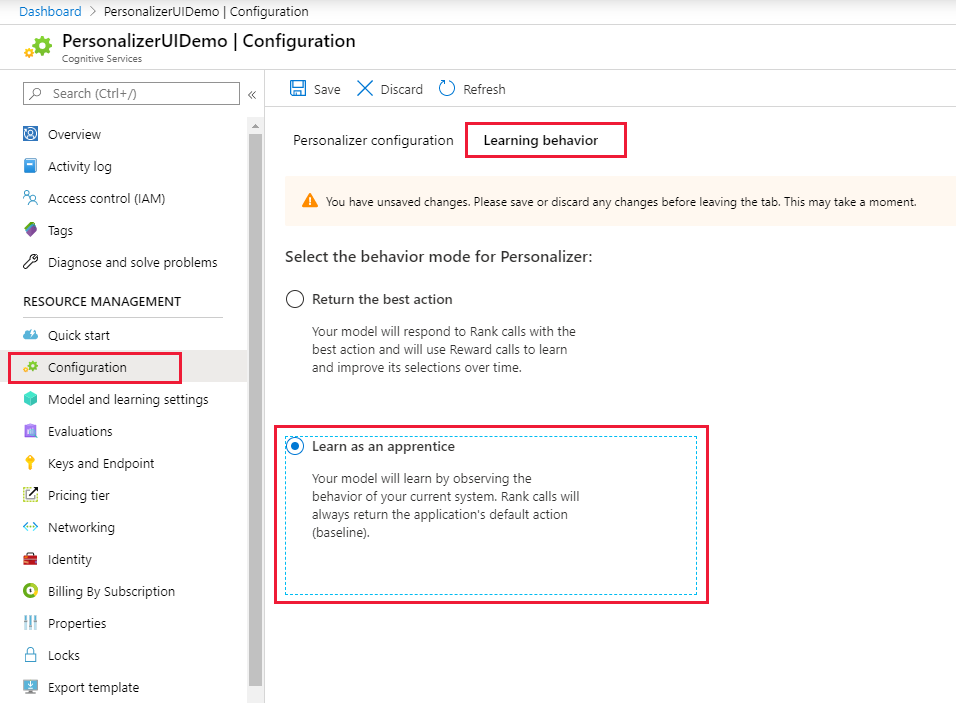
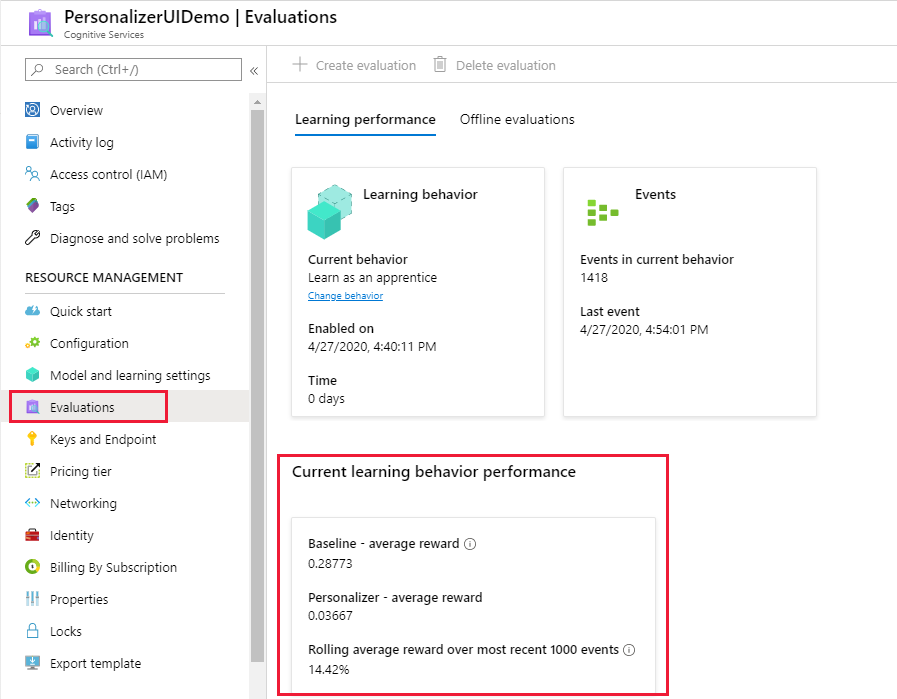

# Configure the Personalizer learning behavior

[Apprentice mode](concept-apprentice-mode.md) gives you trust and confidence in the Personalizer service and its machine learning capabilities, and provides assurance that the service is sent information that can be learned from – without risking online traffic.

## Configure Apprentice mode

1. Sign in to the [Azure portal](https://portal.azure.com), for your Personalizer resource.

2. On the **Setup** page, on the **Model settings** tab, select **Apprentice mode** then select **Save**.

> [!div class="mx-imgBorder"]
> 

## Changes to the existing application

Your existing application shouldn't change how it currently selects actions to display or how the application determines the value, **reward** of that action. The only change to the application might be the order of the actions sent to the Personalizer Rank API. The action your application currently displays is sent as the _first action_ in the action list. The [Rank API](https://westus2.dev.cognitive.microsoft.com/docs/services/personalizer-api/operations/Rank) uses this first action to train your Personalizer model.

### Configure your application to call the Rank API

In order to add Personalizer to your application, you need to call the Rank and Reward APIs.

1. Add the [Rank API](https://westus2.dev.cognitive.microsoft.com/docs/services/personalizer-api/operations/Rank) call after the point in your existing application logic where you determine the list of actions and their features. The first action in the actions list needs to be the action selected by your existing logic.

1. Configure your code to display the action associated with the Rank API response's **Reward Action ID**.

### Configure your application to call Reward API

> [!NOTE] 
> Reward API calls do not affect training while in Apprentice mode. The service learns by matching your application's current logic, or default actions. However implementing Reward calls at this stage does help ensure a smooth transition to Online mode later on with a simple switch in the Azure portal.  Additionally, the rewards will be logged, enabling you to analyze how well the current logic is performing and how much reward is being received.

1. Use your existing business logic to calculate the **reward** of the displayed action. The value needs to be in the range from 0 to 1. Send this reward to Personalizer using the [Reward API](https://westus2.dev.cognitive.microsoft.com/docs/services/personalizer-api/operations/Reward). The reward value is not expected immediately and can be delayed over a time period - depending on your business logic.

1. If you don't return the reward within the configured **Reward wait time**, the default reward will be logged instead.

## Evaluate Apprentice mode

In the Azure portal, on the **Monitor** page for your Personalizer resource, review the **Matching performance**.

> [!div class="mx-imgBorder"]
> 

Apprentice mode provides the following **evaluation metrics**:
* **Baseline – average reward**:  Average rewards of the application’s default (baseline).
* **Personalizer – average reward**: Average of total rewards Personalizer would potentially have reached.
* **Reward achievement ratio over most recent 1000 events**: Ratio of Baseline and Personalizer reward – normalized over the most recent 1000 events.

## Switch behavior to Online mode

When you determine Personalizer is trained with an average of 75-85% rolling average, the model is ready to switch to Online mode.

In the Azure portal for your Personalizer resource, on the **Setup** page, on the **Model settings** tab, select **Online mode* then select **Save**.

You do not need to make any changes to the Rank and Reward API calls.

## Next steps

* [Manage model and learning settings](how-to-manage-model.md)
