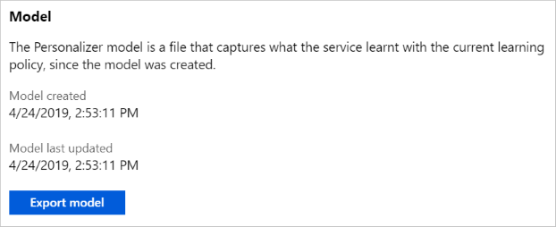
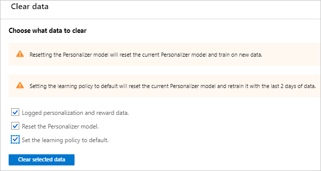

# How to manage model and learning settings

The machine-learned model and learning settings can be exported for backup in your own source control system.

## Export the Personalizer model

From the Resource management's section for **Model and learning settings**, review model creation and last updated date and export the current model. You can use the Azure portal or the Personalizer APIs to export a model file for archival purposes.

## Clear data for your learning loop

1. In the Azure portal, for your Personalizer resource, on the **Model and learning settings** page, select **Clear data**.
1. In order to clear all data, and reset the learning loop to the original state, select all three check boxes.

    

    |Value|Purpose|
    |--|--|
    |Logged personalization and reward data.|This logging data is used in offline evaluations. Clear the data if you're resetting your resource.|
    |Reset the Personalizer model.|This model changes on every retraining. This frequency of training is specified in **upload model frequency** on the **Configuration** page. |
    |Set the learning policy to default.|If you've changed the learning policy as part of an offline evaluation, this resets to the original learning policy.|

1. Select **Clear selected data** to begin the clearing process. Status is reported in Azure notifications, in the top-right navigation.

## Import a new learning policy

The [learning policy](concept-active-learning.md#understand-learning-policy-settings) settings determine the _hyperparameters_ of the model training. Perform an [offline evaluation](how-to-offline-evaluation.md) to find a new learning policy.

1. Open the [Azure portal](https://portal.azure.com), and select your Personalizer resource.
1. Select **Model and learning settings** in the **Resource Management** section.
1. For the **Import learning settings** select the file you created with the JSON format specified above, then select the **Upload** button.

    Wait for the notification that the learning policy was uploaded successfully.

## Export a learning policy

1. Open the [Azure portal](https://portal.azure.com), and select your Personalizer resource.
1. Select **Model and learning settings** in the **Resource Management** section.
1. For the **Import learning settings** select the **Export learning settings** button. This saves the `json` file to your local computer.

## Next steps

[Analyze your learning loop with an offline evaluation](how-to-offline-evaluation.md)
