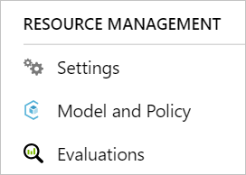

# Personalizer settings

Service configuration includes how the service treats rewards, how often the service explores, how often the model is retrained, and how much data is stored.

Create a Personalizer resource for each feedback loop. 

## Configure service settings in the Azure portal

1. Sign in to the [Azure portal](https://portal.azure.com).
1. Find your Personalizer resource. 
1. In the **Resource management** section, select **Settings**.

    

## Configure the reward settings for the feedback loop

Configure the service's settings for your feedback loop's use of rewards. Changes to the following settings will reset the current Personalizer model and retrain it with the last 2 days of data:

|Setting|Purpose|
|--|--|
|Reward wait time|​Sets the length of time during which Personalizer will collect reward values for a Rank call, starting from the moment the Rank call happens. This value is set by asking: "How long should Personalizer wait for rewards calls?" Any reward arriving after this window will be logged but not used for learning.|
|Default reward|If no reward call is received by Personalizer during the Reward Wait Time window associated to a Rank call, Personalizer will assign the Default Reward. By default, and in most scenarios, the Default Reward is zero.|
|Reward aggregation|If multiple rewards are received for the same Rank API call, this aggregation method is used: **sum** or **earliest**. Earliest picks the earliest score received and discards the rest. This is useful if you want unique reward among possibly duplicate calls. |

After changing these settings, make sure to select **Save**.

## Configure the exploration setting 

Personalization is able to discover new patterns and adapt to user behavior changes over time by exploring alternatives. The **Exploration** setting determines what percentage of Rank calls are answered with exploration. 

Changes to this setting will reset the current Personalizer model and retrain it with the last 2 days of data.

## Configure model update frequency

**Model update frequency** sets how often a new Personalizer model is retrained. 

## Configure data retention

**Data retention period** sets how many days Personalizer keeps data logs. Past data logs are required to perform [offline evaluations](concepts-offline-evaluation.md), which are used to measure the effectiveness of Personalizer and optimize Learning Policy.

## Next steps

[How to use the Personalizer container](https://go.microsoft.com/fwlink/?linkid=2083923&clcid=0x409)
