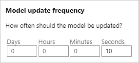

## Change the model update frequency

In the Azure portal, in the Personalizer resource on the **Configuration** page, change the **Model update frequency** to 10 seconds. This short duration will train the service rapidly, allowing you to see how the top action changes for each iteration.

When a Personalizer loop is first instantiated, there is no model since there has been no Reward API calls to train from. Rank calls will return equal probabilities for each item. Your application should still always rank content using the output of RewardActionId.