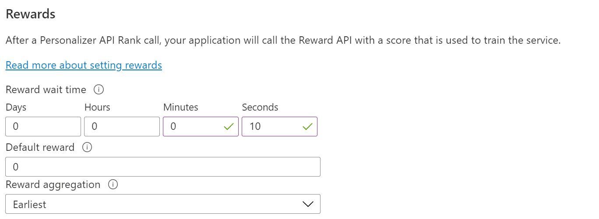

### Change the reward wait time

In the Azure portal, in the Personalizer resource on the **Configuration** page, change the **Reward wait time** to 30 seconds. This short duration will train the service rapidly, allowing you to see how the top action changes for each iteration.

