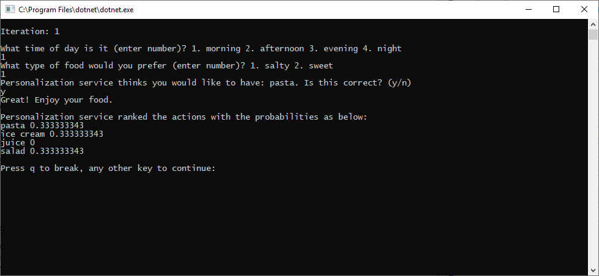

[Reference documentation](https://docs.microsoft.com/dotnet/api/Microsoft.Azure.CognitiveServices.Personalizer?view=azure-dotnet-preview) | [Library source code](https://github.com/Azure/azure-sdk-for-net/tree/master/sdk/cognitiveservices/Personalizer) | [Package (NuGet)](https://www.nuget.org/packages/Microsoft.Azure.CognitiveServices.Personalizer/) | [Samples](https://github.com/Azure-Samples/cognitive-services-personalizer-samples)

## Prerequisites

* Azure subscription - [Create one for free](https://azure.microsoft.com/free/)
* The current version of [.NET Core](https://dotnet.microsoft.com/download/dotnet-core).

## Using this quickstart

There are several steps to use this quickstart:

* In the Azure portal, create a Personalizer resource
* In the Azure portal, for the Personalizer resource, on the **Configuration** page, change the model update frequency to a very short interval
* In a code editor, create a code file and edit the code file
* In the command line or terminal, install the SDK from the command line
* In the command line or terminal, run the code file

[!INCLUDE [Create Azure resource for Personalizer](create-personalizer-resource.md)]

[!INCLUDE [!Change model frequency](change-model-frequency.md)]

## Create a new C# application

Create a new .NET Core application in your preferred editor or IDE.

In a console window (such as cmd, PowerShell, or Bash), use the dotnet `new` command to create a new console app with the name `personalizer-quickstart`. This command creates a simple "Hello World" C# project with a single source file: `Program.cs`.

```console
dotnet new console -n personalizer-quickstart
```

Change your directory to the newly created app folder. You can build the application with:

```console
dotnet build
```

The build output should contain no warnings or errors.

```console
...
Build succeeded.
 0 Warning(s)
 0 Error(s)
...
```

## Install the SDK

Within the application directory, install the Personalizer client library for .NET with the following command:

```console
dotnet add package Microsoft.Azure.CognitiveServices.Personalizer --version 0.8.0-preview
```

If you're using the Visual Studio IDE, the client library is available as a downloadable NuGet package.

## Object model

The Personalizer client is a [PersonalizerClient](https://docs.microsoft.com/dotnet/api/microsoft.azure.cognitiveservices.personalizer.personalizerclient?view=azure-dotnet) object that authenticates to Azure using Microsoft.Rest.ServiceClientCredentials, which contains your key.

To ask for the single best item of the content, create a [RankRequest](https://docs.microsoft.com/dotnet/api/microsoft.azure.cognitiveservices.personalizer.models.rankrequest?view=azure-dotnet-preview), then pass it to [client.Rank](https://docs.microsoft.com/dotnet/api/microsoft.azure.cognitiveservices.personalizer.personalizerclientextensions.rank?view=azure-dotnet-preview) method. The Rank method returns a RankResponse.

To send a reward score to Personalizer, create a [RewardRequest](https://docs.microsoft.com/dotnet/api/microsoft.azure.cognitiveservices.personalizer.models.rewardrequest?view=azure-dotnet-preview), then pass it to the [client.Reward](https://docs.microsoft.com/dotnet/api/microsoft.azure.cognitiveservices.personalizer.personalizerclientextensions.reward?view=azure-dotnet-preview) method.

Determining the reward score, in this quickstart is trivial. In a production system, the determination of what impacts the [reward score](../concept-rewards.md) and by how much can be a complex process, that you may decide to change over time. This design decision should be one of the primary decisions in your Personalizer architecture.

## Code examples

These code snippets show you how to do the following tasks with the Personalizer client library for .NET:

* [Create a Personalizer client](#create-a-personalizer-client)
* [Rank API](#request-the-best-action)
* [Reward API](#send-a-reward)

## Add the dependencies

From the project directory, open the **Program.cs** file in your preferred editor or IDE. Replace the existing `using` code with the following `using` directives:

[!code-csharp[Using statements](~/samples-personalizer/quickstarts/csharp/PersonalizerExample/Program.cs?name=Dependencies)]

## Add Personalizer resource information

In the **Program** class, create variables for your resource's Azure key and endpoint pulled from the environment variables, named `PERSONALIZER_RESOURCE_KEY` and `PERSONALIZER_RESOURCE_ENDPOINT`. If you created the environment variables after the application is launched, the editor, IDE, or shell running it will need to be closed and reloaded to access the variable. The methods will be created later in this quickstart.

[!code-csharp[Create variables to hold the Personalizer resource key and endpoint values found in the Azure portal.](~/samples-personalizer/quickstarts/csharp/PersonalizerExample/Program.cs?name=classVariables)]

## Create a Personalizer client

Next, create a method to return a Personalizer client. The parameter to the method is the `PERSONALIZER_RESOURCE_ENDPOINT` and the ApiKey is the `PERSONALIZER_RESOURCE_KEY`.

[!code-csharp[Create the Personalizer client](~/samples-personalizer/quickstarts/csharp/PersonalizerExample/Program.cs?name=authorization)]

## Get food items as rankable actions

Actions represent the content choices from which you want Personalizer to select the best content item. Add the following methods to the Program class to represent the set of actions and their features.

[!code-csharp[Food items as actions](~/samples-personalizer/quickstarts/csharp/PersonalizerExample/Program.cs?name=createAction)]

## Get user preferences for context

Add the following methods to the Program class to get a user's input from the command line for the time of day and current food preference. These will be used as context features.

[!code-csharp[Present time out day preference to the user](~/samples-personalizer/quickstarts/csharp/PersonalizerExample/Program.cs?name=createUserFeatureTimeOfDay)]

[!code-csharp[Present food taste preference to the user](~/samples-personalizer/quickstarts/csharp/PersonalizerExample/Program.cs?name=createUserFeatureTastePreference)]

Both methods use the `GetKey` method to read the user's selection from the command line.

[!code-csharp[Read user's choice from the command line](~/samples-personalizer/quickstarts/csharp/PersonalizerExample/Program.cs?name=readCommandLine)]

## Create the learning loop

The Personalizer learning loop is a cycle of [Rank](#request-the-best-action) and [Reward](#send-a-reward) calls. In this quickstart, each Rank call, to personalize the content, is followed by a Reward call to tell Personalizer how well the service performed.

The following code loops through a cycle of asking the user their preferences at the command line, sending that information to Personalizer to select the best action, presenting the selection to the customer to choose from among the list, then sending a reward score to Personalizer signaling how well the service did in its selection.

[!code-csharp[Learning loop](~/samples-personalizer/quickstarts/csharp/PersonalizerExample/Program.cs?name=mainLoop)]

Add the following methods, which [get the content choices](#get-food-items-as-rankable-actions), before running the code file:

* `GetActions`
* `GetUsersTimeOfDay`
* `GetUsersTastePreference`
* `GetKey`

## Request the best action

To complete the Rank request, the program asks the user's preferences to create a `currentContent` of the content choices. The process can create content to exclude from the actions, shown as `excludeActions`. The Rank request needs the actions and their features, currentContext features, excludeActions, and a unique event ID, to receive the response.

This quickstart has simple context features of time of day and user food preference. In production systems, determining and [evaluating](../concept-feature-evaluation.md) [actions and features](../concepts-features.md) can be a non-trivial matter.

[!code-csharp[The Personalizer learning loop ranks the request.](~/samples-personalizer/quickstarts/csharp/PersonalizerExample/Program.cs?name=rank)]

## Send a reward

To get the reward score to send in the Reward request, the program gets the user's selection from the command line, assigns a numeric value to the selection, then sends the unique event ID and the reward score as the numeric value to the Reward API.

This quickstart assigns a simple number as a reward score, either a zero or a 1. In production systems, determining when and what to send to the [Reward](../concept-rewards.md) call can be a non-trivial matter, depending on your specific needs.

[!code-csharp[The Personalizer learning loop ranks the request.](~/samples-personalizer/quickstarts/csharp/PersonalizerExample/Program.cs?name=reward)]

## Run the program

Run the application with the dotnet `run` command from your application directory.

```console
dotnet run
```



The [source code for this quickstart](https://github.com/Azure-Samples/cognitive-services-personalizer-samples/blob/master/quickstarts/csharp/PersonalizerExample/Program.cs) is available in the Personalizer samples GitHub repository.
