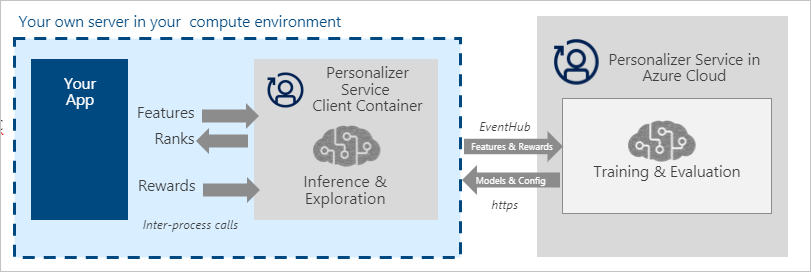

# Install and run containers

The Personalizer Service has the following container(s): 

|Function|Features|
|-|-|
|personalizer|Determine best action from current context of content and user.|

If you don't have an Azure subscription, create a [free account](https://azure.microsoft.com/free/?WT.mc_id=A261C142F) before you begin.

## Prerequisites

You must meet the following prerequisites before using Personalizer Service containers:

|Required|Purpose|
|--|--|
|Docker Engine| You need the Docker Engine installed on a [host computer](#the-host-computer). Docker provides packages that configure the Docker environment on [macOS](https://docs.docker.com/docker-for-mac/), [Windows](https://docs.docker.com/docker-for-windows/), and [Linux](https://docs.docker.com/engine/installation/#supported-platforms). For a primer on Docker and container basics, see the [Docker overview](https://docs.docker.com/engine/docker-overview/).<br><br> Docker must be configured to allow the containers to connect with and send billing data to Azure. <br><br> **On Windows**, Docker must also be configured to support Linux containers.<br><br>|
|Familiarity with Docker | You should have a basic understanding of Docker concepts, like registries, repositories, containers, and container images, as well as knowledge of basic `docker` commands.| 
|Personalizer Service resource |In order to use these containers, you must have:<br><br>A _Personalizer Service_ Azure resource to get the associated billing key and billing endpoint URI. Both values are available on the Azure portal's Personalizer Service Overview and Keys pages and are required to start the container.<br><br>**{BILLING_KEY}**: resource key<br><br>**{BILLING_ENDPOINT_URI}**: endpoint URI example is: `https://westus.api.cognitive.microsoft.com/`|

### The host computer

The **host** is the computer that runs the docker container. It can be a computer on your premises or a docker hosting service in Azure including:

* [Azure Kubernetes Service](https://docs.microsoft.com/aks/index.yml)
* [Azure Container Instances](https://docs.microsoft.com/container-instances/index.yml)
* [Kubernetes](https://kubernetes.io/) cluster deployed to [Azure Stack](https://docs.microsoft.com/azure-stack/index.yml). For more information, see [Deploy Kubernetes to Azure Stack](https://docs.microsoft.com/azure-stack/user/azure-stack-solution-template-kubernetes-deploy.md).

### Container requirements and recommendations

The following table describes the minimum and recommended CPU cores and memory to allocate for each Personalizer Service container.

| Container | Minimum | Recommended |
|-----------|---------|-------------|
|personalizer | 1 core, 4 GB memory | 2 core, 8 GB memory |

Each core must be at least 2.6 gigahertz (GHz) or faster.

Core and memory correspond to the `--cpus` and `--memory` settings, which are used as part of the `docker run` command.

## Get the container image with `docker pull`

Container images for Personalizer Service are available. 

| Container | Repository |
|-----------|------------|
| personalizer | `mcr.microsoft.com/azure-cognitive-services/personalizer:latest` |

> [!TIP]
> You can use the [docker images](https://docs.docker.com/engine/reference/commandline/images/) command to list your downloaded container images. For example, the following command lists the ID, repository, and tag of each downloaded container image, formatted as a table:
>
>  ```Docker
>  docker images --format "table {{.ID}}\t{{.Repository}}\t{{.Tag}}"
>
>  IMAGE ID            REPOSITORY                                                                TAG
>  ebbee78a6baa        mcr.microsoft.com/azure-cognitive-services/personalizer                 latest
>  ``` 

### Docker pull for the Personalizer Service container

```Docker
docker pull mcr.microsoft.com/azure-cognitive-services/personalizer:latest
```

## How the container works

The Personalizer container represents the client portion of the Personalizer service. When the container runs, it gets the models and configuration settings from the Personalizer service in the Azure cloud. The container service uses this information to respond to requests to **rank** and **reward**. The container also sends these requests to the Personalizer resource in the Azure cloud. This information is then used to train your Personalizer loop model, based on the current setting for model update frequency. The updated model is sent back to the container. 



## How to use the container

Once the container is on the [host computer](#the-host-computer), use the following process to work with the container.

1. [Run the container](#run-the-container-with-docker-run), with the required billing settings. More [examples](personalizer-container-configuration.md#example-docker-run-commands) of the `docker run` command are available. 
1. [Query the container's prediction endpoint](#query-the-containers-prediction-endpoint). 

## Run the container with `docker run`

Use the [docker run](https://docs.docker.com/engine/reference/commandline/run/) command to run any of the three containers. The command uses the following parameters:

| Placeholder | Value |
|-------------|-------|
|{BILLING_KEY} | This key is used to start the container, and is available on the Azure portal's Personalizer Service Keys page.  |
|{BILLING_ENDPOINT_URI} | The billing endpoint URI value is available on the Azure portal's Personalizer Service Overview page.|

Replace these parameters with your own values in the following example `docker run` command.

```bash
docker run --rm -it -p 5000:5000 --memory 4g --cpus 1 \
mcr.microsoft.com/azure-cognitive-services/personalizer\
Eula=accept \
Billing={BILLING_ENDPOINT_URI} \
ApiKey={BILLING_KEY}
```

This command:

* Runs a Personalizer Service container from the container image
* Allocates one CPU core and 4 gigabytes (GB) of memory
* Exposes TCP port 5000 and allocates a pseudo-TTY for the container
* Automatically removes the container after it exits. The container image is still available on the host computer. 

> [!IMPORTANT]
> The `Eula`, `Billing`, and `ApiKey` options must be specified to run the container; otherwise, the container won't start.  For more information, see [Billing](#billing).

### Running multiple containers on the same host

If you intend to run multiple containers with exposed ports, make sure to run each container with a different port. For example, run the first container on port 5000 and the second container on port 5001.

Replace the `<container-registry>` and `<container-name>` with the values of the containers you use. These do not have to be the same container. You can have the Face container and the LUIS container running on the HOST together or you can have multiple Face containers running. 

Run the first container on port 5000. 

```bash 
docker run --rm -it -p 5000:5000 --memory 4g --cpus 1 \
<container-registry>/microsoft/<container-name> \
Eula=accept \
Billing={BILLING_ENDPOINT_URI} \
ApiKey={BILLING_KEY}
```

Run the second container on port 5001.


```bash 
docker run --rm -it -p 5000:5001 --memory 4g --cpus 1 \
<container-registry>/microsoft/<container-name> \
Eula=accept \
Billing={BILLING_ENDPOINT_URI} \
ApiKey={BILLING_KEY}
```

Each subsequent container should be on a different port. 

## Query the container's prediction endpoint

The container provides REST-based query prediction endpoint APIs. 

Use the host, https://localhost:5000, for container APIs.

## Stop the container

To shut down the container, in the command-line environment where the container is running, press **Ctrl+C**.

## Troubleshooting

If you run the container with an output [mount](personalizer-container-configuration.md#mount-settings) and logging enabled, the container generates log files that are helpful to troubleshoot issues that happen while starting or running the container. 

## Container's API documentation

The container provides a full set of documentation for the endpoints as well as a `Try it now` feature. This feature allows you to enter your settings into a web-based HTML form and make the query without having to write any code. Once the query returns, an example CURL command is provided to demonstrate the HTTP headers and body format required. 

> [!TIP]
> Read the [OpenAPI specification](https://swagger.io/docs/specification/about/), describing the API operations supported by the container, from the `/swagger` relative URI. For example:
>
>  ```http
>  http://localhost:5000/swagger
>  ```

## Billing

The Personalizer Service containers send billing information to Azure, using a _Personalizer Service_ resource on your Azure account. 

Cognitive Services containers are not licensed to run without being connected to Azure for metering. Customers need to enable the containers to communicate billing information with the metering service at all times. Cognitive Services containers do not send customer data to Microsoft. 

The `docker run` command uses the following arguments for billing purposes:

| Option | Description |
|--------|-------------|
| `ApiKey` | The API key of the _Personalizer Service_ resource used to track billing information. |
| `Billing` | The endpoint of the _Personalizer Service_ resource used to track billing information.|
| `Eula` | Indicates that you've accepted the license for the container.<br/>The value of this option must be set to `accept`. |

> [!IMPORTANT]
> All three options must be specified with valid values, or the container won't start.

For more information about these options, see [Configure containers](personalizer-container-configuration.md).

## Summary

In this article, you learned concepts and workflow for downloading, installing, and running Personalizer Service containers. In summary:

* Personalizer Service provides a Linux containers for Docker, encapsulating personalization.
* Container images are downloaded from the Microsoft Container Registry (MCR) in Azure.
* Container images run in Docker.
* You can use either the REST API or SDK to call operations in Personalizer Service containers by specifying the host URI of the container.
* You must specify billing information when instantiating a container.

> [!IMPORTANT]
> Cognitive Services containers are not licensed to run without being connected to Azure for metering. Customers need to enable the containers to communicate billing information with the metering service at all times. The Personalizer containers will also send the request data to Microsoft for the purposes of online training.

## Next steps

[How to configure Docker container for the `Docker Run` command](personalizer-container-configuration.md)