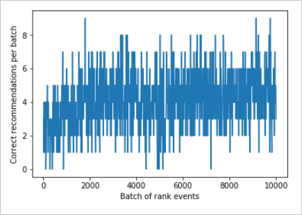

# Tutorial: Use Personalizer in Azure notebooks 

This tutorial simulates a Personalizer loop _system_ which suggests which type of coffee a customer should order. The users and their preferences are known and stored in a [user dataset](~/samples-personalizer/samples/azurenotebook/example.json). Information about the coffee is also available and stored in a [coffee dataset](~/samples-personalizer//samples/azurenotebook/actionfeatures.json).

A summary of the user information is:

|Customers|Times of Day|Types of weather|
|--|--|--|
|Alice Bob Cathy Dave|Morning afternoon evening|Sunny rainy snowy| 

To help Personalizer make the correct coffee selection for each person, the _system_ also knows details about the coffee.

|Types of temperature|Places of origin|Types of roast|Organic|
|--|--|--|--|
|Hot cold|Kenya Brazil Ethiopia|Dark light|Organic not organic|

The **purpose** of the Personalizer loop is to find the best match between the users and the coffee as much of the time as possible. 

## How the simulation works

 At the beginning of the running system, the suggestions from Personalizer are only successful between 20% to 30% (indicated by reward score of 1). After the model update frequency period, the system improves to an accuracy rate of between 70%-80% for the next set of suggestions.  

|#|Groups of rank and reward calls|
|--|--|
|First 2,000 requests|20%-30% success |
|Second 2,000 requests|70%-80% success |

Success is shown as a prediction score of 1.  

## Rank and reward calls

For each of the few thousand calls to the Personalizer service, the Azure notebook sends the **Rank** request:

* A unique ID for the Rank/Request event
* Context - A random choice of the user, weather, and time of day - simulating a user on a website or mobile device
* Features - _All_ the coffee data - from which to make a suggestion

The system receives the rank of the coffee choices, then compares that prediction with the user's known choice for the same time of day and weather. If the known choice is the same as the predicted choice, the **Reward** of 1 is sent back to Personalizer. Otherwise the reward is 0. 

> [!Note]
> This is a simulation so the algorithm for the reward is simple. In a real-world scenario, the algorithm should use business logic, possibly with weights for various aspects of the customer's experience, to determine a score _between_ 0 and 1. 

## Prerequisites

This [user dataset](~/samples-personalizer/samples/azurenotebook/example.json) is stored in a JSON object. 

This [coffee dataset](~/samples-personalizer//samples/azurenotebook/actionfeatures.json) is stored in a JSON object. 

## Create Personalizer resource

Get the Personalizer key and endpoint

## Install SDK

## Set up the Azure notebook

Copy sample files
Edit notebook cell for key and endpoint

## Run notebook cells

Validate SDK is installed

### Set constants for experiment

### Run to create rank and reward data

### Chart results to see improvement with Personalizer

The chart should look like the image below. 

This chart shows a low performance period (between 20-30% prediction reward of 1) then after a few thousand requests, a significant performance increase (to around 80% prediction reward of 1) that continues for the duration of the test.

The 80% success indicates a near perfect prediction, which isn't realistic for all Personalizer loops. The other 20% of the time, the loop is exploring by sending back results to the Rank call that are not determined by the currently trained model. 

## Clean up resources

If you do not intend to continue the tutorial series, clean up the following resources:

* Delete your Azure notebook project. 
* Delete your Personalizer resource. 

## Next steps

In the next tutorial, use the data for offline evaluation, create and apply a new learning policy. Then run the simulation again to see the improvements. 

