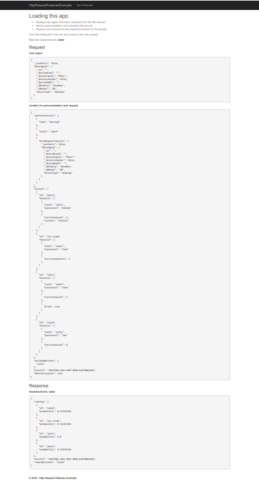
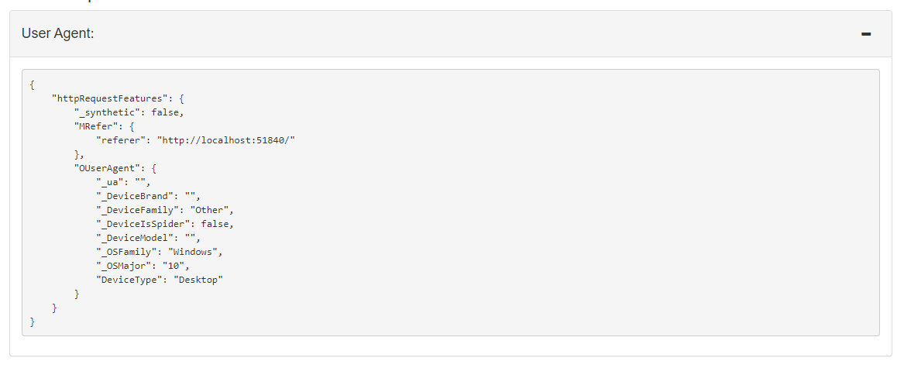

# Add Personalizer to a .NET web app

Customize a C# .NET web app with a Personalizer loop to provide the correct content to a user based on actions (with features) and context features.

**In this tutorial, you learn how to:**

<!-- green checkmark -->
> [!div class="checklist"]
> * Set up Personalizer key and endpoint
> * Collect features
> * Call Rank and Reward APIs
> * Display top action, designated as _rewardActionId_


## Select the best content for a web app

A web app should use Personalizer when there is a list of _actions_ (some type of content) on the web page that needs to be personalized to a single top item (rewardActionId) to display. Examples of action lists include news articles, button placement locations, and word choices for product names.

You send the list of actions, along with context features, to the Personalizer loop. Personalizer selects the single best action, then your web app displays that action.

In this tutorial, the actions are types of food:

* pasta
* ice cream
* juice
* salad
* popcorn
* coffee
* soup

To help Personalizer learn about your actions, send both __actions with features_ and _context features_ with each Rank API request.

A **feature** of the model is information about the action or context that can be aggregated (grouped) across members of your web app user base. A feature _isn't_ individually specific (such as a user ID) or highly specific (such as an exact time of day).

### Actions with features

Each action (content item) has features to help distinguish the food item.

The features aren't configured as part of the loop configuration in the Azure portal. Instead they are sent as a JSON object with each Rank API call. This allows flexibility for the actions and their features to grow, change, and shrink over time, which allows Personalizer to follow trends.

```csharp
 /// <summary>
  /// Creates personalizer actions feature list.
  /// </summary>
  /// <returns>List of actions for personalizer.</returns>
  private IList<RankableAction> GetActions()
  {
      IList<RankableAction> actions = new List<RankableAction>
      {
          new RankableAction
          {
              Id = "pasta",
              Features =
              new List<object>() { new { taste = "savory", spiceLevel = "medium" }, new { nutritionLevel = 5, cuisine = "italian" } }
          },

          new RankableAction
          {
              Id = "ice cream",
              Features =
              new List<object>() { new { taste = "sweet", spiceLevel = "none" }, new { nutritionalLevel = 2 } }
          },

          new RankableAction
          {
              Id = "juice",
              Features =
              new List<object>() { new { taste = "sweet", spiceLevel = "none" }, new { nutritionLevel = 5 }, new { drink = true } }
          },

          new RankableAction
          {
              Id = "salad",
              Features =
              new List<object>() { new { taste = "sour", spiceLevel = "low" }, new { nutritionLevel = 8 } }
          },

          new RankableAction
          {
              Id = "popcorn",
              Features =
              new List<object>() { new { taste = "salty", spiceLevel = "none" }, new { nutritionLevel = 3 } }
          },

          new RankableAction
          {
              Id = "coffee",
              Features =
              new List<object>() { new { taste = "bitter", spiceLevel = "none" }, new { nutritionLevel = 3 }, new { drink = true } }
          },

          new RankableAction
          {
              Id = "soup",
              Features =
              new List<object>() { new { taste = "sour", spiceLevel = "high" }, new { nutritionLevel =  7} }
          }
      };

      return actions;
  }
```


## Context features

Context features help Personalizer understand the context of the actions. The context for this sample application includes:

* time of day - morning, afternoon, evening, night
* user's preference for taste - salty, sweet, bitter, sour, or savory
* browser's context - user agent, geographical location, referrer

```csharp
/// <summary>
/// Get users time of the day context.
/// </summary>
/// <returns>Time of day feature selected by the user.</returns>
private string GetUsersTimeOfDay()
{
    Random rnd = new Random();
    string[] timeOfDayFeatures = new string[] { "morning", "noon", "afternoon", "evening", "night", "midnight" };
    int timeIndex = rnd.Next(timeOfDayFeatures.Length);
    return timeOfDayFeatures[timeIndex];
}

/// <summary>
/// Gets user food preference.
/// </summary>
/// <returns>Food taste feature selected by the user.</returns>
private string GetUsersTastePreference()
{
    Random rnd = new Random();
    string[] tasteFeatures = new string[] { "salty", "bitter", "sour", "savory", "sweet" };
    int tasteIndex = rnd.Next(tasteFeatures.Length);
    return tasteFeatures[tasteIndex];
}
```

## How does the web app use Personalizer?

The web app uses Personalizer to select the best action from the list of food choices. It does this by sending the following information with each Rank API call:
* **actions** with their features such as `taste` and `spiceLevel`
* **context** features such as `time` of day, user's `taste` preference, and the browser's user agent information, and context features
* **actions to exclude** such as juice
* **eventid**, which is different for each call to Rank API.

## Personalizer model features in a web app

Personalizer needs features for the actions (content) and the current context (user and environment). Features are used to align actions to the current context in the model. The model is a representation of Personalizer's past knowledge about actions, context, and their features that allows it to make educated decisions.

The model, including features, is updated on a schedule based on your **Model update frequency** setting in the Azure portal.

> [!CAUTION]
> Features in this application are meant to illustrate features and feature values but not necessarily to the best features to use in a web app.

### Plan for features and their values

Features should be selected with the same planning and design that you would apply to any schema or model in your technical architecture. The feature values can be set with business logic or third-party systems. Feature values should not be so highly specific that they don't apply across a group or class of features.

### Generalize feature values

#### Generalize into categories

This app uses `time` as a feature but groups time into categories such as `morning`, `afternoon`, `evening`, and `night`. That is an example of using the information of time but not in a highly specific way, such as `10:05:01 UTC+2`.

#### Generalize into parts

This app uses the HTTP Request features from the browser. This starts with a very specific string with all the data, for example:

```http
Mozilla/5.0 (Windows NT 10.0; Win64; x64) AppleWebKit/530.99 (KHTML, like Gecko) Chrome/80.0.3900.140 Safari/537.36
```

The **HttpRequestFeatures** class library generalizes this string into a **userAgentInfo** object with individual values. Any values that are too specific are set to an empty string. When the context features for the request are sent, it has the following JSON format:

```JSON
{
  "httpRequestFeatures": {
    "_synthetic": false,
    "OUserAgent": {
      "_ua": "",
      "_DeviceBrand": "",
      "_DeviceFamily": "Other",
      "_DeviceIsSpider": false,
      "_DeviceModel": "",
      "_OSFamily": "Windows",
      "_OSMajor": "10",
      "DeviceType": "Desktop"
    }
  }
}
```


## Using sample web app

The sample browser-based web app (all code is provided) needs the following applications installed to run the app.

Install the following software:

* [.NET Core 2.1](https://dotnet.microsoft.com/download/dotnet-core/2.1) - the sample back end server uses .NET core
* [Node.js](https://nodejs.org/) - the client/front end depends on this application
* [Visual Studio 2019](https://visualstudio.microsoft.com/vs/), or [.NET Core CLI](https://docs.microsoft.com/dotnet/core/tools/) - use either the developer environment of Visual Studio 2019 or the .NET Core CLI to build and run the app

### Set up the sample
1. Clone the Azure Personalizer Samples repo.

    ```bash
    git clone https://github.com/Azure-Samples/cognitive-services-personalizer-samples.git
    ```

1. Navigate to _samples/HttpRequestFeatures_ to open the solution, `HttpRequestFeaturesExample.sln`.

    If requested, allow Visual Studio to update the .NET package for Personalizer.

### Set up Azure Personalizer Service

1. [Create a Personalizer resource](https://ms.portal.azure.com/#create/Microsoft.CognitiveServicesPersonalizer) in the Azure portal.

1. In the Azure portal, find the `Endpoint` and either `Key1` or `Key2` (either will work) in the **Keys and Endpoints** tab. These are your `PersonalizerServiceEndpoint` and your `PersonalizerApiKey`.
1. Fill in the `PersonalizerServiceEndpoint` in **appsettings.json**.
1. Configure the `PersonalizerApiKey` as an [app secrets](https://docs.microsoft.com/aspnet/core/security/app-secrets) in one of the following ways:

    * If you are using the .NET Core CLI, you can use the `dotnet user-secrets set "PersonalizerApiKey" "<API Key>"` command.
    * If you are using Visual Studio, you can right-click the project and select the **Manage User Secrets** menu option to configure the Personalizer keys. By doing this, Visual Studio will open a `secrets.json` file where you can add the keys as follows:

    ```JSON
    {
      "PersonalizerApiKey": "<your personalizer key here>",
    }
    ```

## Run the sample

Build and run HttpRequestFeaturesExample with one of the following methods:

* Visual Studio 2019: Press **F5**
* .NET Core CLI: `dotnet build` then `dotnet run`

Through a web browser, you can send a Rank request and a Reward request and see their responses, as well as the http request features extracted from your environment.

> [!div class="mx-imgBorder"]
> 

## Demonstrate the Personalizer loop

1. Select the **Generate new Rank Request** button to create a new JSON object for the Rank API call. This creates the actions (with features) and context features and displays the values so you can see what the JSON looks like.

    For your own future application, generation of actions and features may happen on the client, on the server, a mix of the two, or with calls to other services.

1. Select **Send Rank Request** to send the JSON object to the server. The server calls the Personalizer Rank API. The server receives the response and returns the top ranked action to the client to display.

1. Set the reward value, then select the **Send Reward Request** button. If you don't change the reward value, the client application always sends the value of `1` to Personalizer.

    > [!div class="mx-imgBorder"]
    > 

    For your own future application, generation of the reward score may happen after collecting information from the user's behavior on the client, along with business logic on the server.

## Understand the sample web app

The sample web app has a **C# .NET** server, which manages the collection of features and sending and receiving HTTP calls to your Personalizer endpoint.

The sample web app uses a **knockout front-end client application** to capture features and process user interface actions such as clicking on buttons, and sending data to the .NET server.

The following sections explain the parts of the server and client that a developer needs to understand to use Personalizer.

## Rank API: Client application sends context to server

The client application collects the user's browser _user agent_.

> [!div class="mx-imgBorder"]
> 

## Rank API: Server application calls Personalizer

This is a typical .NET web app with a client application, much of the boiler plate code is provided for you. Any code not specific to Personalizer is removed from the following code snippets so you can focus on the Personalizer-specific code.

### Create Personalizer client

In the server's **Startup.cs**, the Personalizer endpoint and key are used to create the Personalizer client. The client application doesn't need to communicate with Personalizer in this app, instead relying on the server to make those SDK calls.

The web server's .NET start up code is:

```csharp
using Microsoft.Azure.CognitiveServices.Personalizer;
// ... other using statements removed for brevity

namespace HttpRequestFeaturesExample
{
    public class Startup
    {
        public Startup(IConfiguration configuration)
        {
            Configuration = configuration;
        }

        public IConfiguration Configuration { get; }

        // This method gets called by the runtime. Use this method to add services to the container.
        public void ConfigureServices(IServiceCollection services)
        {
            string personalizerApiKey = Configuration.GetSection("PersonalizerApiKey").Value;
            string personalizerEndpoint = Configuration.GetSection("PersonalizerConfiguration:ServiceEndpoint").Value;
            if (string.IsNullOrEmpty(personalizerEndpoint) || string.IsNullOrEmpty(personalizerApiKey))
            {
                throw new ArgumentException("Missing Azure Personalizer endpoint and/or api key.");
            }
            services.AddSingleton(client =>
            {
                return new PersonalizerClient(new ApiKeyServiceClientCredentials(personalizerApiKey))
                {
                    Endpoint = personalizerEndpoint
                };
            });

            services.AddMvc();
        }

        // ... code removed for brevity
    }
}
```

### Select best action

In the server's **PersonalizerController.cs**, the **GenerateRank** server API summarizes the preparation to call the Rank API

* Create new `eventId` for the Rank call
* Get the list of actions
* Get the list of features from the user and create context features
* Optionally, set any excluded actions
* Call Rank API, return results to client

```csharp
/// <summary>
/// Creates a RankRequest with user time of day, HTTP request features,
/// and taste as the context and several different foods as the actions
/// </summary>
/// <returns>RankRequest with user info</returns>
[HttpGet("GenerateRank")]
public RankRequest GenerateRank()
{
    string eventId = Guid.NewGuid().ToString();

    // Get the actions list to choose from personalizer with their features.
    IList<RankableAction> actions = GetActions();

    // Get context information from the user.
    HttpRequestFeatures httpRequestFeatures = GetHttpRequestFeaturesFromRequest(Request);
    string timeOfDayFeature = GetUsersTimeOfDay();
    string tasteFeature = GetUsersTastePreference();

    // Create current context from user specified data.
    IList<object> currentContext = new List<object>() {
            new { time = timeOfDayFeature },
            new { taste = tasteFeature },
            new { httpRequestFeatures }
    };

    // Exclude an action for personalizer ranking. This action will be held at its current position.
    IList<string> excludeActions = new List<string> { "juice" };

    // Rank the actions
    return new RankRequest(actions, currentContext, excludeActions, eventId);
}
```

The JSON sent to Personalizer, containing both actions (with features) and the current context features, looks like:

```json
{
    "contextFeatures": [
        {
            "time": "morning"
        },
        {
            "taste": "savory"
        },
        {
            "httpRequestFeatures": {
                "_synthetic": false,
                "MRefer": {
                    "referer": "http://localhost:51840/"
                },
                "OUserAgent": {
                    "_ua": "",
                    "_DeviceBrand": "",
                    "_DeviceFamily": "Other",
                    "_DeviceIsSpider": false,
                    "_DeviceModel": "",
                    "_OSFamily": "Windows",
                    "_OSMajor": "10",
                    "DeviceType": "Desktop"
                }
            }
        }
    ],
    "actions": [
        {
            "id": "pasta",
            "features": [
                {
                    "taste": "savory",
                    "spiceLevel": "medium"
                },
                {
                    "nutritionLevel": 5,
                    "cuisine": "italian"
                }
            ]
        },
        {
            "id": "ice cream",
            "features": [
                {
                    "taste": "sweet",
                    "spiceLevel": "none"
                },
                {
                    "nutritionalLevel": 2
                }
            ]
        },
        {
            "id": "juice",
            "features": [
                {
                    "taste": "sweet",
                    "spiceLevel": "none"
                },
                {
                    "nutritionLevel": 5
                },
                {
                    "drink": true
                }
            ]
        },
        {
            "id": "salad",
            "features": [
                {
                    "taste": "sour",
                    "spiceLevel": "low"
                },
                {
                    "nutritionLevel": 8
                }
            ]
        },
        {
            "id": "popcorn",
            "features": [
                {
                    "taste": "salty",
                    "spiceLevel": "none"
                },
                {
                    "nutritionLevel": 3
                }
            ]
        },
        {
            "id": "coffee",
            "features": [
                {
                    "taste": "bitter",
                    "spiceLevel": "none"
                },
                {
                    "nutritionLevel": 3
                },
                {
                    "drink": true
                }
            ]
        },
        {
            "id": "soup",
            "features": [
                {
                    "taste": "sour",
                    "spiceLevel": "high"
                },
                {
                    "nutritionLevel": 7
                }
            ]
        }
    ],
    "excludedActions": [
        "juice"
    ],
    "eventId": "82ac52da-4077-4c7d-b14e-190530578e75",
    "deferActivation": null
}
```

### Return Personalizer rewardActionId to client

The Rank API returns the selected best action **rewardActionId** to the server.

Display the action returned in **rewardActionId**.

```json
{
    "ranking": [
        {
            "id": "popcorn",
            "probability": 0.833333254
        },
        {
            "id": "salad",
            "probability": 0.03333333
        },
        {
            "id": "juice",
            "probability": 0
        },
        {
            "id": "soup",
            "probability": 0.03333333
        },
        {
            "id": "coffee",
            "probability": 0.03333333
        },
        {
            "id": "pasta",
            "probability": 0.03333333
        },
        {
            "id": "ice cream",
            "probability": 0.03333333
        }
    ],
    "eventId": "82ac52da-4077-4c7d-b14e-190530578e75",
    "rewardActionId": "popcorn"
}
```

### Client displays the rewardActionId action

In this tutorial, the `rewardActionId` value is displayed.

In your own future application, that may be some exact text, a button, or a section of the web page highlighted. The list is returned for any post-analysis of scores, not an ordering of the content. Only the `rewardActionId` content should be displayed.

## Reward API: collect information for reward

The [reward score](concept-rewards.md) should be carefully planned, just as the features are planned. The reward score typically should be a value from 0 to 1. The value _can_ be calculated partially in the client application, based on user behaviors, and partially on the server, based on business logic and goals.

If the server doesn't call the Reward API within the **Reward wait time** configured in the Azure portal for your Personalizer resource, then the **Default reward** (also configured in the Azure portal) is used for that event.

In this sample application, you can select a value to see how the reward impacts the selections.

## Additional ways to learn from this sample

The sample uses several time-based events configured in the Azure portal for your personalizer resource. Play with those values then return to this sample web app to see how the changes impact the Rank and Reward calls:

* Reward wait time
* Model update frequency

Additional settings to play with include:
* Default reward
* Exploration percentage


## Clean up resources

When you are done with this tutorial, clean up the following resources:

* Delete your sample project directory.
* Delete your Personalizer resource - think of a Personalizer resource as dedicated to the actions and context - only reuse the resource if you are still using the foods as actions subject domain.


## Next steps
* [How Personalizer works](how-personalizer-works.md)
* [Features](concepts-features.md): learn concepts about features using with actions and context
* [Rewards](concept-rewards.md): learn about calculating rewards