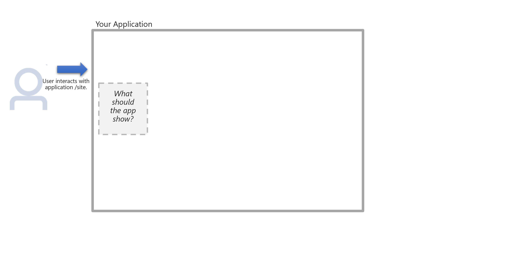

# What is Personalizer?

[!INCLUDE [TLS 1.2 enforcement](../../../includes/cognitive-services-tls-announcement.md)]

Azure Personalizer is a cloud-based API service that helps your client application choose the best, single _content_ item to show each user. The service selects the best item, from content items, based on collective real-time information you provide about content and context.

After you present the content item to your user, your system monitors user behavior and reports a reward score back to Personalizer to improve its ability to select the best content based on the context information it receives.

**Content** can be any unit of information such as text, images, urls, or emails that you want to select from to show to your user.

<!--

-->

## How does Personalizer select the best content item?

Personalizer uses **reinforcement learning** to select the best item (_action_) based on collective behavior and reward scores across all users. Actions are the content items, such as news articles, specific movies, or products to choose from.

The **Rank** call takes the action item, along with features of the action, and context features to select the top action item:

* **Actions with features** - content items with features specific to each item
* **Context features** - features of your users, their context or their environment when using your app

The Rank call returns the ID of which content item, __action__, to show to the user, in the **Reward Action ID** field.
The __action__ shown to the user is chosen with machine learning models, trying to maximize the total amount of rewards over time.

Several example scenarios are:

|Content type|**Actions (with features)**|**Context features**|Returned Reward Action ID (display this content)|
|--|--|--|--|
|News list|a. `The president...` (national, politics, [text]) b. `Premier League ...` (global, sports, [text, image, video])  c. `Hurricane in the ...` (regional, weather, [text,image]|Device news is read from Month, or season |a `The president...`|
|Movies list|1. `Star Wars` (1977, [action, adventure, fantasy], George Lucas) 2. `Hoop Dreams` (1994, [documentary, sports], Steve James 3. `Casablanca` (1942, [romance, drama, war], Michael Curtiz)|Device movie is watched from screen size Type of user |3. `Casablanca`|
|Products list|i. `Product A` (3 kg, $$$$, deliver in 24 hours) ii. `Product B` (20 kg, $$, 2 week shipping with customs) iii. `Product C` (3 kg, $$$, delivery in 48 hours)|Device shopping  is read from Spending tier of user Month, or season|ii. `Product B`|

Personalizer used reinforcement learning to select the single best action, known as _reward action ID_, based on a combination of:
* Trained model - past information the Personalizer service received
* Current data - Specific actions with features and context features

## When to call Personalizer

Personalizer's **Rank** [API](https://go.microsoft.com/fwlink/?linkid=2092082) is called _every time_ you present content, in real-time. This is known as an **event**, noted with an _event ID_.

Personalizer's **Reward** [API](https://westus2.dev.cognitive.microsoft.com/docs/services/personalizer-api/operations/Reward) can be called in real-time or delayed to better fit your infrastructure. You determine the reward score based on your business needs. The reward score is between 0 and 1. That can be a single value such as 1 for good, and 0 for bad, or a number produced by an algorithm you create considering your business goals and metrics.

## Personalizer content requirements

Use Personalizer when your content:

* Has a limited set of items (max of ~50) to select from. If you have a larger list, [use a recommendation engine](where-can-you-use-personalizer.md#how-to-use-personalizer-with-a-recommendation-solution) to reduce the list down to 50 items.
* Has information describing the content you want ranked: _actions with features_ and _context features_.
* Has a minimum of ~1k/day content-related events for Personalizer to be effective. If Personalizer doesn't receive the minimum traffic required, the service takes longer to determine the single best content item.

Since Personalizer uses collective information in near real-time to return the single best content item, the service doesn't:
* Persist and manage user profile information
* Log individual users' preferences or history
* Require cleaned and labeled content

## How to design and implement Personalizer for your client application

1. [Design](concepts-features.md) and plan for content, **_actions_**, and **_context_**. Determine the reward algorithm for the **_reward_** score.
1. Each [Personalizer Resource](how-to-settings.md) you create is considered one Learning Loop. The loop will receive the both the Rank and Reward calls for that content or user experience.

    |Resource type| Purpose|
    |--|--|
    |[Apprentice mode](concept-apprentice-mode.md) `E0`|Train the Personalizer model without impacting your existing application, then deploy to Online learning behavior to a production environment|
    |Standard, `S0`|Online learning behavior in a production environment|
    |Free, `F0`| Try Online learning behavior in a non-production environment|

1. Add Personalizer to your application, website, or system:
    1. Add a **Rank** call to Personalizer in your application, website, or system to determine best, single _content_ item before the content is shown to the user.
    1. Display best, single _content_ item, which is the returned _reward action ID_, to user.
    1. Apply _business logic_ to collected information about how the user behaved, to determine the **reward** score, such as:

    |Behavior|Calculated reward score|
    |--|--|
    |User selected best, single _content_ item (reward action ID)|**1**|
    |User selected other content|**0**|
    |User paused, scrolling around indecisively, before selecting best, single _content_ item (reward action ID)|**0.5**|

    1. Add a **Reward** call sending a reward score between 0 and 1
        * Immediately after showing your content
        * Or sometime later in an offline system
    1. [Evaluate your loop](concepts-offline-evaluation.md) with an offline evaluation after a period of use. An offline evaluation allows you to test and assess the effectiveness of the Personalizer Service without changing your code or affecting user experience.

## Next steps

* [How Personalizer works](how-personalizer-works.md)
* [What is Reinforcement Learning?](concepts-reinforcement-learning.md)
* [Learn about features and actions for the Rank request](concepts-features.md)
* [Learn about determining the score for the Reward request](concept-rewards.md)
* [Quickstarts](sdk-learning-loop.md)
* [Tutorial](tutorial-use-azure-notebook-generate-loop-data.md)
* [Use the interactive demo](https://personalizationdemo.azurewebsites.net/)
