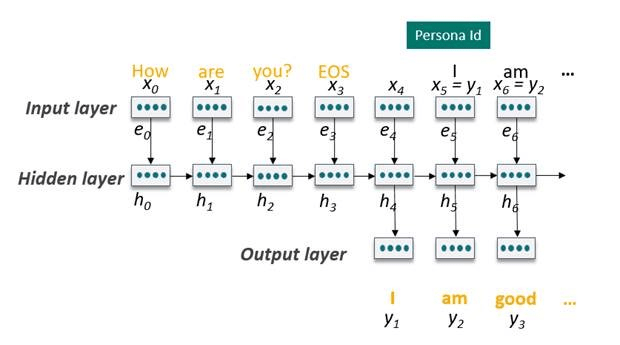
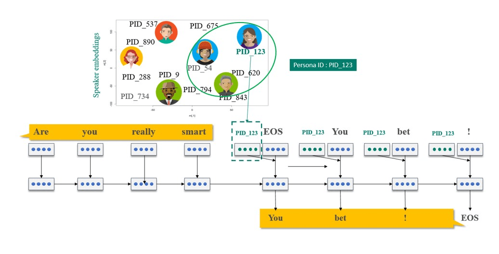

# What is Project Personality Chat?

Project Personality Chat enhances your bot’s conversational abilities by handling small talk in line with a distinct, chosen personality. Personality Chat uses intent classifiers to identify common small talk intents and generates responses consistent with a personality. Based on the intent and the confidence scores, the bot either chooses the best response from a curated editorial base or generates one in real-time using deep neural networks (DNNs). You can choose from three default personas. The persona model returns responses that are the most similar with the chosen personality.

A customizable editorial set for common small talk queries is available. It can be easily integrated using the Microsoft Bot Framework SDK. This SDK saves you the time and cost of writing them from scratch.

## Getting started with Project Personality Chat

You can visit the Project Personality Chat labs page and chat with the available demo, and request for early-access when the service is available.
Today, you can also integrate the customizable editorial-only library into your bots through the Microsoft Bot Framework SDK.  
[Samples: Integrate Personality Chat in a bot](https://github.com/Microsoft/BotBuilder-PersonalityChat/)  
[Try the Personality Chat library](https://github.com/Microsoft/BotBuilder-PersonalityChat/tree/master/CSharp)

## Generating responses using neural networks

Personality Chat uses deep learning models to learn general conversation patterns and generate responses. The response generation model is a recurrent neural network (RNN). This model is trained on millions of conversations, where it understands and learns patterns of human interactions. With the learned sentence structure patterns, new queries are formed and responses are generated. When generating this new response, the model searches through a "write vocabulary" of words, and picks n-best first words for the response. Using beam-search, it continues to search for the n-best second words for each of the generated first words. A response is deemed complete when the model picks the "End of sentence" (EOS) word. Once it has all the responses, it chooses the n-best responses based on the probability score for the full response.

The model learns to generate contextually appropriate turns that have the right "structure". For instance, a question like “Do you want to talk now?” says quite a bit about the structure of a plausible reply: it will probably start with some paraphrase of “yes” or “no” and a pronoun will likely be “I”. A “no” response is more likely to include a polite explanation, and so on.

The system tries to learn a language model for the basic structure of conversation. This structure should allow responses to be influenced in part by external constraints like topics, personality, and so on.  Since these constraints are learnt from broad patterns, they're suited for (but not limited to) application for Small talk.

## Personality modeling

 With any data-driven conversational model, there's the challenge of consistently giving a coherent “personality”. PERSONA is defined as the character experienced during conversational interactions. A persona can be viewed as made up of elements of identity, language behavior, and interaction style. In the current version of Personality Chat, the focus is on language behavior and interaction style.

This model represents each individual speaker as a vector or embedding. It encodes information from the speaker that influences the content and style of their responses. The model then learns speaker representations based on conversational content given by different speakers. The speakers with similar responses tend to have similar embeddings, occupying nearby positions in the vector space. This way, the training data of speakers nearby in vector space help increase the generalization capability of the speaker model. The model effectively clusters speakers that have similar representations in the vector space to form a persona cluster, with a "persona ID".

For the default personas, attributes and curated responses are used to find the closest matched speaker cluster. This cluster is then chosen as the Persona ID for each of the default personalities. Continued customization can happen for any type of personality by taking a set of bot/brand responses. Conversations are then made that accurately emulate that individual’s persona like linguistic response behavior and other main characteristics.

## Small talk intent understanding

Personality Chat has intent classifiers to ensure a response for small talk intents. These classifiers won't get in the way of tasks or information queries. A high-level chat classifier determines if the query is of small talk or chit-chat intent. It decides by using lexical and semantic -based classifiers and combining their scores. These intents are trained using conversational data (as positive intent samples) and search/tasks queries (for negative intent samples).

Other subintent classifiers are used to identify the subclasses of small talk to constrain the types of small talk the service responds to, for example: greetings, compliments, opinions, and so on. These deep learning classifiers, using the Convolutional Deep Structure Semantic Model (CDSSM), convert all queries to vectors. They're trained using tens of thousands of curated queries for the subintents. The classifier then matches a query with existing, identified intent classes by finding the closest match in the vector space.

A number of controls have been put into place to help prevent unfavorable responses, building on knowledge from intelligent agents like Zo. By default, Project Personality Chat is set to respond solely to recognized user intents. You may want to test whether Project Personality Chat is suitable for your circumstances. Your feedback is welcome if you see anything that needs further training.
