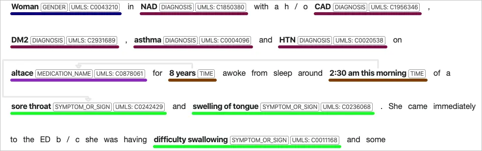
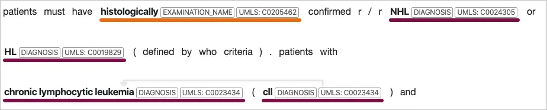

# How to: Use Text Analytics for health

> [!IMPORTANT] 
> Text Analytics for health is a capability provided “AS IS” and “WITH ALL FAULTS.” Text Analytics for health is not intended or made available for use as a medical device, clinical support, diagnostic tool, or other technology intended to be used in the diagnosis, cure, mitigation, treatment, or prevention of disease or other conditions, and no license or right is granted by Microsoft to use this capability for such purposes. This capability is not designed or intended to be implemented or deployed as a substitute for professional medical advice or healthcare opinion, diagnosis, treatment, or the clinical judgment of a healthcare professional, and should not be used as such. The customer is solely responsible for any use of Text Analytics for health. The customer must separately license any and all source vocabularies it intends to use under the terms set for that [UMLS Metathesaurus License Agreement Appendix](https://www.nlm.nih.gov/research/umls/knowledge_sources/metathesaurus/release/license_agreement_appendix.html) or any future equivalent link. The customer is responsible for ensuring compliance with those license terms, including any geographic or other applicable restrictions.


Text Analytics for health is a feature of the Text Analytics API service that extracts and labels relevant medical information from unstructured texts such as doctor's notes, discharge summaries, clinical documents, and electronic health records.  There are two ways to utilize this service: 

* [The web-based API (asynchronous)](#structure-the-api-request-for-the-hosted-asynchronous-web-api)
* [A Docker container (synchronous)](#hosted-asynchronous-web-api-response)   

> [!VIDEO https://channel9.msdn.com/Shows/AI-Show/Introducing-Text-Analytics-for-Health/player]

## Features

Text Analytics for health performs Named Entity Recognition (NER), relation extraction, entity negation and entity linking on English-language text to uncover insights in unstructured clinical and biomedical text.

### [Named Entity Recognition](#tab/ner)

Named Entity Recognition detects words and phrases mentioned in unstructured text that can be associated with one or more semantic types, such as diagnosis, medication name, symptom/sign, or age.

> [!div class="mx-imgBorder"]
> 

### [Relation Extraction](#tab/relation-extraction)

Relation extraction identifies meaningful connections between concepts mentioned in text. For example, a "time of condition" relation is found by associating a condition name with a time or between an abbreviation and the full description.  

> [!div class="mx-imgBorder"]
> 


### [Entity Linking](#tab/entity-linking)

Entity Linking disambiguates distinct entities by associating named entities mentioned in text to concepts found in a predefined database of concepts including the Unified Medical Language System (UMLS). Medical concepts are also assigned preferred naming, as an additional form of normalization.

> [!div class="mx-imgBorder"]
> 

Text Analytics for health supports linking to the health and biomedical vocabularies found in the Unified Medical Language System ([UMLS](https://www.nlm.nih.gov/research/umls/sourcereleasedocs/index.html)) Metathesaurus Knowledge Source.

### [Assertion Detection](#tab/assertion-detection) 

The meaning of medical content is highly affected by modifiers, such as negative or conditional assertions which can have critical implications if misrepresented. Text Analytics for health supports three categories of assertion detection for entities in the text: 

* certainty
* conditional
* association

> [!div class="mx-imgBorder"]
> 

---

See the [entity categories](../named-entity-types.md?tabs=health) returned by Text Analytics for health for a full list of supported entities. For information on confidence scores, see the [Text Analytics transparency note](/legal/cognitive-services/text-analytics/transparency-note#general-guidelines-to-understand-and-improve-performance?context=/azure/cognitive-services/text-analytics/context/context). 

### Supported languages

Text Analytics for health only supports English language documents. 

## Using the Docker container 

To run the Text Analytics for health container in your own environment, follow these [instructions to download and install the container](../how-tos/text-analytics-how-to-install-containers.md?tabs=healthcare).

## Using the client library

The latest prerelease of the Text Analytics client library enables you to call Text Analytics for health using a client object. Refer to the reference documentation, and see the examples on GitHub:
* [C#](https://github.com/Azure/azure-sdk-for-net/tree/master/sdk/textanalytics/Azure.AI.TextAnalytics)
* [Python](https://github.com/Azure/azure-sdk-for-python/tree/master/sdk/textanalytics/azure-ai-textanalytics/)
* [Java](https://github.com/Azure/azure-sdk-for-java/tree/master/sdk/textanalytics/azure-ai-textanalytics)


## Sending a REST API request 

### Preparation

You must have JSON documents in this format: ID, text, and language. 

Document size must be under 5,120 characters per document. For the maximum number of documents permitted in a collection, see the [data limits](../concepts/data-limits.md?tabs=version-3) article under Concepts. The collection is submitted in the body of the request. If your text exceeds this limit, consider splitting the text into separate requests. For best results, split text between sentences.

### Structure the API request for the hosted asynchronous web API

For both the container and hosted web API, you must create a POST request. You can [use Postman](text-analytics-how-to-call-api.md), a cURL command or the **API testing console** in the [Text Analytics for health hosted API reference](https://westus2.dev.cognitive.microsoft.com/docs/services/TextAnalytics-v3-1/operations/Health) to quickly construct and send a POST request to the hosted web API in your desired region. In the API v3.1 endpoint, the `loggingOptOut` boolean query parameter can be used to enable logging for troubleshooting purposes.  It's default is TRUE if not specified in the request query.

Send the POST request to `https://<your-custom-subdomain>.cognitiveservices.azure.com/text/analytics/v3.1/entities/health/jobs`
Below is an example of a JSON file attached to the Text Analytics for health API request's POST body:

```json
example.json

{
  "documents": [
    {
      "language": "en",
      "id": "1",
      "text": "Subject was administered 100mg remdesivir intravenously over a period of 120 min"
    }
  ]
}
```

### Hosted asynchronous web API response 

Since this POST request is used to submit a job for the asynchronous operation, there is no text in the response object.  However, you need the value of the operation-location KEY in the response headers to make a GET request to check the status of the job and the output.  Below is an example of the value of the operation-location KEY in the response header of the POST request:

`https://<your-custom-subdomain>.cognitiveservices.azure.com/text/analytics/v3.1/entities/health/jobs/<jobID>`

To check the job status, make a GET request to the URL in the value of the operation-location KEY header of the POST response.  The following states are used to reflect the status of a job: `NotStarted`, `running`, `succeeded`, `failed`, `rejected`, `cancelling`, and `cancelled`.  

You can cancel a job with a `NotStarted` or `running` status with a DELETE HTTP call to the same URL as the GET request.  More information on the DELETE call is available in the [Text Analytics for health hosted API reference](https://westus2.dev.cognitive.microsoft.com/docs/services/TextAnalytics-v3-1/operations/CancelHealthJob).

The following is an example of the response of a GET request.  The output is available for retrieval until the `expirationDateTime` (24 hours from the time the job was created) has passed after which the output is purged.

```json
{
    "jobId": "69081148-055b-4f92-977d-115df343de69",
    "lastUpdateDateTime": "2021-07-06T19:06:03Z",
    "createdDateTime": "2021-07-06T19:05:41Z",
    "expirationDateTime": "2021-07-07T19:05:41Z",
    "status": "succeeded",
    "errors": [],
    "results": {
        "documents": [
            {
                "id": "1",
                "entities": [
                    {
                        "offset": 25,
                        "length": 5,
                        "text": "100mg",
                        "category": "Dosage",
                        "confidenceScore": 1.0
                    },
                    {
                        "offset": 31,
                        "length": 10,
                        "text": "remdesivir",
                        "category": "MedicationName",
                        "confidenceScore": 1.0,
                        "name": "remdesivir",
                        "links": [
                            {
                                "dataSource": "UMLS",
                                "id": "C4726677"
                            },
                            {
                                "dataSource": "DRUGBANK",
                                "id": "DB14761"
                            },
                            {
                                "dataSource": "GS",
                                "id": "6192"
                            },
                            {
                                "dataSource": "MEDCIN",
                                "id": "398132"
                            },
                            {
                                "dataSource": "MMSL",
                                "id": "d09540"
                            },
                            {
                                "dataSource": "MSH",
                                "id": "C000606551"
                            },
                            {
                                "dataSource": "MTHSPL",
                                "id": "3QKI37EEHE"
                            },
                            {
                                "dataSource": "NCI",
                                "id": "C152185"
                            },
                            {
                                "dataSource": "NCI_FDA",
                                "id": "3QKI37EEHE"
                            },
                            {
                                "dataSource": "NDDF",
                                "id": "018308"
                            },
                            {
                                "dataSource": "RXNORM",
                                "id": "2284718"
                            },
                            {
                                "dataSource": "SNOMEDCT_US",
                                "id": "870592005"
                            },
                            {
                                "dataSource": "VANDF",
                                "id": "4039395"
                            }
                        ]
                    },
                    {
                        "offset": 42,
                        "length": 13,
                        "text": "intravenously",
                        "category": "MedicationRoute",
                        "confidenceScore": 0.99
                    },
                    {
                        "offset": 73,
                        "length": 7,
                        "text": "120 min",
                        "category": "Time",
                        "confidenceScore": 0.98
                    }
                ],
                "relations": [
                    {
                        "relationType": "DosageOfMedication",
                        "entities": [
                            {
                                "ref": "#/results/documents/0/entities/0",
                                "role": "Dosage"
                            },
                            {
                                "ref": "#/results/documents/0/entities/1",
                                "role": "Medication"
                            }
                        ]
                    },
                    {
                        "relationType": "RouteOfMedication",
                        "entities": [
                            {
                                "ref": "#/results/documents/0/entities/1",
                                "role": "Medication"
                            },
                            {
                                "ref": "#/results/documents/0/entities/2",
                                "role": "Route"
                            }
                        ]
                    },
                    {
                        "relationType": "TimeOfMedication",
                        "entities": [
                            {
                                "ref": "#/results/documents/0/entities/1",
                                "role": "Medication"
                            },
                            {
                                "ref": "#/results/documents/0/entities/3",
                                "role": "Time"
                            }
                        ]
                    }
                ],
                "warnings": []
            }
        ],
        "errors": [],
        "modelVersion": "2021-05-15"
    }
}
```


### Structure the API request for the container

You can [use Postman](text-analytics-how-to-call-api.md) or the example cURL request below to submit a query to the container you deployed, replacing the `serverURL` variable with the appropriate value.  Note the version of the API in the URL for the container is different than the hosted API.

```bash
curl -X POST 'http://<serverURL>:5000/text/analytics/v3.1/entities/health' --header 'Content-Type: application/json' --header 'accept: application/json' --data-binary @example.json

```

The following JSON is an example of a JSON file attached to the Text Analytics for health API request's POST body:

```json
example.json

{
  "documents": [
    {
      "language": "en",
      "id": "1",
      "text": "Patient reported itchy sores after swimming in the lake."
    },
    {
      "language": "en",
      "id": "2",
      "text": "Prescribed 50mg benadryl, taken twice daily."
    }
  ]
}
```

### Container response body

The following JSON is an example of the Text Analytics for health API response body from the containerized synchronous call:

```json
{
    "documents": [
        {
            "id": "1",
            "entities": [
                {
                    "offset": 25,
                    "length": 5,
                    "text": "100mg",
                    "category": "Dosage",
                    "confidenceScore": 1.0
                },
                {
                    "offset": 31,
                    "length": 10,
                    "text": "remdesivir",
                    "category": "MedicationName",
                    "confidenceScore": 1.0,
                    "name": "remdesivir",
                    "links": [
                        {
                            "dataSource": "UMLS",
                            "id": "C4726677"
                        },
                        {
                            "dataSource": "DRUGBANK",
                            "id": "DB14761"
                        },
                        {
                            "dataSource": "GS",
                            "id": "6192"
                        },
                        {
                            "dataSource": "MEDCIN",
                            "id": "398132"
                        },
                        {
                            "dataSource": "MMSL",
                            "id": "d09540"
                        },
                        {
                            "dataSource": "MSH",
                            "id": "C000606551"
                        },
                        {
                            "dataSource": "MTHSPL",
                            "id": "3QKI37EEHE"
                        },
                        {
                            "dataSource": "NCI",
                            "id": "C152185"
                        },
                        {
                            "dataSource": "NCI_FDA",
                            "id": "3QKI37EEHE"
                        },
                        {
                            "dataSource": "NDDF",
                            "id": "018308"
                        },
                        {
                            "dataSource": "RXNORM",
                            "id": "2284718"
                        },
                        {
                            "dataSource": "SNOMEDCT_US",
                            "id": "870592005"
                        },
                        {
                            "dataSource": "VANDF",
                            "id": "4039395"
                        }
                    ]
                },
                {
                    "offset": 42,
                    "length": 13,
                    "text": "intravenously",
                    "category": "MedicationRoute",
                    "confidenceScore": 1.0
                },
                {
                    "offset": 73,
                    "length": 7,
                    "text": "120 min",
                    "category": "Time",
                    "confidenceScore": 0.94
                }
            ],
            "relations": [
                {
                    "relationType": "DosageOfMedication",
                    "entities": [
                        {
                            "ref": "#/documents/0/entities/0",
                            "role": "Dosage"
                        },
                        {
                            "ref": "#/documents/0/entities/1",
                            "role": "Medication"
                        }
                    ]
                },
                {
                    "relationType": "RouteOfMedication",
                    "entities": [
                        {
                            "ref": "#/documents/0/entities/1",
                            "role": "Medication"
                        },
                        {
                            "ref": "#/documents/0/entities/2",
                            "role": "Route"
                        }
                    ]
                },
                {
                    "relationType": "TimeOfMedication",
                    "entities": [
                        {
                            "ref": "#/documents/0/entities/1",
                            "role": "Medication"
                        },
                        {
                            "ref": "#/documents/0/entities/3",
                            "role": "Time"
                        }
                    ]
                }
            ],
            "warnings": []
        }
    ],
    "errors": [],
    "modelVersion": "2021-03-01"
}
```

### Assertion output

Text Analytics for health returns assertion modifiers, which are informative attributes assigned to medical concepts that provide deeper understanding of the concepts’ context within the text. These modifiers are divided into three categories, each focusing on a different aspect, and containing a set of mutually exclusive values. Only one value per category is assigned to each entity. The most common value for each category is the Default value. The service’s output response contains only assertion modifiers that are different from the default value.

**CERTAINTY**  – provides information regarding the presence (present vs. absent) of the concept and how certain the text is regarding its presence (definite vs. possible).
*	**Positive** [Default]: the concept exists or happened.
* **Negative**: the concept does not exist now or never happened.
* **Positive_Possible**: the concept likely exists but there is some uncertainty.
* **Negative_Possible**: the concept’s existence is unlikely but there is some uncertainty.
* **Neutral_Possible**: the concept may or may not exist without a tendency to either side.

**CONDITIONALITY** – provides information regarding whether the existence of a concept depends on certain conditions. 
*	**None** [Default]: the concept is a fact and not hypothetical and does not depend on certain conditions.
*	**Hypothetical**: the concept may develop or occur in the future.
*	**Conditional**: the concept exists or occurs only under certain conditions.

**ASSOCIATION** – describes whether the concept is associated with the subject of the text or someone else.
*	**Subject** [Default]: the concept is associated with the subject of the text, usually the patient.
*	**Someone_Else**: the concept is associated with someone who is not the subject of the text.


Assertion detection represents negated entities as a negative value for the certainty category, for example:

```json
{
                        "offset": 381,
                        "length": 3,
                        "text": "SOB",
                        "category": "SymptomOrSign",
                        "confidenceScore": 0.98,
                        "assertion": {
                            "certainty": "negative"
                        },
                        "name": "Dyspnea",
                        "links": [
                            {
                                "dataSource": "UMLS",
                                "id": "C0013404"
                            },
                            {
                                "dataSource": "AOD",
                                "id": "0000005442"
                            },
    ...
```

### Relation extraction output

Text Analytics for Health recognizes relations between different concepts, including relations between attribute and entity (for example, direction of body structure, dosage of medication) and between entities (for example, abbreviation detection).

**ABBREVIATION**

**BODY_SITE_OF_CONDITION**

**BODY_SITE_OF_TREATMENT**

**COURSE_OF_CONDITION**

**COURSE_OF_EXAMINATION**

**COURSE_OF_MEDICATION**

**COURSE_OF_TREATMENT**

**DIRECTION_OF_BODY_STRUCTURE**

**DIRECTION_OF_CONDITION**

**DIRECTION_OF_EXAMINATION**

**DIRECTION_OF_TREATMENT**

**DOSAGE_OF_MEDICATION**

**EXAMINATION_FINDS_CONDITION**

**EXPRESSION_OF_GENE**

**EXPRESSION_OF_VARIANT**

**FORM_OF_MEDICATION**

**FREQUENCY_OF_CONDITION**

**FREQUENCY_OF_MEDICATION**

**FREQUENCY_OF_TREATMENT**

**MUTATION_TYPE_OF_GENE**

**MUTATION_TYPE_OF_VARIANT**

**QUALIFIER_OF_CONDITION**

**RELATION_OF_EXAMINATION**

**ROUTE_OF_MEDICATION**	

**SCALE_OF_CONDITION**

**TIME_OF_CONDITION**

**TIME_OF_EVENT**

**TIME_OF_EXAMINATION**

**TIME_OF_MEDICATION**

**TIME_OF_TREATMENT**

**UNIT_OF_CONDITION**

**UNIT_OF_EXAMINATION**

**VALUE_OF_CONDITION**	

**VALUE_OF_EXAMINATION**

**VARIANT_OF_GENE**

> [!NOTE]
> * Relations referring to CONDITION may refer to either the DIAGNOSIS entity type or the SYMPTOM_OR_SIGN entity type.
> * Relations referring to MEDICATION may refer to either the MEDICATION_NAME entity type or the MEDICATION_CLASS entity type.
> * Relations referring to TIME may refer to either the TIME entity type or the DATE entity type.

Relation extraction output contains URI references and assigned roles of the entities of the relation type. For example:

```json
                "relations": [
                    {
                        "relationType": "DosageOfMedication",
                        "entities": [
                            {
                                "ref": "#/results/documents/0/entities/0",
                                "role": "Dosage"
                            },
                            {
                                "ref": "#/results/documents/0/entities/1",
                                "role": "Medication"
                            }
                        ]
                    },
                    {
                        "relationType": "RouteOfMedication",
                        "entities": [
                            {
                                "ref": "#/results/documents/0/entities/1",
                                "role": "Medication"
                            },
                            {
                                "ref": "#/results/documents/0/entities/2",
                                "role": "Route"
                            }
                        ]
...
]
```

## See also

* [Text Analytics overview](../overview.md)
* [Named Entity categories](../named-entity-types.md)
* [What's new](../whats-new.md)
