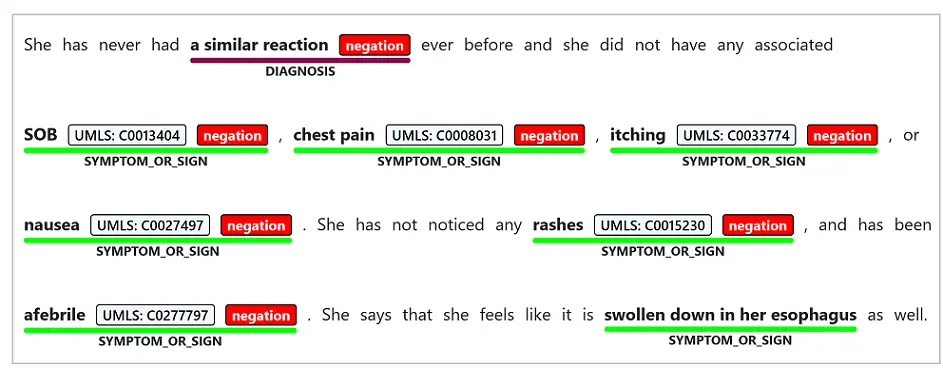

# How to: Use Text Analytics for health (preview)

> [!NOTE]
> The Text Analytics for health container has recently updated. See [What's new](../whats-new.md) for more information on recent changes. Remember to pull the latest container to use the updates listed.

> [!IMPORTANT] 
> Text Analytics for health is a preview capability provided “AS IS” and “WITH ALL FAULTS.” As such, **Text Analytics for health (preview) should not be implemented or deployed in any production use.** 
Text Analytics for health is not intended or made available for use as a medical device, clinical support, diagnostic tool, or other technology intended to be used in the diagnosis, cure, mitigation, treatment, or prevention of disease or other conditions, and no license or right is granted by Microsoft to use this capability for such purposes. This capability is not designed or intended to be implemented or deployed as a substitute for professional medical advice or healthcare opinion, diagnosis, treatment, or the clinical judgment of a healthcare professional, and should not be used as such. The customer is solely responsible for any use of Text Analytics for health. Microsoft does not warrant that Text Analytics for health or any materials provided in connection with the capability will be sufficient for any medical purposes or otherwise meet the health or medical requirements of any person. 


Text Analytics for health is a containerized service that extracts and labels relevant medical information from unstructured texts such as doctor's notes, discharge summaries, clinical documents, and electronic health records.  

## Features

The Text Analytics for health container currently performs Named Entity Recognition (NER), relation extraction, entity negation and entity linking for English-language text in your own development environment that meets your specific security and data governance requirements.

#### [Named Entity Recognition](#tab/ner)

Named Entity Recognition detects words and phrases mentioned in unstructured text that can be associated with one or more semantic types, such as diagnosis, medication name, symptom/sign, or age.

> [!div class="mx-imgBorder"]
> 

#### [Relation Extraction](#tab/relation-extraction)

Relation extraction identifies meaningful connections between concepts mentioned in text. For example, a "time of condition" relation is found by associating a condition name with a time. 

> [!div class="mx-imgBorder"]
> 


#### [Entity Linking](#tab/entity-linking)

Entity Linking disambiguates distinct entities by associating named entities mentioned in text to concepts found in a predefined database of concepts. For example, the Unified Medical Language System (UMLS).

> [!div class="mx-imgBorder"]
> 

Text Analytics for health supports linking to the health and biomedical vocabularies found in the Unified Medical Language System ([UMLS](https://www.nlm.nih.gov/research/umls/sourcereleasedocs/index.html)) Metathesaurus Knowledge Source.

#### [Negation Detection](#tab/negation-detection) 

The meaning of medical content is highly affected by modifiers such as negation, which can have critical implication if misdiagnosed. Text Analytics for health supports negation detection for the different entities mentioned in the text. 

> [!div class="mx-imgBorder"]
> 

---

See the [entity categories](../named-entity-types.md?tabs=health) returned by Text Analytics for health for a full list of supported entities.

## Supported languages

Text Analytics for health only supports English language documents.

## Request access to the container registry

Fill out and submit the [Cognitive Services containers request form](https://aka.ms/cognitivegate) to request access to the container. Currently you will not be billed for Text Analytics for health usage. 

[!INCLUDE [Request access to the container registry](../../../../includes/cognitive-services-containers-request-access-only.md)]

[!INCLUDE [Authenticate to the container registry](../../../../includes/cognitive-services-containers-access-registry.md)]

## Install the container

There are multiple ways you can install and run the container. 

- Use the [Azure portal](text-analytics-how-to-install-containers.md?tabs=healthcare) to create a Text Analytics resource, and use Docker to get your container.
- Use the following PowerShell and [Azure CLI](https://docs.microsoft.com/cli/azure/?view=azure-cli-latest) scripts to automate resource deployment container configuration.

### Install the container using Azure Web App for Containers

Azure [Web App for Containers](https://azure.microsoft.com/services/app-service/containers/) is an Azure resource dedicated to running containers in the cloud. It brings out-of-the-box capabilities such as autoscaling, support of docker containers and docker compose, HTTPS support and much more.

> [!NOTE]
> Using Azure Web App you will automatically get a domain in the form of `<appservice_name>.azurewebsites.net`

Run this PowerShell script using the Azure CLI to create a Web App for Containers, using your subscription and the container image over HTTPS. Wait for the script to complete (approximately 25-30 minutes) before submitting the first request.

```bash
$subscription_name = ""                    # THe name of the subscription you want you resource to be created on.
$resource_group_name = ""                  # The name of the resource group you want the AppServicePlan
                                           #    and AppSerivce to be attached to.
$resources_location = ""                   # This is the location you wish the AppServicePlan to be deployed to.
                                           #    You can use the "az account list-locations -o table" command to
                                           #    get the list of available locations and location code names.
$appservice_plan_name = ""                 # This is the AppServicePlan name you wish to have.
$appservice_name = ""                      # This is the AppService resource name you wish to have.
$TEXT_ANALYTICS_RESOURCE_API_KEY = ""      # This should be taken from the Text Analytics resource.
$TEXT_ANALYTICS_RESOURCE_API_ENDPOINT = "" # This should be taken from the Text Analytics resource.
$DOCKER_REGISTRY_SERVER_PASSWORD = ""      # This will be provided separately.
$DOCKER_REGISTRY_SERVER_USERNAME = ""      # This will be provided separately.
$DOCKER_IMAGE_NAME = "containerpreview.azurecr.io/microsoft/cognitive-services-healthcare:latest"

az login
az account set -s $subscription_name
az appservice plan create -n $appservice_plan_name -g $resource_group_name --is-linux -l $resources_location --sku P3V2
az webapp create -g $resource_group_name -p $appservice_plan_name -n $appservice_name -i $DOCKER_IMAGE_NAME -s $DOCKER_REGISTRY_SERVER_USERNAME -w $DOCKER_REGISTRY_SERVER_PASSWORD
az webapp config appsettings set -g $resource_group_name -n $appservice_name --settings Eula=accept Billing=$TEXT_ANALYTICS_RESOURCE_API_ENDPOINT ApiKey=$TEXT_ANALYTICS_RESOURCE_API_KEY

# Once deployment complete, the resource should be available at: https://<appservice_name>.azurewebsites.net
```

### Install the container using Azure Container Instance

You can also use an Azure Container Instance (ACI) to make deployment easier. ACI is a resource that allows you to run Docker containers on-demand in a managed, serverless Azure environment. 

See [How to use Azure Container Instances](text-analytics-how-to-use-container-instances.md) for steps on deploying an ACI resource using the Azure portal. You can also use the below PowerShell script using Azure CLI, which will create a ACI on your subscription using the container image.  Wait for the script to complete (approximately 25-30 minutes) before submitting the first request.  Due to the limit on the maximum number of CPUs per ACI resource, do not select this option if you expect to submit more than 5 large documents (approximately 5000 characters each) per request.
See the [ACI regional support](https://docs.microsoft.com/azure/container-instances/container-instances-region-availability) article for availability information. 

> [!NOTE] 
> Azure Container Instances don't include HTTPS support for the builtin domains. If you need HTTPS, you will need to manually configure it, including creating a certificate and registering a domain. You can find instructions to do this with NGINX below.

```bash
$subscription_name = ""                    # The name of the subscription you want you resource to be created on.
$resource_group_name = ""                  # The name of the resource group you want the AppServicePlan
                                           # and AppService to be attached to.
$resources_location = ""                   # This is the location you wish the web app to be deployed to.
                                           # You can use the "az account list-locations -o table" command to
                                           # Get the list of available locations and location code names.
$azure_container_instance_name = ""        # This is the AzureContainerInstance name you wish to have.
$TEXT_ANALYTICS_RESOURCE_API_KEY = ""      # This should be taken from the Text Analytics resource.
$TEXT_ANALYTICS_RESOURCE_API_ENDPOINT = "" # This should be taken from the Text Analytics resource.
$DOCKER_REGISTRY_SERVER_PASSWORD = ""      # This will be provided separately.
$DOCKER_REGISTRY_SERVER_USERNAME = ""      # This will be provided separately.
$DNS_LABEL = ""                            # This is the DNS label name you wish your ACI will have
$DOCKER_REGISTRY_LOGIN_SERVER = "containerpreview.azurecr.io"
$DOCKER_IMAGE_NAME = "containerpreview.azurecr.io/microsoft/cognitive-services-healthcare:latest"

az login
az account set -s $subscription_name
az container create --resource-group $resource_group_name --name $azure_container_instance_name --image $DOCKER_IMAGE_NAME --cpu 4 --memory 12 --registry-login-server $DOCKER_REGISTRY_LOGIN_SERVER --registry-username $DOCKER_REGISTRY_SERVER_USERNAME --registry-password $DOCKER_REGISTRY_SERVER_PASSWORD --port 5000 --dns-name-label $DNS_LABEL --environment-variables Eula=accept Billing=$TEXT_ANALYTICS_RESOURCE_API_ENDPOINT ApiKey=$TEXT_ANALYTICS_RESOURCE_API_KEY

# Once deployment complete, the resource should be available at: http://<unique_dns_label>.<resource_group_region>.azurecontainer.io:5000
```

### Secure ACI connectivity

By default there is no security provided when using ACI with container API. This is because typically containers will run as part of a pod which is protected from the outside by a network bridge. You can however modify a container with a front-facing component, keeping the container endpoint private. The following examples use [NGINX](https://www.nginx.com) as an ingress gateway to support HTTPS/SSL and client-certificate authentication.

> [!NOTE]
> NGINX is an open-source, high-performance HTTP server and proxy. An NGINX container can be used to terminate a TLS connection for a single container. More complex NGINX ingress-based TLS termination solutions are also possible.

#### Set up NGINX as an ingress gateway

NGINX uses [configuration files](https://docs.nginx.com/nginx/admin-guide/basic-functionality/managing-configuration-files/) to enable features at runtime. In order to enable TLS termination for another service, you must specify an SSL certificate to terminate the TLS connection and  `proxy_pass` to specify an address for the service. A sample is provided below.


> [!NOTE]
> `ssl_certificate` expects a path to be specified within the NGINX container's local filesystem. The address specified for `proxy_pass` must be available from within the NGINX container's network.

The NGINX container will load all of the files in the `_.conf_` that are mounted under `/etc/nginx/conf.d/` into the HTTP configuration path.

```nginx
server {
  listen              80;
  return 301 https://$host$request_uri;
}
server {
  listen              443 ssl;
  # replace with .crt and .key paths
  ssl_certificate     /cert/Local.crt;
  ssl_certificate_key /cert/Local.key;

  location / {
    proxy_pass http://cognitive-service:5000;
    proxy_set_header X-Forwarded-For $proxy_add_x_forwarded_for;
    proxy_set_header X-Real-IP  $remote_addr;
  }
}
```

#### Example Docker compose file

The below example shows how a [docker compose](https://docs.docker.com/compose/reference/overview) file can be created to deploy the NGINX and Text Analytics for health containers:

```yaml
version: "3.7"
services:
  cognitive-service:
    image: {IMAGE_ID}
    ports:
      - 5000:5000
    environment:
      - eula=accept
      - billing={ENDPOINT_URI}
      - apikey={API_KEY}
      - Logging:Disk:Format=json
    volumes:
        # replace with path to logs folder
      - <path-to-logs-folder>:/output
  nginx:
    image: nginx
    ports:
      - 443:443
    volumes:
        # replace with paths for certs and conf folders
      - <path-to-certs-folder>:/cert
      - <path-to-conf-folder>:/etc/nginx/conf.d/
```

To initiate this Docker compose file, execute the following command from a console at the root level of the file:

```bash
docker-compose up
```

For more information, see NGINX's documentation on [NGINX SSL Termination](https://docs.nginx.com/nginx/admin-guide/security-controls/terminating-ssl-http/).


## Example API request
The container provides REST-based query prediction endpoint APIs.

Use the example cURL request below to submit a query to the container you have deployed replacing the `serverURL` variable with the appropriate value.

```bash
curl -X POST 'http://<serverURL>:5000/text/analytics/v3.2-preview.1/entities/health' --header 'Content-Type: application/json' --header 'accept: application/json' --data-binary @example.json

```

The following JSON is an example of a JSON file attached to the Text Analytics for health API request's POST body:

```json
example.json

{
  "documents": [
    {
      "language": "en",
      "id": "1",
      "text": "Patient reported itchy sores after swimming in the lake."
    },
    {
      "language": "en",
      "id": "2",
      "text": "Prescribed 50mg benadryl, taken twice daily."
    }
  ]
}
```

## API response body

The following JSON is an example of the Text Analytics for health API response body:

```json
{
    "documents": [
        {
            "id": "1",
            "entities": [
                {
                    "id": "0",
                    "offset": 17,
                    "length": 11,
                    "text": "itchy sores",
                    "category": "SymptomOrSign",
                    "confidenceScore": 1.0,
                    "isNegated": false
                }
            ]
        },
        {
            "id": "2",
            "entities": [
                {
                    "id": "0",
                    "offset": 11,
                    "length": 4,
                    "text": "50mg",
                    "category": "Dosage",
                    "confidenceScore": 1.0,
                    "isNegated": false
                },
                {
                    "id": "1",
                    "offset": 16,
                    "length": 8,
                    "text": "benadryl",
                    "category": "MedicationName",
                    "confidenceScore": 1.0,
                    "isNegated": false,
                    "links": [
                        {
                            "dataSource": "UMLS",
                            "id": "C0700899"
                        },
                        {
                            "dataSource": "CHV",
                            "id": "0000044903"
                        },
                        {
                            "dataSource": "MMSL",
                            "id": "899"
                        },
                        {
                            "dataSource": "MSH",
                            "id": "D004155"
                        },
                        {
                            "dataSource": "NCI",
                            "id": "C300"
                        },
                        {
                            "dataSource": "NCI_DTP",
                            "id": "NSC0033299"
                        },
                        {
                            "dataSource": "PDQ",
                            "id": "CDR0000039163"
                        },
                        {
                            "dataSource": "PSY",
                            "id": "05760"
                        },
                        {
                            "dataSource": "RXNORM",
                            "id": "203457"
                        }
                    ]
                },
                {
                    "id": "2",
                    "offset": 32,
                    "length": 11,
                    "text": "twice daily",
                    "category": "Frequency",
                    "confidenceScore": 1.0,
                    "isNegated": false
                }
            ],
            "relations": [
                {
                    "relationType": "DosageOfMedication",
                    "bidirectional": false,
                    "source": "#/documents/1/entities/0",
                    "target": "#/documents/1/entities/1"
                },
                {
                    "relationType": "FrequencyOfMedication",
                    "bidirectional": false,
                    "source": "#/documents/1/entities/2",
                    "target": "#/documents/1/entities/1"
                }
            ]
        }
    ],
    "errors": [],
    "modelVersion": "2020-07-24"
}
```

### Negation detection output

When using negation detection, in some cases a single negation term may address several terms at once. The negation of a recognized entity is represented in the JSON output by the boolean value of the `isNegated` flag:

```json
{
  "id": "2",
  "offset": 90,
  "length": 10,
  "text": "chest pain",
  "category": "SymptomOrSign",
  "score": 0.9972,
  "isNegated": true,
  "links": [
    {
      "dataSource": "UMLS",
      "id": "C0008031"
    },
    {
      "dataSource": "CHV",
      "id": "0000023593"
    },
    ...
```

### Relation extraction output

Relation extraction output contains URI references to the *source* of the relation, and its *target*. Entities with relation role of `ENTITY` are assigned to the `target` field. Entities with relation role of `ATTRIBUTE` are assigned to the `source` field. Abbreviation relations contain bidirectional `source` and `target` fields, and `bidirectional` will be set to `true`. 

```json
"relations": [
                {
                    "relationType": "DosageOfMedication",
                    "bidirectional": false,
                    "source": "#/documents/1/entities/0",
                    "target": "#/documents/1/entities/1"
                },
                {
                    "relationType": "FrequencyOfMedication",
                    "bidirectional": false,
                    "source": "#/documents/1/entities/2",
                    "target": "#/documents/1/entities/1"
                }
            ]
  },
...
]
```

## See also

* [Text Analytics overview](../overview.md)
* [Named Entity categories](../named-entity-types.md)
* [What's new](../whats-new.md)
