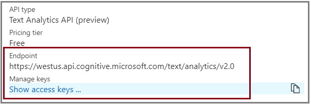

# How to find endpoints and access keys for the Text Analytics Cognitive Service

When you sign up for Text Analytics, you get a personalized access key unique to your subscription. This key is required on each call to the Text Analytics API. If you haven't [signed up](text-analytics-how-to-signup.md), do so now to get your key. 

If you need help finding the key, or to determine whether your subscription already has Text Analytics, use the following instructions to get the necessary information. 

## Find your service endpoint and access key

1. Sign in to [Azure portal](https://portal.azure.com).

2. In the left navigation pane, select **All services**.

3. In Filter, type *Cognitive Services*. If your subscription has Text Analytics, it appears in the list, with an API Type of **Text Analytics API**.

4. Click the link to open the service blade. You can now get a key from **Resources > Keys** or by clicking **Show access keys** in the Essentials pane. The endpoint is also visible in the Essentials pane.

   

## See also 

 [Text Analytics Overview](../overview.md)  
 [Frequently asked questions (FAQ)](../text-analytics-resource-faq.md)

## Next steps

> [!div class="nextstepaction"]
> [Call the Text Analytics API](text-analytics-how-to-call-api.md)
