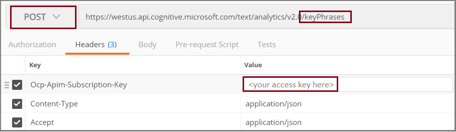
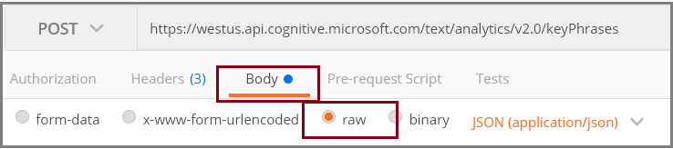

# How to call the Text Analytics REST API

In this article, we use the Text Analytics REST API and [Postman](https://www.postman.com/downloads/) to demonstrate key concepts. The API provides several synchronous and asynchronous endpoints for using the features of the service. 

## Create a Text Analytics resource

> [!NOTE]
> * You will need a Text Analytics resource using a Standard (S) [pricing tier](https://azure.microsoft.com/pricing/details/cognitive-services/text-analytics/) if you want to use the `/analyze` or `/health` endpoints. The `/analyze` endpoint is included in your [pricing tier](https://azure.microsoft.com/pricing/details/cognitive-services/text-analytics/).

Before you use the Text Analytics API, you will need to create a Azure resource with a key and endpoint for your applications. 

1.	First, go to the [Azure portal](https://ms.portal.azure.com/#create/Microsoft.CognitiveServicesTextAnalytics) and create a new Text Analytics resource, if you don't have one already. Choose a [pricing tier](https://azure.microsoft.com/pricing/details/cognitive-services/text-analytics/).

2.	Select the region you want to use for your endpoint.  Please note the `/analyze` and `/health` endpoints are only available in the following regions: West US 2, East US 2, Central US, North Europe and West Europe.

3.	Create the Text Analytics resource and go to the “keys and endpoint blade” in the left of the page. Copy the key to be used later when you call the APIs. You'll add this later as a value for the `Ocp-Apim-Subscription-Key` header.

4. To check the number of text records that have been sent using your Text Analytics resource:

    1. Navigate to your Text Analytics resource in the Azure portal. 
    2. Click **Metrics**, located under **Monitoring** in the left navigation menu. 
    3. Select *Processed text records* in the dropdown box for **Metric**.
    
A text record is 1000 characters.

## Change your pricing tier 

If you have an existing Text Analytics resource using the S0 through S4 pricing tier, you should update it to use the Standard (S) [pricing tier](https://azure.microsoft.com/pricing/details/cognitive-services/text-analytics/). The S0 through S4 pricing tiers will be retired. To update your resource's pricing:

1. Navigate to your Text Analytics resource in the [Azure portal](https://portal.azure.com/).
2. Select **Pricing tier** in the left navigation menu. It will be below **RESOURCE MANAGEMENT**. 
3. Choose the Standard (S) pricing tier. Then click **Select**.

You can also create a new Text Analytics resource with the Standard (S) pricing tier, and migrate your applications to use the credentials for the new resource. 

## Using the API synchronously

You can call Text Analytics synchronously (for low latency scenarios). You have to call each API (feature) separately when using synchronous API. If you need to call multiple features then check out below section on how to call Text Analytics asynchronously. 

## Using the API asynchronously

Starting in v3.1-preview.3, the Text Analytics API provides two asynchronous endpoints: 

* The `/analyze` endpoint for Text Analytics allows you to analyze the same set of text documents with multiple text analytics features in one API call. Previously, to use multiple features you would need to make separate API calls for each operation. Consider this capability when you need to analyze large sets of documents with more than one Text Analytics feature.

* The `/health` endpoint for Text Analytics for health, which can extract and label relevant medical information from clinical documents.  

Please note the /analyze and /health endpoints are only available in the following regions: West US 2, East US 2, Central US, North Europe and West Europe.

See the table below to see which features can be used asynchronously. Note that only a few features can be called from the `/analyze` endpoint. 

| Feature | Synchronous | Asynchronous |
|--|--|--|
| Language detection | ✔ |  |
| Sentiment analysis | ✔ |  |
| Opinion mining | ✔ |  |
| Key phrase extraction | ✔ | ✔* |
| Named Entity Recognition (including PII and PHI) | ✔ | ✔* |
| Entity linking | ✔ | ✔* |
| Text Analytics for health (container) | ✔ |  |
| Text Analytics for health (API) |  | ✔  |

`*` - Called asynchronously through the `/analyze` endpoint.


[!INCLUDE [text-analytics-api-references](../includes/text-analytics-api-references.md)]

<a name="json-schema"></a>

## API request formats

You can send both synchronous and asynchronous calls to the Text Analytics API.

#### [Synchronous](#tab/synchronous)

### Synchronous requests

The format for API requests is the same for all synchronous operations. Documents are submitted in a JSON object as raw unstructured text. XML is not supported. The JSON schema consists of the elements described below.

| Element | Valid values | Required? | Usage |
|---------|--------------|-----------|-------|
|`id` |The data type is string, but in practice document IDs tend to be integers. | Required | The system uses the IDs you provide to structure the output. Language codes, key phrases, and sentiment scores are generated for each ID in the request.|
|`text` | Unstructured raw text, up to 5,120 characters. | Required | For language detection, text can be expressed in any language. For sentiment analysis, key phrase extraction and entity identification, the text must be in a [supported language](../language-support.md). |
|`language` | 2-character [ISO 639-1](https://en.wikipedia.org/wiki/List_of_ISO_639-1_codes) code for a [supported language](../language-support.md) | Varies | Required for sentiment analysis, key phrase extraction, and entity linking; optional for language detection. There is no error if you exclude it, but the analysis is weakened without it. The language code should correspond to the `text` you provide. |

The following is an example of an API request for the synchronous Text Analytics endpoints. 

```json
{
  "documents": [
    {
      "language": "en",
      "id": "1",
      "text": "Sample text to be sent to the text analytics api."
    }
  ]
}
```

#### [Asynchronous](#tab/asynchronous)

### Asynchronous requests to the `/analyze` endpoint

> [!NOTE]
> The latest prerelease of the Text Analytics client library enables you to call Asynchronous Analyze operations using a client object. You can find examples on GitHub:
* [C#](https://github.com/Azure/azure-sdk-for-net/tree/master/sdk/textanalytics/Azure.AI.TextAnalytics)
* [Python](https://github.com/Azure/azure-sdk-for-python/tree/master/sdk/textanalytics/azure-ai-textanalytics/)
* [Java](https://github.com/Azure/azure-sdk-for-java/tree/master/sdk/textanalytics/azure-ai-textanalytics)

The `/analyze` endpoint lets you choose which of the supported Text Analytics features you want to use in a single API call. This endpoint currently supports:

* Key Phrase Extraction 
* Named Entity Recognition (including PII and PHI)
* Entity Linking

| Element | Valid values | Required? | Usage |
|---------|--------------|-----------|-------|
|`displayName` | String | Optional | Used as the display name for the unique identifier to the job.|
|`analysisInput` | Includes the `documents` field below | Required | Contains the information for the documents you want to send. |
|`documents` | Includes the `id` and `text` fields below | Required | Contains information for each document being sent, and the raw text of the document. |
|`id` | String | Required | The IDs you provide are used to structure the output. |
|`text` | Unstructured raw text, up to 125,000 characters. | Required | Must be in the English language, which is the only language currently supported. |
|`tasks` | Includes the following Text Analytics features: `entityRecognitionTasks`,`entityLinkingTasks`,`keyPhraseExtractionTasks` or `entityRecognitionPiiTasks`. | Required | One or more of the Text Analytics features you want to use. Note that `entityRecognitionPiiTasks` has an optional `domain` parameter that can be set to `pii` or `phi` and the `pii-categories` for detection of selected entity types. If the `domain` parameter is unspecified, the system defaults to `pii`. |
|`parameters` | Includes the `model-version` and `stringIndexType` fields below | Required | This field is included within the above feature tasks that you choose. They contain information about the model version that you want to use and the index type. |
|`model-version` | String | Required | Specify which version of the model being called that you want to use.  |
|`stringIndexType` | String | Required | Specify the text decoder that matches your programming environment.  Types supported are `textElement_v8` (default), `unicodeCodePoint`, `utf16CodeUnit`. Please see the [Text offsets article](../concepts/text-offsets.md#offsets-in-api-version-31-preview) for more information.  |
|`domain` | String | Optional | Only applies as a parameter to the `entityRecognitionPiiTasks` task and can be set to `pii` or `phi`. It defaults to `pii` if unspecified.  |

```json
{
    "displayName": "My Job",
    "analysisInput": {
        "documents": [
            {
                "id": "doc1",
                "text": "It's incredibly sunny outside! I'm so happy"
            },
            {
                "id": "doc2",
                "text": "Pike place market is my favorite Seattle attraction."
            }
        ]
    },
    "tasks": {
        "entityRecognitionTasks": [
            {
                "parameters": {
                    "model-version": "latest",
                    "stringIndexType": "TextElements_v8"
                }
            }
        ],
        "entityLinkingTasks": [
            {
                "parameters": {
                    "model-version": "latest",
                    "stringIndexType": "TextElements_v8"
                }
            }
        ],
        "keyPhraseExtractionTasks": [{
            "parameters": {
                "model-version": "latest"
            }
        }],
        "entityRecognitionPiiTasks": [{
            "parameters": {
                "model-version": "latest",
                "stringIndexType": "TextElements_v8",
                "domain": "phi",
                "pii-categories":"default"
            }
        }]
    }
}

```

### Asynchronous requests to the `/health` endpoint

The format for API requests to the Text Analytics for health hosted API is the same as for its container. Documents are submitted in a JSON object as raw unstructured text. XML is not supported. The JSON schema consists of the elements described below.  Please fill out and submit the [Cognitive Services request form](https://aka.ms/csgate) to request access to the Text Analytics for health public preview. You will not be billed for Text Analytics for health usage. 

| Element | Valid values | Required? | Usage |
|---------|--------------|-----------|-------|
|`id` |The data type is string, but in practice document IDs tend to be integers. | Required | The system uses the IDs you provide to structure the output. |
|`text` | Unstructured raw text, up to 5,120 characters. | Required | Note that only English text is currently supported. |
|`language` | 2-character [ISO 639-1](https://en.wikipedia.org/wiki/List_of_ISO_639-1_codes) code for a [supported language](../language-support.md) | Required | Only `en` is currently supported. |

The following is an example of an API request for the Text Analytics for health endpoints. 

```json
example.json

{
  "documents": [
    {
      "language": "en",
      "id": "1",
      "text": "Subject was administered 100mg remdesivir intravenously over a period of 120 min"
    }
  ]
}
```

---

>[!TIP]
> See the [Data and rate limits](../concepts/data-limits.md) article for information on the rates and size limits for sending data to the Text Analytics API.


## Set up a request 

In Postman (or another web API test tool), add the endpoint for the feature you want to use. Use the table below to find the appropriate endpoint format, and replace `<your-text-analytics-resource>` with your resource endpoint. For example:

`https://my-resource.cognitiveservices.azure.com/text/analytics/v3.0/languages`

#### [Synchronous](#tab/synchronous)

### Endpoints for sending synchronous requests

| Feature | Request type | Resource endpoints |
|--|--|--|
| Language detection | POST | `<your-text-analytics-resource>/text/analytics/v3.0/languages` |
| Sentiment analysis | POST | `<your-text-analytics-resource>/text/analytics/v3.0/sentiment` |
| Opinion Mining | POST | `<your-text-analytics-resource>/text/analytics/v3.0/sentiment?opinionMining=true` |
| Key phrase extraction | POST | `<your-text-analytics-resource>/text/analytics/v3.0/keyPhrases` |
| Named entity recognition - general | POST | `<your-text-analytics-resource>/text/analytics/v3.0/entities/recognition/general` |
| Named entity recognition - PII | POST | `<your-text-analytics-resource>/text/analytics/v3.0/entities/recognition/pii` |
| Named entity recognition - PHI | POST |  `<your-text-analytics-resource>/text/analytics/v3.0/entities/recognition/pii?domain=phi` |

#### [Asynchronous](#tab/asynchronous)

### Endpoints for sending asynchronous requests to the `/analyze` endpoint

| Feature | Request type | Resource endpoints |
|--|--|--|
| Submit analysis job | POST | `https://<your-text-analytics-resource>/text/analytics/v3.1-preview.4/analyze` |
| Get analysis status and results | GET | `https://<your-text-analytics-resource>/text/analytics/v3.1-preview.4/analyze/jobs/<Operation-Location>` |

### Endpoints for sending asynchronous requests to the `/health` endpoint

| Feature | Request type | Resource endpoints |
|--|--|--|
| Submit Text Analytics for health job  | POST | `https://<your-text-analytics-resource>/text/analytics/v3.1-preview.4/entities/health/jobs` |
| Get job status and results | GET | `https://<your-text-analytics-resource>/text/analytics/v3.1-preview.4/entities/health/jobs/<Operation-Location>` |
| Cancel job | DELETE | `https://<your-text-analytics-resource>/text/analytics/v3.1-preview.4/entities/health/jobs/<Operation-Location>` |

--- 

After you have your endpoint, in Postman (or another web API test tool):

1. Choose the request type for the feature you want to use.
2. Paste in the endpoint of the proper operation you want from the above table.
3. Set the three request headers:

   + `Ocp-Apim-Subscription-Key`: your access key, obtained from Azure portal
   + `Content-Type`: application/json
   + `Accept`: application/json

    If you're using Postman, your request should look similar to the following screenshot, assuming a `/keyPhrases` endpoint.
    
    
    
4. Choose **raw** for the format of the **Body**
    
    

5. Paste in some JSON documents in a valid format. Use the examples in the **API request format** section above, and for more information and examples, see the topics below:

      + [Language detection](text-analytics-how-to-language-detection.md)
      + [Key phrase extraction](text-analytics-how-to-keyword-extraction.md)
      + [Sentiment analysis](text-analytics-how-to-sentiment-analysis.md)
      + [Entity recognition](text-analytics-how-to-entity-linking.md)

## Send the request

Submit the API request. If you made the call to a synchronous endpoint, the response will be displayed immediately, as a single JSON document, with an item for each document ID provided in the request.

If you made the call to the asynchronous `/analyze` or `/health` endpoints, check that you received a 202 response code. you will need to get the response to view the results:

1. In the API response, find the `Operation-Location` from the header, which identifies the job you sent to the API. 
2. Create a GET request for the endpoint you used. refer to the [table above](#set-up-a-request) for the endpoint format, and review the [API reference documentation](https://westus2.dev.cognitive.microsoft.com/docs/services/TextAnalytics-v3-1-preview-3/operations/AnalyzeStatus). For example:

    `https://my-resource.cognitiveservices.azure.com/text/analytics/v3.1-preview.4/analyze/jobs/<Operation-Location>`

3. Add the `Operation-Location` to the request.

4. The response will be a single JSON document, with an item for each document ID provided in the request.

Please note that for both asynchronous `/analyze` or `/health` operations, the results from the GET request in step 2 above are available for 24 hours from the time the job was created.  This time is indicated by the `expirationDateTime` value in the GET response.  After this time period, the results are purged and are no longer available for retrieval.    

## Example API responses
 
# [Synchronous](#tab/synchronous)

### Example responses for synchronous operation

The synchronous endpoint responses will vary depending on the endpoint you use. See the following articles for example responses.

+ [Language detection](text-analytics-how-to-language-detection.md#step-3-view-the-results)
+ [Key phrase extraction](text-analytics-how-to-keyword-extraction.md#step-3-view-results)
+ [Sentiment analysis](text-analytics-how-to-sentiment-analysis.md#view-the-results)
+ [Entity recognition](text-analytics-how-to-entity-linking.md#view-results)

# [Asynchronous](#tab/asynchronous)

### Example responses for asynchronous operations

If successful, the GET request to the `/analyze` endpoint will return an object containing the assigned tasks. For example `keyPhraseExtractionTasks`. These tasks contain the response object from the appropriate Text Analytics feature. See the following articles for more information.

+ [Key phrase extraction](text-analytics-how-to-keyword-extraction.md#step-3-view-results)
+ [Entity recognition](text-analytics-how-to-entity-linking.md#view-results)
+ [Text Analytics for health](text-analytics-for-health.md#hosted-asynchronous-web-api-response)

--- 

## See also

* [Text Analytics overview](../overview.md)
* [Frequently asked questions (FAQ)](../text-analytics-resource-faq.md)</br>
* [Text Analytics product page](//go.microsoft.com/fwlink/?LinkID=759712)
* [Using the Text Analytics client library](../quickstarts/client-libraries-rest-api.md)
* [What's new](../whats-new.md)
