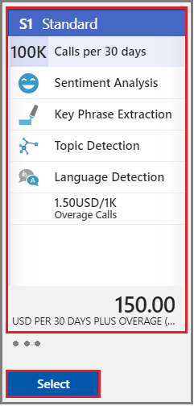

# How to sign up for the Text Analytics API

Text Analytics resources are available 24-7 in the cloud. Before you can upload your content for analysis, you must sign up to get an access key. Each call to the API requires an access key on the request.

+ Start with an Azure Subscription. You can create a [free account](https://azure.microsoft.com/free/) to experiment at no charge.

+ Create a [Cognitive Services API account](https://docs.microsoft.com/azure/cognitive-services/cognitive-services-apis-create-account), choosing the **Text Analytics API**. Your key is generated when you sign up.

For Text Analytics, there is a Free tier for exploration and evaluation, and billable tiers for production workloads. You can have multiple sign-ups in each subscrption: one free, one paid, and so forth. You can switch to a tier offering more transactions if your request volume increases.

There is no service level agreement for services in Preview or the free tier. For more information, see [SLA for Cognitive Services](https://azure.microsoft.com/support/legal/sla/cognitive-services/v1_1/)

## How to change tiers

Start with a Free tier and then transition to a billable tier for production workloads. Standard billing is offered at graduated levels. You can switch tiers and still keep the same endpoint and access keys.

1. Sign in to [Azure portal](https://portal.azure.com) and [find your service](text-analytics-how-to-access-key.md).

2. Click **Price tier**.

   

3. Choose a tier and click **Select**.  The new limits take effect as soon as the selection is processed. 

   

## How billing works

Billing is based on the number of transactions. You can purchase a block of transactions at a specific tier in a monthly billing cycle, and then if you go over, a small overage charge is applied per transaction. If you routinely go over the maximum limit, consider switching to a higher tier.

Please see the [pricing page](https://azure.microsoft.com/pricing/details/cognitive-services/text-analytics/) for more information.

### What constitutes a transaction in the Text Analytics API?
Any annotation to a document counts as a transaction. Batch scoring calls will also take into consideration the number of documents that need to be scored in that transaction. So for instance, if 1,000 documents are sent for sentiment analysis in a single API call, that will count for 1,000 transactions.

## See also 

 [Text Analytics Overview](../overview.md)  
 [Frequently asked questions (FAQ)](../text-analytics-resource-faq.md)

## Next steps

> [!div class="nextstepaction"]
> [Get an access key](text-analytics-how-to-access-key.md)
