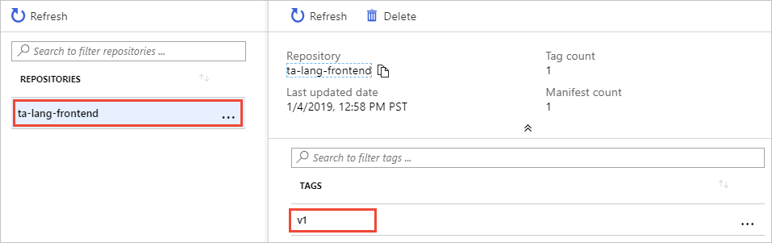
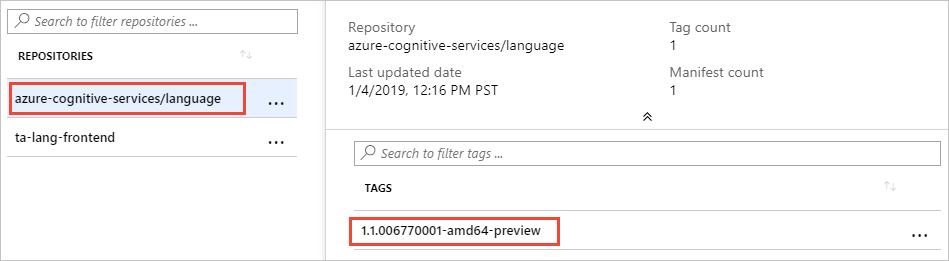
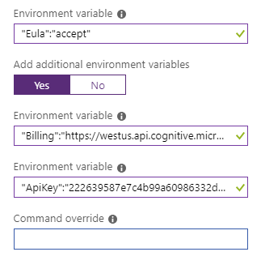
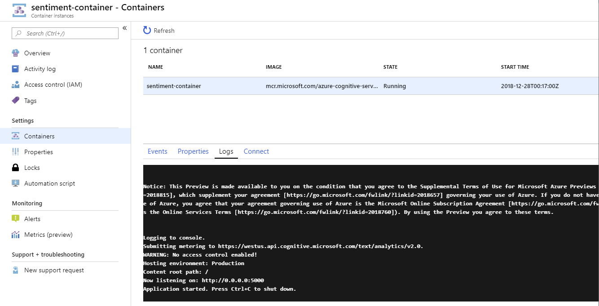

# Deploy the Language detection container to Azure Kubernetes service

The following procedure demonstrates how to deploy the language detection container, with a running sample, to the Azure Kubernetes service, and test it in a web browser. 

## Prerequisites

This procedure requires several tools that must be installed and run locally. Do not use Azure Cloud shell. 

1. Have a valid Azure subscription. The trial and pay-as-you-go subscriptions will both work. 
1. Install [Git](https://git-scm.com/downloads) for your operating system so you can clone the sample used in this procedure. 
1. Install [Azure cli](https://docs.microsoft.com/cli/azure/install-azure-cli?view=azure-cli-latest) or use integrated Azure Cloud shell's **Try it** feature next to each code snippet. 
1. Install [Docker engine](https://www.docker.com/products/docker-engine) and validate that the docker cli works in a terminal.
1. Install [kubectl](https://storage.googleapis.com/kubernetes-release/release/v1.13.1/bin/windows/amd64/kubectl.exe). 


## Running the sample 

This procedure loads and runs the Cognitive Services Container sample for language detection. 

* The sample has two container images, one for the website with its own API. This website is equivalent to your own client-side application that makes requests of the language detection endpoint. The second image is the language detection image returning the detected language of text. 
* Both these images need to be pushed to your own Azure Container Registry.
* Once they are on your own Azure Container Registry, create an Azure Kubernetes service to access these images and run the containers.
* Once the containers are running, use the kubectl cli to watch the containers performance.
* Access the website (client-application) with an HTTP request and see the results. 


## Set up the Azure cli 

If you have access to more than one subscription, make sure to set the correct subscription as the default before creating your resources.

1. Login to Azure.

    ```azurecli
    az login
    ```

1. Get list of subscriptions

    ```azurecli
    az account list -o table
    ```

1. Set Azure subscription default

    ```azurecli
    az account set --subscription <name or id>
    ```

## Create Azure Container Registry service

In order to deploy the container to the Azure Kubernetes service, the container images need to be accessible. Create your own Azure Container Registry service to host the images. 

1. Create a resource group named `cogserv-container-rg` to hold every created in this procedure.

    ```azurecli
    az group create --name cogserv-container-rg --location westus
    ```

    The result looks like: 

    ```json
    {
      "id": "/subscriptions/333d9379-a62c-4b5d-84ab-52f2b0fc40ac/resourceGroups/cogserv-container-rg",
      "location": "westus",
      "managedBy": null,
      "name": "cogserv-container-rg",
      "properties": {
        "provisioningState": "Succeeded"
      },
      "tags": null
    }
    ```

1. Create your own Azure Container Registry named `cogservcontainerregistry`. Prepend your login, such as `pattio`, so the name is unique such as `pattiocogservcontainerregistry`. Do not use dashes or underline characters in the name.

    ```azurecli
    az acr create --resource-group cogserv-container-rg --name pattiocogservcontainerregistry --sku Basic
    ```

    Save the results to get the **loginServer** property:

    ```json
    {
        "adminUserEnabled": false,
        "creationDate": "2019-01-02T23:49:53.783549+00:00",
        "id": "/subscriptions/333d9379-a62c-4b5d-84ab-52f2b0fc40ac/resourceGroups/cogserv-container-rg/providers/Microsoft.ContainerRegistry/registries/pattiocogservcontainerregistry",
        "location": "westus",
        "loginServer": "pattiocogservcontainerregistry.azurecr.io",
        "name": "pattiocogservcontainerregistry",
        "provisioningState": "Succeeded",
        "resourceGroup": "cogserv-container-rg",
        "sku": {
            "name": "Basic",
            "tier": "Basic"
        },
        "status": null,
        "storageAccount": null,
        "tags": {},
        "type": "Microsoft.ContainerRegistry/registries"
    }
    ```

1. Login to your registry

    ```azurecli
    az acr login --name pattiocogservcontainerregistry
    ```

## Get website docker image 

1. The sample code for the language detection container is in the Cognitive Services container repository. Clone the repository to have a local copy of the sample.

    ```console
    git clone https://github.com/Azure-Samples/cognitive-services-containers-samples
    ```

    Once the repository is on your local computer, find the website in the [\dotnet\Language\FrontendService](https://github.com/Azure-Samples/cognitive-services-containers-samples/tree/master/dotnet/Language/FrontendService) directory. There is also a python version if you are comfortable with that language instead. This website acts as the client application calling the language detection API hosted in the language detection container.  

1. Build the docker image for this website. Make sure the console is in the FrontendService directory when you run the following command:

    ```console
    docker build -t ta-lang-frontend  .
    ```

1. Verify the image is in the images list on your local machine:

    ```console
    docker images
    ```

    The response includes the new image:

    ```console
    PS C:\Users\pattio\repos\cognitive-services-containers-samples\dotnet\Language\FrontendService> docker images
    REPOSITORY                      TAG                      IMAGE ID            CREATED             SIZE
    ta-lang-frontend                latest                   0faab2f01682        1 minute ago        1.85GB
    ```

1. Tag image with your Azure Container registry. The format of the command is:

    `docker tag <local-repository-value>:<local-repository-tag> <your-container-registry>/<repository>:<tag>`

    Locally your image probably has the tag of latest. In order to track the version on the Container Registry, change the tag to a version format. For this simple example, use `v1`. 

    ```console
    docker tag ta-lang-frontend:latest pattiocogservcontainerregistry.azurecr.io/ta-lang-frontend:v1
    ```

1. Push the image to the Azure Container registry. 

    ```console
    docker push pattiocogservcontainerregistry.azurecr.io/ta-lang-frontend:v1
    ```

1. Verify the image is in your Container registry. On the Azure portal, on your Container registry, verify the repositories list has this new repository named **ta-lang-frontend**. 

1. Select the **ta-lang-frontend** repository, verify that the only tag in the list is **v1**.

    The first image is in your Azure Container Registry. 

    

## Get language detection docker image 

1. Pull the latest version of the docker image to the local machine. 

    ```console
    docker pull mcr.microsoft.com/azure-cognitive-services/language:1.1.006770001-amd64-preview
    ```

1. Verify the image is in the images list on your local machine:

    ```console
    docker images
    ```

    The response includes the new image:

    ```console
    PS C:\Users\pattio\repos\cognitive-services-containers-samples\dotnet\Language\FrontendService> docker images
    REPOSITORY                                               TAG                      IMAGE ID            CREATED             SIZE
    mcr.microsoft.com/azure-cognitive-services/language      latest                   aaaab2f01682        1 minute ago        843MB
    ```

1. Tag image with your Azure Container registry. Find the latest version and replace the version `1.1.006770001-amd64-preview` if you have a more recent version. 

    ```console
    docker tag mcr.microsoft.com/azure-cognitive-services/language pattiocogservcontainerregistry.azurecr.io/azure-cognitive-services/language:1.1.006770001-amd64-preview
    ```

    No results are returned.

1. Push the image to the Azure Container registry. 

    ```console
    docker push pattiocogservcontainerregistry.azurecr.io/azure-cognitive-services/language:1.1.006770001-amd64-preview
    ```

1. Verify the image is in your Container registry. On the Azure portal, on your Container registry, verify the repositories list has this new repository named **azure-cognitive-services**. 

1. Select the **azure-cognitive-services** repository, verify that the only tag in the list is **1.1.006770001-amd64-preview**.

    

    The second image is in your Azure Container Registry. 


## Get Container Registry credentials

    registry: diberrycontainerregistry001
    registry resourcegroup:diberry-rg-container
    registry loginserver = diberrycontainerregistry001.azurecr.io
    registry username = diberrycontainerregistry001
    registry password = ntRFwOFd9AOmcEUvpOdTEMPwN6D/hTAS


The following steps are needed to get information needed to connect your Container Registry with the Kubernetes service you will create later in this procedure.

1. Create service principal.

    ```azurecli-interactive
    az ad sp create-for-rbac --skip-assignment
    ```

    Save the appId value for step 3 in this section.

    ```json
    {
      "appId": "55962827-4bd0-41c3-aa91-d8cc383a1025",
      "displayName": "azure-cli-2018-12-31-18-39-32",
      "name": "http://azure-cli-2018-12-31-18-39-32",
      "password": "ba839221-f513-4e86-b952-5a8fcdb9610c",
      "tenant": "72f988bf-86f1-41af-91ab-2d7cd011db47"
    }
    ```

1. Get Container Registry id.

    ```azurecli-interactive
    az acr show --resource-group cogserv-container-rg --name pattiowenscogservcontainerregistry --query "id" --output tsv
    ```

    Save the full id value for step 3 in this section. 

1. To grant the correct access for the AKS cluster to use images stored in your Container Registry, create a role assignment. Replace <appId> and <acrId> with the values gathered in the previous two steps.

    ```azurecli-interactive
    az role assignment create --assignee 55962827-4bd0-41c3-aa91-d8cc383a1025 --scope /subscriptions/65a1016d-0f67-45d2-b838-b8f373d6d52e/resourceGroups/diberry-rg-container/providers/Microsoft.ContainerRegistry/registries/diberrycontainerregistry001 --role Reader
    ```

    The result includes the full JSON of the role assignment.

    ```JSON
    {
      "canDelegate": null,
      "id": "/subscriptions/65a1016d-0f67-45d2-b838-b8f373d6d52e/resourceGroups/diberry-rg-container/providers/Microsoft.ContainerRegistry/registries/diberrycontainerregistry001/providers/Microsoft.Authorization/roleAssignments/d85b34d4-b46e-4239-8eab-a10d7bdb95b0",
      "name": "d85b34d4-b46e-4239-8eab-a10d7bdb95b0",
      "principalId": "b183584b-cec4-4307-8dbc-3fa833b3e394",
      "resourceGroup": "diberry-rg-container",
      "roleDefinitionId": "/subscriptions/65a1016d-0f67-45d2-b838-b8f373d6d52e/providers/Microsoft.Authorization/roleDefinitions/acdd72a7-3385-48ef-bd42-f606fba81ae7",
      "scope": "/subscriptions/65a1016d-0f67-45d2-b838-b8f373d6d52e/resourceGroups/diberry-rg-container/providers/Microsoft.ContainerRegistry/registries/diberrycontainerregistry001",
      "type": "Microsoft.Authorization/roleAssignments"
    }
    ```

## Create Azure Kubernetes service

1. Create service

    ```azurecli-interactive
    az aks create --resource-group diberry-rg-container --name diberryAKSCluster --node-count 3  --service-principal 55962827-4bd0-41c3-aa91-d8cc383a1025  --client-secret ba839221-f513-4e86-b952-5a8fcdb9610c  --generate-ssh-keys
    ```

    SSH key files 'C:\Users\diberry\.ssh\id_rsa' and 'C:\Users\diberry\.ssh\id_rsa.pub' have been generated under ~/.ssh to allow SSH access to the VM. If using machines without permanent storage like Azure Cloud Shell without an attached file share, back up your keys to a safe location

1. Get credentials

    ```azurecli-interactive
    az aks get-credentials --resource-group diberry-rg-container --name diberryAKSCluster
    ```

1. List service

    az aks list

1. Verify creation

    kubectl get nodes

1. Create nodes in service

    kubectl apply -f dina-ta-language-aks.yml

1. Delete service

    az aks delete


<!--
### Configure basic settings

container name: sentiment-{username}
container image type: public
container image: mcr.microsoft.com/azure-cognitive-services/sentiment
Subscription: {your subscription}
Resource group: {your resource group}
Location: West US

### Specify container requirements

OS type: Linux
Number of cores: 1
Memory (GB): 2
Networking, Public IP address: yes
DNS name label: sentiment-{username}
Port: 5000
Open additional ports: No
Port protocol: TCP
Advanced, restart policy: Always
Environment variable: "Eula":"accept"
Add Additional environment variables: Yes
Environment variable: "Billing"="{Billing Endpoint URI}"
Environment variable: "ApiKey"="{Billing Key}"






-->
