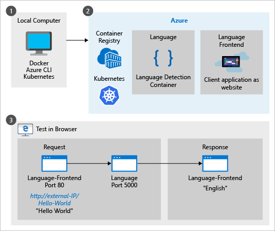
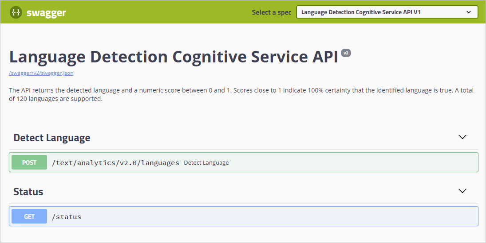

# Deploy the Language detection container to Azure Kubernetes Service

Learn how to deploy the language detection container. This procedure shows you how to create the local Docker containers, push the containers to your own private container registry, run the container in a Kubernetes cluster, and test it in a web browser. Using containers can shift the developers' attention away from managing infrastructure to instead focusing on application development.

## Prerequisites

This procedure requires several tools that must be installed and run locally. Do not use Azure Cloud shell.

* Use an Azure subscription. If you don't have an Azure subscription, create a [free account](https://azure.microsoft.com/free/) before you begin.
* [Git](https://git-scm.com/downloads) for your operating system so you can clone the [sample](https://github.com/Azure-Samples/cognitive-services-containers-samples) used in this procedure.
* [Azure CLI](https://docs.microsoft.com/cli/azure/install-azure-cli?view=azure-cli-latest).
* [Docker engine](https://www.docker.com/products/docker-engine) and validate that the Docker CLI works in a console window.
* [kubectl](https://storage.googleapis.com/kubernetes-release/release/v1.13.1/bin/windows/amd64/kubectl.exe).
* An Azure resource with the correct pricing tier. Not all pricing tiers work with this container:
    * **Text Analytics** resource with F0 or Standard pricing tiers only.
    * **Cognitive Services** resource with the S0 pricing tier.

## Running the sample

This procedure loads and runs the Cognitive Services Container sample for language detection. The sample has two containers, one for the client application and one for the Cognitive Services container. You need to push both these images to your own Azure Container Registry. Once they are on your own registry, create an Azure Kubernetes Service to access these images and run the containers. When the containers are running, use the **kubectl** CLI to watch the containers performance. Access the client application with an HTTP request and see the results.



## The sample containers

The sample has two container images, one for the frontend website. The second image is the language detection container returning the detected language (culture) of text. Both containers are accessible from an external IP when you are done.

### The language-frontend container

This website is equivalent to your own client-side application that makes requests of the language detection endpoint. When the procedure is finished, you get the detected language of a string of characters by accessing the website container in a browser with `http://<external-IP>/<text-to-analyze>`. An example of this URL is `http://132.12.23.255/helloworld!`. The result in the browser is `English`.

### The language container

The language detection container, in this specific procedure, is accessible to any external request. The container hasn't been changed in any way so the standard Cognitive Services container-specific language detection API is available.

For this container, that API is a POST request for language detection. As with all Cognitive Services containers, you can learn more about the container from its hosted Swagger information, `http://<external-IP>:5000/swagger/index.html`.

Port 5000 is the default port used with the Cognitive Services containers.

## Create Azure Container Registry service

To deploy the container to the Azure Kubernetes Service, the container images need to be accessible. Create your own Azure Container Registry service to host the images.

1. Sign in to the Azure CLI

    ```azurecli
    az login
    ```

1. Create a resource group named `cogserv-container-rg` to hold every resource created in this procedure.

    ```azurecli
    az group create --name cogserv-container-rg --location westus
    ```

1. Create your own Azure Container Registry with the format of your name then `registry`, such as `pattyregistry`. Do not use dashes or underline characters in the name.

    ```azurecli
    az acr create --resource-group cogserv-container-rg --name pattyregistry --sku Basic
    ```

    Save the results to get the **loginServer** property. This will be part of the hosted container's address, used later in the `language.yml` file.

    ```console
    > az acr create --resource-group cogserv-container-rg --name pattyregistry --sku Basic
    {
        "adminUserEnabled": false,
        "creationDate": "2019-01-02T23:49:53.783549+00:00",
        "id": "/subscriptions/xxxxxxxx-xxxx-xxxx-xxxx-xxxxxxxxxxxx/resourceGroups/cogserv-container-rg/providers/Microsoft.ContainerRegistry/registries/pattyregistry",
        "location": "westus",
        "loginServer": "pattyregistry.azurecr.io",
        "name": "pattyregistry",
        "provisioningState": "Succeeded",
        "resourceGroup": "cogserv-container-rg",
        "sku": {
            "name": "Basic",
            "tier": "Basic"
        },
        "status": null,
        "storageAccount": null,
        "tags": {},
        "type": "Microsoft.ContainerRegistry/registries"
    }
    ```

1. Sign in to your container registry. You need to login before you can push images to your registry.

    ```azurecli
    az acr login --name pattyregistry
    ```

## Get website Docker image

1. The sample code used in this procedure is in the Cognitive Services containers samples repository. Clone the repository to have a local copy of the sample.

    ```console
    git clone https://github.com/Azure-Samples/cognitive-services-containers-samples
    ```

    Once the repository is on your local computer, find the website in the [\dotnet\Language\FrontendService](https://github.com/Azure-Samples/cognitive-services-containers-samples/tree/master/dotnet/Language/FrontendService) directory. This website acts as the client application calling the language detection API hosted in the language detection container.  

1. Build the Docker image for this website. Make sure the console is in the [\FrontendService](https://github.com/Azure-Samples/cognitive-services-containers-samples/tree/master/dotnet/Language/FrontendService) directory where the Dockerfile is located when you run the following command:

    ```console
    docker build -t language-frontend -t pattiyregistry.azurecr.io/language-frontend:v1 .
    ```

    To track the version on your container registry, add the tag with a version format, such as `v1`. 

1. Push the image to your container registry. This may take a few minutes. 

    ```console
    docker push pattyregistry.azurecr.io/language-frontend:v1
    ```

    If you get an `unauthorized: authentication required` error, login with the `az acr login --name <your-container-registry-name>` command. 

    When the process is done, the results should be similar to:

    ```console
    > docker push pattyregistry.azurecr.io/language-frontend:v1
    The push refers to repository [pattyregistry.azurecr.io/language-frontend]
    82ff52ee6c73: Pushed
    07599c047227: Pushed
    816caf41a9a1: Pushed
    2924be3aed17: Pushed
    45b83a23806f: Pushed
    ef68f6734aa4: Pushed
    v1: digest: sha256:31930445deee181605c0cde53dab5a104528dc1ff57e5b3b34324f0d8a0eb286 size: 1580
    ```

## Get language detection Docker image 

1. Pull the latest version of the Docker image to the local machine. This may take a few minutes. If there is a newer version of this container, change the value from `1.1.006770001-amd64-preview` to the newer version. 

    ```console
    docker pull mcr.microsoft.com/azure-cognitive-services/language:1.1.006770001-amd64-preview
    ```

1. Tag image with your container registry. Find the latest version and replace the version `1.1.006770001-amd64-preview` if you have a more recent version. 

    ```console
    docker tag mcr.microsoft.com/azure-cognitive-services/language pattiyregistry.azurecr.io/language:1.1.006770001-amd64-preview
    ```

1. Push the image to your container registry. This may take a few minutes. 

    ```console
    docker push pattyregistry.azurecr.io/language:1.1.006770001-amd64-preview
    ```

## Get Container Registry credentials

The following steps are needed to get the required information to connect your container registry with the Azure Kubernetes Service you create later in this procedure.

1. Create service principal.

    ```azurecli
    az ad sp create-for-rbac --skip-assignment
    ```

    Save the results `appId` value for the assignee parameter in step 3, `<appId>`. Save the `password` for the next section's client-secret parameter `<client-secret>`.

    ```console
    > az ad sp create-for-rbac --skip-assignment
    {
      "appId": "xxxxxxxx-xxxx-xxxx-xxxx-xxxxxxxxxxxx",
      "displayName": "azure-cli-2018-12-31-18-39-32",
      "name": "http://azure-cli-2018-12-31-18-39-32",
      "password": "xxxxxxxx-xxxx-xxxx-xxxx-xxxxxxxxxxxx",
      "tenant": "xxxxxxxx-xxxx-xxxx-xxxx-xxxxxxxxxxxx"
    }
    ```

1. Get your container registry ID.

    ```azurecli
    az acr show --resource-group cogserv-container-rg --name pattyregistry --query "id" --o table
    ```

    Save the output for the scope parameter value, `<acrId>`, in the next step. It looks like:

    ```console
    > az acr show --resource-group cogserv-container-rg --name pattyregistry --query "id" --o table
    /subscriptions/xxxxxxxx-xxxx-xxxx-xxxx-xxxxxxxxxxxx/resourceGroups/cogserv-container-rg/providers/Microsoft.ContainerRegistry/registries/pattyregistry
    ```

    Save the full value for step 3 in this section. 

1. To grant the correct access for the AKS cluster to use images stored in your container registry, create a role assignment. Replace `<appId>` and `<acrId>` with the values gathered in the previous two steps.

    ```azurecli
    az role assignment create --assignee <appId> --scope <acrId> --role Reader
    ```

## Create Azure Kubernetes Service

1. Create the Kubernetes cluster. All the parameter values are from previous sections except the name parameter. Choose a name that indicates who created it and its purpose, such as `patty-kube`. 

    ```azurecli
    az aks create --resource-group cogserv-container-rg --name patty-kube --node-count 2  --service-principal <appId>  --client-secret <client-secret>  --generate-ssh-keys
    ```

    This step may take a few minutes. The result is: 

    ```console
    > az aks create --resource-group cogserv-container-rg --name patty-kube --node-count 2  --service-principal <appId>  --client-secret <client-secret>  --generate-ssh-keys
    {
      "aadProfile": null,
      "addonProfiles": null,
      "agentPoolProfiles": [
        {
          "count": 2,
          "dnsPrefix": null,
          "fqdn": null,
          "maxPods": 110,
          "name": "nodepool1",
          "osDiskSizeGb": 30,
          "osType": "Linux",
          "ports": null,
          "storageProfile": "ManagedDisks",
          "vmSize": "Standard_DS1_v2",
          "vnetSubnetId": null
        }
      ],
      "dnsPrefix": "patty-kube--65a101",
      "enableRbac": true,
      "fqdn": "patty-kube--65a101-341f1f54.hcp.westus.azmk8s.io",
      "id": "/subscriptions/xxxxxxxx-xxxx-xxxx-xxxx-xxxxxxxxxxxx/resourcegroups/cogserv-container-rg/providers/Microsoft.ContainerService/managedClusters/patty-kube",
      "kubernetesVersion": "1.9.11",
      "linuxProfile": {
        "adminUsername": "azureuser",
        "ssh": {
          "publicKeys": [
            {
              "keyData": "ssh-rsa AAAAB3NzaC...ohR2d81mFC
            }
          ]
        }
      },
      "location": "westus",
      "name": "patty-kube",
      "networkProfile": {
        "dnsServiceIp": "10.0.0.10",
        "dockerBridgeCidr": "172.17.0.1/16",
        "networkPlugin": "kubenet",
        "networkPolicy": null,
        "podCidr": "10.244.0.0/16",
        "serviceCidr": "10.0.0.0/16"
      },
      "nodeResourceGroup": "MC_patty_westus",
      "provisioningState": "Succeeded",
      "resourceGroup": "cogserv-container-rg",
      "servicePrincipalProfile": {
        "clientId": "xxxxxxxx-xxxx-xxxx-xxxx-xxxxxxxxxxxx",
        "keyVaultSecretRef": null,
        "secret": null
      },
      "tags": null,
      "type": "Microsoft.ContainerService/ManagedClusters"
    }
    ```

    The service is created but it doesn't have the website container or language detection container yet.  

1. Get credentials of the Kubernetes cluster. 

    ```azurecli
    az aks get-credentials --resource-group cogserv-container-rg --name patty-kube
    ```

## Load the orchestration definition into your Kubernetes service

This section uses the **kubectl** CLI to talk with the Azure Kubernetes Service. 

1. Before loading the orchestration definition, check **kubectl** has access to the nodes.

    ```console
    kubectl get nodes
    ```

    The response looks like:

    ```console
    > kubectl get nodes
    NAME                       STATUS    ROLES     AGE       VERSION
    aks-nodepool1-13756812-0   Ready     agent     6m        v1.9.11
    aks-nodepool1-13756812-1   Ready     agent     6m        v1.9.11
    ```

1. Copy the following file and name it `language.yml`. The file has a `service` section and a `deployment` section each for the two container types, the `language-frontend` website container and the `language` detection container. 

    [!code-yml[Kubernetes orchestration file for the Cognitive Services containers sample](~/samples-cogserv-containers/Kubernetes/language/language.yml "Kubernetes orchestration file for the Cognitive Services containers sample")]

1. Change the language-frontend deployment lines of `language.yml` based on the following table to add your own container registry image names, client secret, and text analytics settings.

    Language-frontend deployment settings|Purpose|
    |--|--|
    |Line 32<br> `image` property|Image location for the frontend image in your Container Registry<br>`<container-registry-name>.azurecr.io/language-frontend:v1`|
    |Line 44<br> `name` property|Container Registry secret for the image, referred to as `<client-secret>` in a previous section.|

1. Change the language deployment lines of `language.yml` based on the following table to add your own container registry image names, client secret, and text analytics settings.

    |Language deployment settings|Purpose|
    |--|--|
    |Line 78<br> `image` property|Image location for the language image in your Container Registry<br>`<container-registry-name>.azurecr.io/language:1.1.006770001-amd64-preview`|
    |Line 95<br> `name` property|Container Registry secret for the image, referred to as `<client-secret>` in a previous section.|
    |Line 91<br> `apiKey` property|Your text analytics resource key|
    |Line 92<br> `billing` property|The billing endpoint for your text analytics resource.<br>`https://westus.api.cognitive.microsoft.com/text/analytics/v2.1`|

    Because the **apiKey** and **billing endpoint** are set as part of the Kubernetes orchestration definition, the website container doesn't need to know about these or pass them as part of the request. The website container refers to the language detection container by its orchestrator name `language`. 

1. Load the orchestration definition file for this sample from the folder where you created and saved the `language.yml`. 

    ```console
    kubectl apply -f language.yml
    ```

    The response is:

    ```console
    > kubectl apply -f language.yml
    service "language-frontend" created
    deployment.apps "language-frontend" created
    service "language" created
    deployment.apps "language" created
    ```

## Get external IPs of containers

For the two containers, verify the `language-frontend` and `language` services are running and get the external IP address. 

```console
kubectl get all
```

```console
> kubectl get all
NAME                                     READY     STATUS    RESTARTS   AGE
pod/language-586849d8dc-7zvz5            1/1       Running   0          13h
pod/language-frontend-68b9969969-bz9bg   1/1       Running   1          13h

NAME                        TYPE           CLUSTER-IP    EXTERNAL-IP     PORT(S)          AGE
service/kubernetes          ClusterIP      10.0.0.1      <none>          443/TCP          14h
service/language            LoadBalancer   10.0.39.169   104.42.172.68   5000:30161/TCP   13h
service/language-frontend   LoadBalancer   10.0.42.136   104.42.37.219   80:30943/TCP     13h

NAME                                      DESIRED   CURRENT   UP-TO-DATE   AVAILABLE   AGE
deployment.extensions/language            1         1         1            1           13h
deployment.extensions/language-frontend   1         1         1            1           13h

NAME                                                 DESIRED   CURRENT   READY     AGE
replicaset.extensions/language-586849d8dc            1         1         1         13h
replicaset.extensions/language-frontend-68b9969969   1         1         1         13h

NAME                                DESIRED   CURRENT   UP-TO-DATE   AVAILABLE   AGE
deployment.apps/language            1         1         1            1           13h
deployment.apps/language-frontend   1         1         1            1           13h

NAME                                           DESIRED   CURRENT   READY     AGE
replicaset.apps/language-586849d8dc            1         1         1         13h
replicaset.apps/language-frontend-68b9969969   1         1         1         13h
```

If the `EXTERNAL-IP` for the service is shown as pending, rerun the command until the IP address is shown before moving to the next step. 

## Test the language detection container

Open a browser and navigate to the external IP of the `language` container from the previous section: `http://<external-ip>:5000/swagger/index.html`. You can use the `Try it` feature of the API to test the language detection endpoint. 



## Test the client application container

Change the URL in the browser to the external IP of the `language-frontend` container using the following format: `http://<external-ip>/helloworld`. The English culture text of `helloworld` is predicted as `English`.

## Clean up resources

When you are done with the cluster, delete the Azure resource group. 

```azure-cli
az group delete --name cogserv-container-rg
```

## Related information

* [kubectl for Docker Users](https://kubernetes.io/docs/reference/kubectl/docker-cli-to-kubectl/)

## Next steps 

* Use more [Cognitive Services Containers](../../cognitive-services-container-support.md)
* Use the [Text Analytics Connected Service](../vs-text-connected-service.md)


<!--
kubectl get secrets

>az aks browse --resource-group diberry-cogserv-container-rg --name diberry-kubernetes-languagedetection

kubectl proxy

http://localhost:8001/api/v1/namespaces/kube-system/services/kubernetes-dashboard/proxy/#!/pod/default/language-frontend-6d65bdb77c-8f4qv?namespace=default

kubectl describe pod language-frontend-6d65bdb77c
-->