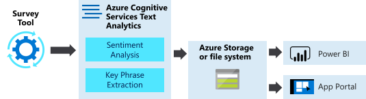
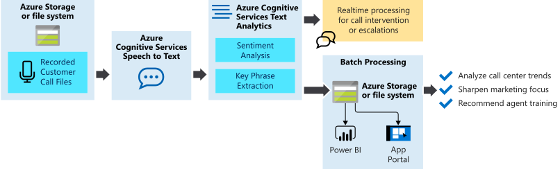
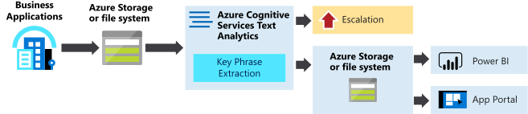
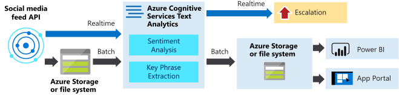

# Example user scenarios for the Text Analytics API

The Text Analytics API is a cloud-based service that provides advanced natural language processing over text. This article describes some example use cases for integrating the API into your business solutions and processes. 

## Analyze Survey results​

Draw insights from customer and employee survey results by processing the raw text responses using Sentiment Analysis. Aggregate the findings for analysis, follow up, and driving engagements.​

## Analyze recorded inbound customer calls​

Extract insights from customer services calls using Text to Speech, Sentiment Analysis, and Key Phrase Extraction. Display the results in Power BI dashboard or a portal to better understand customers, highlight customer service trends, and drive customer engagement.​ Send API requests as a batch for reporting, or in real-time for intervention. See [sample code](https://github.com/rlagh2/callcenteranalytics).​

## Process and categorize support incidents​

Use Key Phrase Extraction and Entity Recognition to process support requests submitted in unstructured textual format. Use the extracted phrases and entities to categorize the requests for resource planning and trend analysis.

## Monitor your product’s social media feeds​

Monitor user product feedback on your product’s twitter or Facebook page. Use the data to analyze customer sentiment toward new products launches, extract key phrases about features and feature requests, or address customer complaints  as they happen.​

## Next steps

* [What is the Text Analytics API?](overview.md)
* [Send a request to the Text Analytics API using C#](quickstarts/csharp.md)
