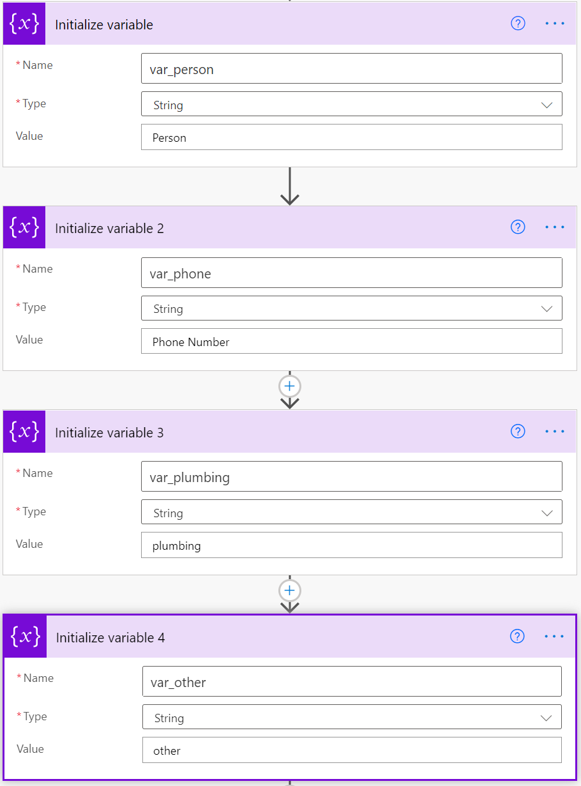

# Extract information in Excel using Text Analytics and Power Automate 

Learn how to use Text Analytics to extract information from text data in your Excel spreadsheet without having to write code.

In this tutorial, you'll learn how to:

> [!div class="checklist"]
> * Use Power Automate to...
> * Upload Excel data to OneDrive for business...
> * Extract information...

## Prerequisites

- A Microsoft Azure account. [Start a free trial](https://azure.microsoft.com/free/) or [sign in](https://portal.azure.com/).
- A Cognitive Services API account with the Text Analytics API. If you don't have one, you can [sign up](../../cognitive-services-apis-create-account.md)
 and use the free tier for 5,000 transactions/month (see [pricing details](https://azure.microsoft.com/pricing/details/cognitive-services/text-analytics/) to complete this tutorial.
- The [Text Analytics key](../../cognitive-services-apis-create-account.md#get-the-keys-for-your-resource) that was generated for you during sign-up.
- Customer comments. You can use our example data.
- Office 360

## Load your text data

We have a spreadsheet of issues reported to an apartment complex management. We want to classify the issues into two categories: plumbing and other.

The issue is reported in raw text. We will use Text Analytics’ Named Entity Recognition to extract person and phone number. We will look for the word “plumbing” in the description to categorize the issues. 

> [!div class="mx-imgBorder"] 
> :::image type="content" source="../media/tutorials/excel/example-data.png" alt-text="Examples from the Excel file.":::

## Create a new Power Automate workflow

Go to the Power Automate site, and login. Then click **Create** and **Scheduled flow**.

> [!div class="mx-imgBorder"] 
> :::image type="content" source="../media/tutorials/excel/flow-creation.png" alt-text="The flow creation screen.":::

On the **Build a scheduled flow** page, initialize your flow with the following fields:

|Field |Value  |
|---------|---------|
|**Flow name**     | **Scheduled Review** or another name.         |
|**Starting**     |  Enter the current date and time.       |
|**Repeat every**     | **1 hour**        |

## Add variables to the flow

Create variables representing the information that will be extracted from the Excel file.

1. Click **New Step** and search for **Initialize variable**. Do this four times, to create four variables.

    > [!div class="mx-imgBorder"] 
    > :::image type="content" source="../media/tutorials/excel/initialize-variables.png" alt-text="Initialize variables.":::

Add the following information to the variables you created. They represent the columns of the Excel file. If any variables are collapsed, you can click on them to expand them.

> [!div class="mx-imgBorder"] 
> 

## Read the excel file

Click New Step and type Excel, then select Update a Row from Actions.

Select the options to fill in the fields as below. This requires the sample Excel file to have been uploaded to One Drive for Business.

:::row:::
   :::column span="2":::
        > [!div class="mx-imgBorder"] 
        > :::image type="content" source="../media/tutorials/excel/list-excel-rows.png" alt-text="add excel rows.":::
   :::column-end:::
   :::column span="":::
        > [!div class="mx-imgBorder"] 
        > :::image type="content" source="../media/tutorials/excel/list-rows-present.png" alt-text="add excel rows.":::
   :::column-end:::
:::row-end:::

Add an Apply to each action.

> [!div class="mx-imgBorder"] 
> :::image type="content" source="../media/tutorials/excel/add-an-apply.png" alt-text="add an apply command.":::

Select output from spreadsheet. Click inside the box and select value.

> [!div class="mx-imgBorder"] 
> :::image type="content" source="../media/tutorials/excel/select-output.png" alt-text="Select output from the excel file.":::

## Send a request to the Text Analytics API

If you haven’t already, you need to create a Text Analytics resource in the Azure Portal.

### Create a Text Analytics connection

You can skip this step if you have already created a Text Analytics connection. Click on the ellipsis on the top right corner, the click  + Add new connection under My Connections.

Go to the Azure Portal’s Quickstart Page, and get the following information for your Text Analytics resource (see here how to create a resource):

In your flow, enter the following information to create a new Text Analytics connection.

| Field           | Value                                                                                                             |
|-----------------|-------------------------------------------------------------------------------------------------------------------|
| Connection Name | enter the name of the Text Analytics Resource you created in the Azure Portal. For example, `TAforPowerAutomate`. |
| Account key     | Copy the value from Key1 field.                                                                                   |
| Site URL        | copy the value from Endpoint field.                                                                               |

> [!div class="mx-imgBorder"] 
> :::image type="content" source="../media/tutorials/excel/add-credentials.png" alt-text="Add Text Analytics credentials to your flow.":::
