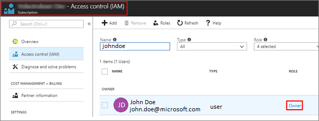
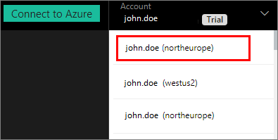

# Create a Video Indexer account connected to Azure

When creating a Video Indexer account, you can choose a free trial account (where you get a certain number of free indexing minutes) or a paid option (where you are not limited by the quota). With free trial, Video Indexer provides up to 600 minutes of free indexing to website users and up to 2400 minutes of free indexing to API users. With paid option, you create a Video Indexer account that is connected to your Azure subscription and an Azure Media Services account. You pay for minutes indexed as well as the Media Account related charges. 

This article shows how to create a Video Indexer account that's linked to an Azure subscription and an Azure Media Services account. 

## Prerequisites

* An Azure subscription. 

    If you don't have an Azure subscription yet, sign up for [Azure Free Trial](https://azure.microsoft.com/free/).

* An Azure Active Directory (AD) domain. 

    If you don't have an Azure AD domain, create this domain with your Azure subscription. For more information, see [Managing custom domain names in your Azure Active Directory](../../active-directory/users-groups-roles/domains-manage.md)

* A user and member in your Azure AD domain. You'll use this member when connecting your Video Indexer account to Azure.

    This user should meet these criteria:

    * Be an Azure AD user with a work or school account, not a personal account, such as outlook.com, live.com, or hotmail.com.
        
        

    *  Be a member in your Azure subscription with either an Owner role, or both Contributor and User Access Administrator roles. A user can be added twice, with 2 roles. Once with Contributor and once with user Access Administrator.

        

* Register the EventGrid resource provider using the Azure portal.

    In the [Azure portal](https://portal.azure.com/), go to **Subscriptions** > [subscription] > **ResourceProviders** > **Microsoft.EventGrid**. If not in the "Registered" state, click **Register**. It takes a couple of minutes to register. 

    

## Connect to Azure

1. Browse to the [Video Indexer](https://www.videoindexer.ai/) website and sign in.

2. Click on the **Connect to Azure** button:

    

3. When the subscriptions list appears, select the subscription you want to use. 

    

4. Select an Azure region from the supported locations: West US 2, North Europe, or East Asia.
5. Under **Azure Media Services account**, choose one of these options:

    * To create a new Media Services account, select **Create new resource group**. Provide a name for your resource group.

        Azure will create your new account in your subscription, including a new Azure Storage account. Your new Media Services account has a default initial configuration with a Streaming Endpoint and 10 S3 Reserved Units.
    * To use an existing Media Services account, select **Use existing resource**. From the accounts list, select your account.

        Your Media Services account must have the same region as your Video Indexer account. To minimize indexing duration and low throughput, adjust the type and number of Reserved Units to **10 S3 Reserved Units** in your Media Services account.
    * To manually configure your connection, click the **Switch to manual configuration**. 
    
        You may want to manually configure your connection, if for some reason the automatic option fails to complete, or if your setup and configuration is different than the common cases, or you want to have full visibility and control over the settings. 
        
        In the **Connect Video Indexer to an Azure subscription**, provide the following information.

        |Setting|Description|
        |---|---|
        |Video Indexer account region|The name of the Video Indexer account region. For better performance and lower costs, it is highly recommended to specify the name of the region where the Azure Media Services resource and Azure Storage account are located. |
        |Azure Active Directory (AAD) tenant|The name of the Azure AD tenant, for example "contoso.onmicrosoft.com". The tenant information can be retrieved from the Azure portal. Place your cursor over the name of the signed-in user in the top right corner.|
        |Subscription ID|The Azure subscription under which this connection should be created. The subscription ID can be retrieved from the Azure portal. Click on **All services** in the left panel, and search for "subscriptions". Select, **Subscriptions** and choose the desired ID from the list of your subscriptions.|
        |Azure Media Services resource group name|The name for the resource group in which to the Media Services account exists.|
        |Media service resource name|The name of the Azure Media Services resource.|
        |Application ID|The Azure AD application ID with permissions for the specified Media Services account. For more information, see [Use service principal authentication](../../media-services/previous/media-services-portal-get-started-with-aad.md#service-principal-authentication).|
        |Application Key|For more information, see [Use service principal authentication](../../media-services/previous/media-services-portal-get-started-with-aad.md#service-principal-authentication).|

6. When you're done, choose **Connect**. This operation might take up to a few minutes. 

    After you're connected to Azure, your new Video Indexer account appears in the account list:

    

7. Browse to your new account: 

    

## Considerations

The following Azure Media Services related considerations apply:

* If you connected to a new Media Services account, you will see a new Resource Group, Media Services account, and a Storage account in your Azure subscription.
* If you connected to a new Media Services account, Video Indexer will set the media **Reserved Units** to 10 S3 units:

    

* If you connected to an existing Media Services account, Video Indexer does not change the existing media **Reserved Units** configuration.

    You might need to adjust the type and number of media **Reserved Units**, according to your planned load. Keep in mind that if your load is high and you don’t have enough units or speed, videos processing can result in timeout failures.

* If you connected to a new Media Services account, Video Indexer automatically starts the default **Streaming Endpoint** in it:

    

* If you connected to an existing Media Services account, Video Indexer does not change the default Streaming Endpoint configuration. If there is no running **Streaming Endpoint**, you will not be able to watch videos from this Media Services account or in Video Indexer.

## Next steps

You can programmatically interact with your trial account and/or with your Video Indexer accounts that are connected to azure by following the instructions in: [Use APIs](video-indexer-use-apis.md).

You should use the same Azure AD user you used when connecting to Azure.

