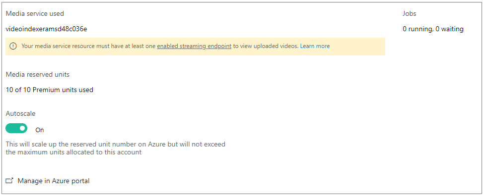

# Manage a Video Indexer account connected to Azure

This article demonstrates how to manage a Video Indexer account that is connected to your Azure subscription and an Azure Media Services account.

> [!NOTE]
> You have to be the Video Indexer account owner to do account configuration adjustments discussed in this topic.

## Prerequisites

Connect your Video Indexer account to Azure, as described in [Connected to Azure](connect-to-azure.md). 

Make sure to follow [Prerequisites](connect-to-azure.md#prerequisites) and review [Considerations](connect-to-azure.md#considerations) in the article.

## Examine account settings

This section examines settings of your Video Indexer account.

To view settings:

1. Click on the user icon in the top right corner and select **Settings**.

    

2. On the **Settings** page, select the **Account** tab.

If your Videos Indexer account is connected to Azure, you see the following:

* The name of the underlying Azure Media Services account.
* The number of indexing jobs running and queued.
* The number and type of allocated Reserved Units.

If your account needs some adjustments, you will see relevant errors and warnings about your account configuration on the **Settings** page. The messages contain links to exact places in Azure portal where you need to make changes. For more information, see the [errors and warnings](#errors-and-warnings) section that follows.

## Auto-scale reserved units

The **Settings** page enables you to set the autoscaling of Media Reserved Units (RU). If the option is **On**, you can allocate the maximum number of RUs and be sure that Video Indexer stops/starts RUs automatically. With this option, you don't pay extra money for idle time but also do not wait for indexing jobs to complete a long time when the indexing load is high.

Auto-scale does not scale below 1 RU or above the default limit of the Media Services account. In order to increase the limit, create a service request. For information about quotas and limitations and how to open a support ticket, see [Quotas and limitations](../../media-services/previous/media-services-quotas-and-limitations.md).

## Errors and warnings

If your account needs some adjustments, you see relevant errors and warnings about your account configuration on the **Settings** page. The messages contain links to exact places in Azure portal where you need to make changes. This section gives more details about the error and warning messages.

* Event Grid

    You have to register the EventGrid resource provider using the Azure portal. In the [Azure portal](https://portal.azure.com/), go to **Subscriptions** > [subscription] > **ResourceProviders** > **Microsoft.EventGrid**. If not in the **Registered** state, click **Register**. It takes a couple of minutes to register. 

* Streaming Endpoint

    Make sure the underlying Media Services account has the default **Streaming Endpoint** in a started state. Otherwise, you will not be able to watch videos from this Media Services account or in Video Indexer.

* Media Reserved Units 

    You must allocate Media Reserved Units on your Media Service resource in order to index videos. For optimal indexing performance, it's recommended to allocate at least 10 S3 Reserved Units. For pricing information, see the FAQ section of the [Media Services pricing](https://azure.microsoft.com/pricing/details/media-services/) page.   

## Next steps

You can programmatically interact with your trial account and/or with your Video Indexer accounts that are connected to azure by following the instructions in: [Use APIs](video-indexer-use-apis.md).

You should use the same Azure AD user you used when connecting to Azure.
