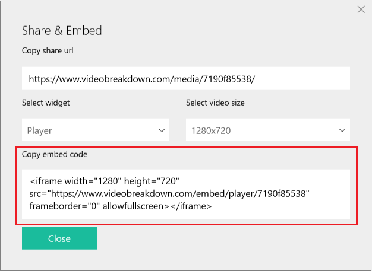
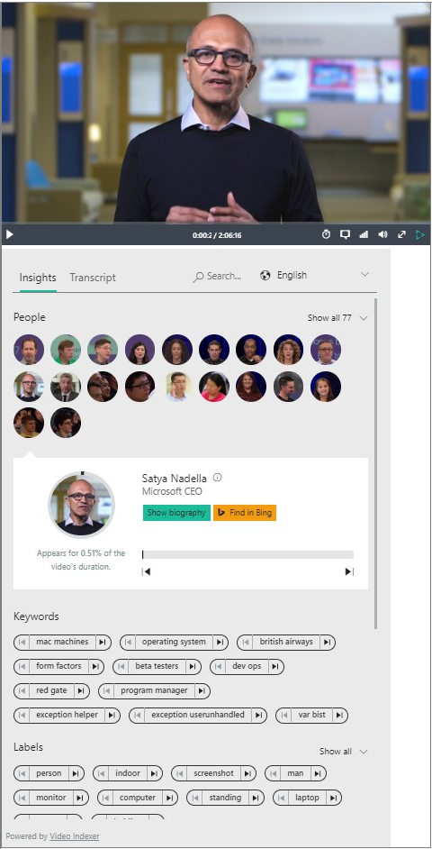

# Embed Video Indexer widgets into your applications

Video Indexer supports embedding two types of widgets into your application: **Cognitive Insights** and **Player**. A **Cognitive Insights** widget includes all visual insights that were extracted from your video indexing process. A **Player** widget enables you to stream the video using adaptive bit rate.

## Embedding public content

1. Sign in to your [Video Indexer](https://vi.microsoft.com) account. 
2. Click the "embed" button that appears below the video.

	

	After clicking the button, an embed modal will appear on the screen where you can choose what widget you want to embed in your application.
	Selecting a widget (**Player** or **Cognitive Insights**), generates the embedded code for you to paste in your application.
 
3. Choose the type of widget you want (**Cognitive Insights** or **Player**).
4. Copy the embed code, and add to your application. 

	

## Embedding private (or Org) content

You can get embed codes from embed popups (as shown in the previous section) for **Public** videos only. 

If you want to embed a **Private** video, you have to pass an access token in the **iframe**'s **src** attribute:

     https://www.videobreakdown.com/embed/[insights | player]/<VideoId>/?accessToken=<accessToken>
    
Use the **GetInsightsWidgetUrl** API to get a URL for a Cognitive Insights widget. The URL includes the access token. Specify this URL as the **iframe**'s **src** value.

## Widgets interaction

The **Cognitive Insights** widget can interact with a video on your application. This section shows how to achieve this interaction.

### Cross-origin communications

To get Video Indexer widgets to communicate with other components, the Video Indexer service does the following:

- Uses the cross-origin communication HTML5 method **postMessage** and 
- Validates the message across videobreakdown.com origin. 

If you choose to implement your own player code and do the integration with **Cognitive Insights** widgets, it is your responsibility to validate the origin of the message that comes from videobreakdown.com.

### Embed both types of widgets in your application / blog (recommended) 

This section shows how to achieve interaction between two Video Indexer widgets so when a user clicks the insight control on your application, the player jumps to the relevant moment.

	 

1. Copy the **Player** widget embed code.
2. Copy the **Cognitive Insights** embed code.
3. Add the https://breakdown.blob.core.windows.net/public/vb.widgets.mediator.js file to handle the communication between the two widgets.

	

Now when a user clicks the insight control on your application, the player jumps to the relevant moment.

For more information, see [this demo](https://videobreakdown.portal.azure-api.net/demo-all-breakdown-widgets).

### Embed the Cognitive Insights widget and use Azure Media Player to play the content

This section shows how to achieve interaction between a **Cognitive Insights** widget and an Azure Media Player instance using the [AMP plugin](https://breakdown.blob.core.windows.net/public/amp-vb.plugin.js).
 
1. Add a Video Indexer plugin for the AMP player.

		

2. Instantiate Azure Media Player with the Video Indexer plugin.
		// Init Source
		function initSource() {
		    var tracks = [{
			kind: 'captions',
			// Here is how to load vtt from VI, you can replace it with your vtt url.
			src: this.getSubtitlesUrl("c4c1ad4c9a", "English"),
			srclang: 'en',
			label: 'English'
		    }];

		    myPlayer.src([
			{
			    "src": "//amssamples.streaming.mediaservices.windows.net/91492735-c523-432b-ba01-faba6c2206a2/AzureMediaServicesPromo.ism/manifest",
			    "type": "application/vnd.ms-sstr+xml"
			}
		    ], tracks);
		}

		// Init your AMP instance
		var myPlayer = amp('vid1', { /* Options */
		    "nativeControlsForTouch": false,
		    autoplay: true,
		    controls: true,
		    width: "640",
		    height: "400",
		    poster: "",
		    plugins: {
			videobreakedown: {}
		    }
		}, function () {
		    // Activate the plugin
		    this.videobreakdown({
			videoId: "c4c1ad4c9a",
			syncTranscript: true,
			syncLanguage: true
		    });

		    // Set the source dynamically
		    initSource.call(this);
		});

3. Copy the **Cognitive Insights** embed code.

You should be able now to communicate with your Azure Media Player.

For more information, see [this demo](https://videobreakdown.portal.azure-api.net/demo-your-amp).

### Embed Video Indexer Cognitive Insights widget and use your own player (could be any player)

If you use your own player, you have to take care of manipulating your player yourself in order to achieve the communication. 

1. Insert your video player.

	For example, a standard HTML5 player

		<video id="vid1" width="640" height="360" controls autoplay preload>
		   <source src="//breakdown.blob.core.windows.net/public/Microsoft%20HoloLens-%20RoboRaid.mp4" type="video/mp4" /> 
		   Your browser does not support the video tag.
		</video>    

2. Embed the Cognitive Insights widget.
3. Implement communication for your player by listening to the "message" event. For example:

		

For more information, see [this demo](https://videobreakdown.portal.azure-api.net/demo-your-player).

## Adding subtitles

If you embed Video Indexer insights with your own AMP player, you can use the **GetVttUrl** method to get closed captions (subtitles). You can also use call a javascript method from the Video Indexer AMP plugin **getSubtitlesUrl** (as shown earlier). 

## Customizing embeddable widgets

### Cognitive insights widget
You can choose the types of insights you want by specifying them as a value to the  following URL parameter added to the the embed code you get (from API or from the web application):

**&widgets=**<list of wanted widgets>

The possible values are: people, keywords, sentiments, transcript, search.

For example, if you want to embed widget containing only people and search insights the iframe embed URL will look like this:
https://www.videoindexer.ai/embed/insights/c4c1ad4c9a/?widgets=people,search

### Player widget
If you embed Video Indexer player you can choose the size of the player by specifying the size of the iframe.

For example :
<iframe width="640" height="360" src="https://www.videoindexer.ai/embed/player/{id}” frameborder="0" allowfullscreen />

By default Video Indexer player will have auto generated closed captions based on the transcript of the video that was extracted from the video with the source language that was selected when the video was uploaded.

If you want to embed with a different language you can add **&captions=< Language | ”all” | “false” >** to the embed player URL or put “all” as the value if you want to have all available languages captions.
If you want the captions to be dispalyed by defualt you can pass **&showCaptions=true**

The embed URL then will look like this : https://www.videoindexer.ai/embed/player/9a296c6ec3/?captions=italian. If you want to disable captions you can pass “false” as value for captions parameter.

Auto play – by default the player will start playing the video. you can choose not to by passing &autoplay=false to the embed URL above.

## Next steps

For information about how to view and edit Video Indexer insights, see [this](video-indexer-view-edit.md) topic.

## See also

[Video Indexer overview](video-indexer-overview.md)
