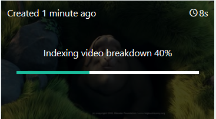

# Sign up and upload your first video

This getting started tutorial shows how to sign in to the Video Indexer website and how to upload your first video.

When creating a Video Indexer account, you can choose a free trial account (where you get a certain number of free indexing minutes) or a paid option (where you are not limited by the quota). With free trial, Video Indexer provides up to 600 minutes of free indexing to website users and up to 2400 minutes of free indexing to API users. With paid option, you create a Video Indexer account that is [connected to your Azure subscription and a Azure Media Services account](connect-to-azure.md). You pay for minutes indexed as well as the Azure Media Services account related charges. 

## Sign up for Video Indexer

To start developing with Video Indexer, browse to the the [Video Indexer](https://www.videoindexer.com) website and sign up.

## Upload a video using the Video Indexer website

1. Sign in on the [Video Indexer](https://www.videoindexer.ai/) website.
2. To upload a video, press the **Upload** button or link.

    

    Once your video has been uploaded, Video Indexer starts indexing and analyzing the video.

     

    Once Video Indexer is done analyzing, you will get a notification with a link to your video and a short description of what was found in your video. For example: people, topics, OCRs.

## Next steps

You can now use the [Video Indexer](video-indexer-view-edit.md) webiste or [Video Indexer Developer Portal](video-indexer-use-apis.md) to see the insights of the video. 

## See also

[Video Indexer overview](video-indexer-overview.md)

[Start using APIs](video-indexer-use-apis.md).

