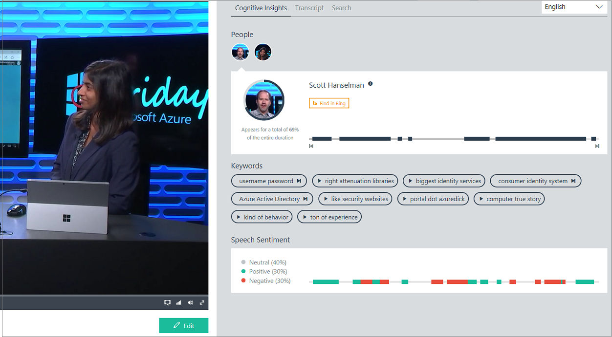

# Examine the Video Indexer output

When you call the **Get Breakdowns** API and the response status is OK, you get a detailed JSON output as the response content. The JSON content contains details of the specified video insights including (transcript, OCRs, people). The details include keywords (topics), faces, blocks. Each block includes time ranges, transcript lines, OCR lines, sentiments, faces, and block thumbnails.

You can use the **Get Breakdowns** API to get the full breakdown of a video as a JSON content.  
 
	GET https://videobreakdown.azure-api.net/Breakdowns/Api/Partner/Breakdowns/63c6d532ff HTTP/1.1
	Host: videobreakdown.azure-api.net
	Ocp-Apim-Subscription-Key: ••••••••••••••••••••••••••••••••
	
You can also visually examine the video's summarized insights by pressing the **Play** button on the video in the Video Indexer portal. For more information, see [View and edit video insights](video-indexer-view-edit.md).

This topic examines the JSON content returned by the  **Get Breakdowns** API.
 
>[!NOTE]
> Make sure to review the [concepts](video-indexer-concepts.md) topic.	

## Root elements

Attribute | Description
---|---
id|The id of this video. For example, "63c6d532ff".
partition|A logical partition that the user can specify in upload in order to search for it later.
name|The name of the video. For example, "Azure Monitor".
description|Description of the video. For example, "John Kemnetz joins Scott Hanselman to show how to unlock the power of Azure monitoring data with Azure Monitor. "
userName|The creator of the video. For example, "Channel9 Videos".
createTime |Time created. For example, "2017-03-31T16:36:41.4504249+00:00".
privacyMode|Your video can have one of the following modes: **Private**, **Public**. **Public** - the video is visible to everyone in your account and anyone that has a link to the video. **Private** - the video is visible to everyone in your account.
isOwned|True, if the current user owns the video. Otherwise, false.  
isBase|True, if the breakdown is based on a source video. False, if the breakdown is of a playlist that is derived from another breakdown.
durationInSeconds|Duration of the video.
summarizedInsights|Contains one [summarizedInsights](#summarizedInsights).
breakdowns|May contain one or more [breakdowns](#breakdowns)
social|Contains one **social** element that describes number of likes and views of the video.

## summarizedInsights

This section shows the summary of the insights.

Attribute | Description
---|---
name|The name of the video. For example, "Azure Monitor".
shortId|The id of the video. For example, "63c6d532ff".
privacyMode|Your breakdown can have one of the following modes: **Private**, **Public**. **Public** - the video is visible to everyone in your account and anyone that has a link to the video. **Private** - the video is visible to everyone in your account.
duration|Contains one duration that describes the time an insight occurred. Duration is in seconds.
thumbnailUrl|The URL to the video's thumbnail.
faces|May contain one or more [faces](#faces)
topics|May contain one or more [topics](#topics)
sentiments|May contain one or more [sentiments](#sentiments)
audioEffects| May contain one or more [audioEffects](#audioEffects)

## breakdowns

This section shows the details of the insights.

Attribute | Description
---|---
id|The breakdown id. For example, "63c6d532ff".
state|The processing state of the given breakdown id. Could be one of the following: Uploaded, Processing, Processed, Failed.
processingProgress|The progress. For example, "10%".
externalId| You can set externalId during upload. For example, "4f9c3500-eca7-4ab3-987e-a745017af698". You can later search for your videos by this external id.
externalUrl|You can set externalUrl during upload. 
metadata|You can set metadata during upload. 
insights|May contain one or more [insights](#insights)
thumbnailUrl|For example, "https://www.videobreakdown.com/api/Thumbnail/63c6d532ff/b9316989-3467-4031-bf6a-27ee3c909bb4"
publishedUrl|The published URL. For example, "https://BreakdownMedia.azureedge.net:443/d5e5232d-48e2-4fbc-9893-0ea6335da563/Azure%20Monitor%20%20Azure%20Friday.ism/manifest".
viewToken|The bearer token
sourceLanguage|The source language. The following are supported: Chinese, English, French, German, Italian, Japanese, Portuguese, Russian, Spanish.
language|The language of the transcript.

## insights

Attribute | Description 
---|---
transcriptBlocks|May contain one or more [transcriptBlocks](#transcriptBlocks)
topics|May contain one or more [topics](#topics)
faces|May contain one or more [faces](#faces)
participants|May contain one or more [participants](#participants)
contentModeration|May contain one [contentModeration](#contentModeration)
audioEffectsCategories|May contain one or more [audioEffectsCategories](#audioEffectsCategories)

## faces

### summarizedInsights

**faces** that appear under **summarizedInsights**, show a summary of each face found in the video.

Attribute | Description 
---|---
id|The id of a person. For example, 11775.
shortId|The short id. Because a playlist may be derived from several breakdowns, this id is needed to find out which of these breakdowns is the origin of each face.  
name|If the face is recognized, the name of the person is added. For example, "Scott Hanselman". If the face is unknown, "Unknown #" is added. 
description|If the face is recognized, the description is populated based on the Bing API search. Otherwise, the description is **null**.
title|If the face is recognized, the description is populated based on the Bing API search. Otherwise, the title is **null**.
thumbnailUrl|The thumbnail URL. For example, "/api/Thumbnail/63c6d532ff/616468f0-1636-4efa-94e7-262f2e575059".
appearances|May contain one or more [appearances](#appearances)
seenDuration|For how long the face was seen (in seconds).
seenDurationRatio|Presence relative to the video duration (0-1).

### breakdown insights

**faces** that appear under **breakdowns**, describe details about each face found in the video.

Attribute | Description 
---|---
id|The id of a person. For example, 11775.
bingId|
name|If the face is recognized, the name of the person is added. For example, "Scott Hanselman". If the face is unknown, "Unknown #" is added. 
thumbnailId|For example, "616468f0-1636-4efa-94e7-262f2e575059".
description|If the face is recognized, the description is populated based on the Bing API search. Otherwise, the description is **null**.
title|If the face is recognized, the description is populated based on the Bing API search. Otherwise, the title is **null**.
imageUrl|This URL points to an image that is taken from the source video.  
confidence|
knownPersonId|The id of a known person (for example, celebrity). If a person is not known, the id contains zeros. For example, "e3eaff5f-ee1b-4eac-80ce-ebac47aadf64".

## topics

### summarizedInsights

**topics** that appear under **summarizedInsights**, show a summary of each topic found in the video.

Attribute | Description 
---|---
name|The topic name (for example, "Azure"). 
appearances|May contain one or more [appearances](#appearances).
isTranscript|True, if found in a transcript. False, if found in an OCR.

### breakdown insights

**topics** that appear under **breakdowns**, describe details about each topic found in the video.

Attribute | Description 
---|---
id|
name|
stem|
words|
rank|

## sentiments

Attribute | Description
---|---
sentimentKey| Currently, the following sentiments are supported: Positive, Neutral, Negative. 
appearances|May contain one or more [appearances](#appearances)|.
seenDurationRatio|Presence relative to the video duration (0-1).

## audioEffects

Attribute | Description 
---|---
audioEffectKey| Valid values are: Speech, Silence, HandClaps.
appearances|May contain one or more [appearances](#appearances)
seenDurationRatio|Presence relative to the video duration (0-1).
seenDuration|For how long the audio effect was present (in seconds).

## appearances

Attribute | Description 
---|---
startTime| Time value.
endTime|Time value.
startSeconds| Time value.
endSeconds| Time value.

## participants

Attribute | Description 
---|---
id|The id of the participant.
name|The name of the participant. For example, "Speaker #1".
pictureUrl|The **pictureUrl** attribute is reserved for future use.

## contentModeration

Attribute | Description 
---|---
adultClassifierValue|
bannedWordsCount|
bannedWordsRatio|
isSuspectedAsAdult|
isAdult|

## audioEffectsCategories

Attribute | Description 
---|---
type|Id of the category.
key|One of the following: Speech, Silence, HandClaps. 

## transcriptBlocks

Attribute | Description
---|---
id|Id of the block.
lines|May contain one or more [lines](#lines)
sentimentIds|The **sentimentIds** attribute is reserved for future use.
thumbnailIds|The **thumbnailIds** attribute is reserved for future use.
sentiment|The sentiment in the block (0-1, negative to positive).
faces|May contain one or more [faces](#faces).
ocrs|May contain one or more [ocrs](#ocrs).
audioEffectInstances|May contain one or more [audioEffectInstances](#audioEffectInstances).
scenes|May contain one or more [scenes](#scenes).
annotations|May contain zero or more **annotations**.

## ocrs

Describes at what point in the video the text content was found. 

Attribute | Description 
---|---
timeRange|The time range in the original video.
adjustedTimeRange|AdjustedTimeRange is the time range relative to the current playlist. Since you can create a playlist from different lines of different videos, you can take a 1-hour video and use just 1 line from it, for example, 10:00-10:15. In that case, you will have a playlist with 1 line, where the time range is 10:00-10:15 but the adjustedTimeRange is 00:00-00:15.
lines|May contain one or more [lines](#lines).

## lines

### transcriptBlocks

**lines** that appear under **transcriptBlocks**, describe lines of transcripts found in the video.

Attribute | Description 
---|---
id| The id of the line.
timeRange|The time range in the original video.
adjustedTimeRange|AdjustedTimeRange is the time range relative to the current playlist. Since you can create a playlist from different lines of different videos, you can take a 1-hour video and use just 1 line from it, for example, 10:00-10:15. In that case, you will have a playlist with 1 line, where the time range is 10:00-10:15 but the adjustedTimeRange is 00:00-00:15.
partcicipantID| The id of the speaker of this line.
text| The transcript.
isIncluded| In base breakdowns always true. In derived playlists, the lines that were included in the source video, are set to isIncluded=true. All other lines are false.

### ocrs

**lines** that appear under **ocrs**, describe lines of OCRs found in the video.

Attribute | Description 
---|---
id|The OCR id.
width|
hight|
language|The OCR language.
textData|The OCR text.
confidence|

## scenes

Attribute | Description 
---|---
id|The scene id.
timeRange|Contains one **timeRange**.
keyFrame|The time of the key frame.
shots|May contain one or more [shots](#shots).

## shots

Attribute | Description 
---|---
id||The shot id.
timeRange|Contains one **timeRange**.
keyFrame|The time of the key frame.

## audioEffectInstances

Attribute | Description 
---|---
type|
ranges|May contain one or more [ranges](#ranges).

## ranges

### audioEffectInstances

**ranges** that appear under **audioEffectInstances**, describe audio effects in those ranges.

Attribute | Description 
---|---
type|
ranges|May contain one or more [ranges](#ranges).

### faces

**ranges** that appear under **faces**, describe faces in those ranges.

Attribute | Description 
---|---
timeRange|The time range in the original video.
adjustedTimeRange|AdjustedTimeRange is the time range relative to the current playlist. Since you can create a playlist from different lines of different videos, you can take a 1-hour video and use just 1 line from it, for example, 10:00-10:15. In that case, you will have a playlist with 1 line, where the time range is 10:00-10:15 but the adjustedTimeRange is 00:00-00:15.

## Next steps

For information about how to create your own breakdown, see [View and edit Video Indexer insights](video-indexer-view-edit.md).

For information about how to embed widgets in your application, see [Embed Video Indexer widgets into your applications](video-indexer-embed-widgets.md). 

## See also

[Video Indexer overview](video-indexer-overview.md)

