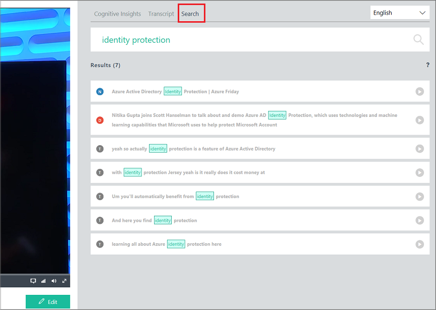

# Find exact moments within videos

This topic shows you the search options that enable you find exact moments within videos.

1. Sign in to your [Video Indexer](http://vi.microsoft.com) account.
2. Search among all videos in your account.

	In the following example, we searched for all videos created by Channel9 with Scott Hanselman.

	
	
3. Search the summarized insights of the video.

	You can then search within a video by clicking **Play** on the video. Then, you can search within the video by selecting the **Search** tab. For example, we searched for all the places where the "identity protection" text is used. 

	

	If you click one of the results, the player brings you to that moment in the video. You can achieve the player/insights view and synchronization in your application. For more information, see [Embed Video Indexer widgets into your application](video-indexer-embed-widgets.md). 

	
4. Search the detailed breakdown of the video.

	If you want to create your own breakdown based on the video that you found, press the **Edit** button. This page shows you the full breakdown of a video. You can search within the breakdown to only show the lines you are interested in. For more information, see [View and edit Video Indexer insights](video-indexer-view-edit.md).

	In this example, we searched the "identity protection" text. We aslo applied additional fiters, as shown in the screen below.

	

## Next steps 

Once you find the video you want to work with, you can continue processing the video, as described in one of these topics: 

- [Create new video insights based on existing video](video-indexer-create-new.md)
- [Process content with Video Indexer REST API](video-indexer-use-apis.md)
- [Embed visual widgets in your application](video-indexer-embed-widgets.md)

## See also

[Video Indexer overview](video-indexer-overview.md)
