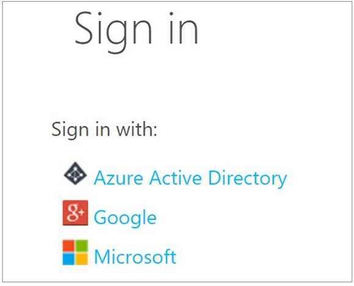
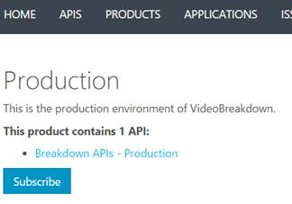

# Tutorial: Use the Video Indexer API

> [!Note]
> The Video Indexer V1 API was deprecated on August 1st, 2018. You should now use the Video Indexer v2 API. <br/>To develop with Video Indexer v2 APIs, please refer to the instructions found [here](https://api-portal.videoindexer.ai/). 

Video Indexer consolidates various audio and video artificial intelligence (AI) technologies offered by Microsoft in one integrated service, making development simpler. The APIs are designed to enable developers to focus on consuming Media AI technologies without worrying about scale, global reach, availability, and reliability of cloud platform. You can use the API to upload your files, get detailed video insights, get URLs of insight and player widgets in order to embed them into your application, and other tasks.

When creating a Video Indexer account, you can choose a free trial account (where you get a certain number of free indexing minutes) or a paid option (where you are not limited by the quota). With free trial, Video Indexer provides up to 600 minutes of free indexing to website users and up to 2400 minutes of free indexing to API users. With paid option, you create a Video Indexer account that is [connected to your Azure subscription and a Azure Media Services account](connect-to-azure.md). You pay for minutes indexed as well as the Azure Media Services account related charges. 

This article shows how the developers can take advantage of the [Video Indexer API](https://api-portal.videoindexer.ai/).

## Subscribe to the API

1. Sign in to [Video Indexer Developer Portal](https://api-portal.videoindexer.ai/).
	
	

    > [!Important]
    > * You must use the same provider you used when you signed up for Video Indexer.
    > * Personal Google and Microsoft (outlook/live) accounts can only be used for trial accounts. Accounts connected to Azure require Azure AD.
    > * There can be only one active account per E-Mail. If a user tries to sign-in with user@gmail.com for LinkedIn and after that with user@gmail.com for Google the later will display an error page, saying the user already exist.

2. Subscribe.

	Select the [Products](https://api-portal.videoindexer.ai/products) tab. Then, select Authorization and subscribe. 
	
	

    > [!NOTE]
    > New users are automatically subscribed to Authorization.
	
	Once you subscribe, you will be able to see your subscription and your primary and secondary keys. The keys should be protected. The keys should only be used by your server code. They should not be available on the client side (.js, .html, etc.).

	

## Obtain access token using the Authorization API

Once you subscribed to the Authorization API, you will be able to obtain access tokens. These access tokens are used to authenticate against the Operations API. 

Each call to the Operations API should be associated with an access token, matching the authorization scope of the call.

- User level -  user level access tokens let you perform operations on the **user** level. For example, get associated accounts.
- Account level – account level access tokens let you perform operations on the **account** level or the **video** level. For example, Upload video, list all videos, get video insights, etc.
- Video level – video level access tokens let you perform operations on a specific **video**. For example, get video insights, download captions, get widgets, etc. 

You can control whether these tokens are readonly or they allow editing by specifying **allowEdit=true/false**.

For most server-to-server scenarios, you will probably use the same **account** token since it covers both **account** operations and **video** operations. However, if you are planning to make client side calls to Video Indexer (for example, from javascript), you would want to use a **video** access token, to prevent clients from getting access to the entire account. That is also the reason that when embedding VideoIndexer client code in your client (for example, using **Get Insights Widget** or **Get Player Widget**) you must provide a **video** access token.

To make things easier, you can use the **Authorization** API > **GetAccounts** to get your accounts without obtaining a user token first. You can also ask to get the accounts with valid tokens, enabling you to skip an additional call to get an account token.

Access tokens expire after 1 hour. Make sure your access token is valid before using the Operations API. If expires, call the Authorization API again to get a new access token.
 
You are ready to start integrating with the API. Find [the detailed description of each Video Indexer REST API](http://api-portal.videoindexer.ai/).

## Location

All operation APIs require a Location parameter, which indicates the region to which the call should be routed and in which the account was created.

The values described in the following table apply. The **Param value** is the value you pass when using the API.

|**Name**|**Param value**|**Description**|
|---|---|---|
|Trial|trial|Used for trial accounts.|
|West US|westus2|Used for the Azure West US 2 region.|
|North Europe |northeurope|Used for the Azure North Europe region.|
|East Asia|eastasia|Used for the Azure East Asia region.|

## Account ID 

The Account ID parameter is required in all operational API calls. Account ID is a GUID that can be obtained in one of the following ways:

* Use the **Video Indexer website** to get the Account ID:

    1. Browse to the [Video Indexer](https://www.videoindexer.ai/) website and sign in.
    2. Browse to the **Settings** page.
    3. Copy the account ID.

        

* Use **Video Indexer Developer Portal** to programmatically get the Account ID.

    Use the [Get accounts](https://api-portal.videoindexer.ai/docs/services/authorization/operations/Get-Accounts?) API.
    
    > [!TIP]
    > You can generate access tokens for the accounts by defining `generateAccessTokens=true`.
    
* Get the account ID from the URL of a player page in your account.

    When you watch a video, the ID appears after the `accounts` section and before the `videos` section.

    ```
    https://www.videoindexer.ai/accounts/00000000-f324-4385-b142-f77dacb0a368/videos/d45bf160b5/
    ```

## Recommendations

This section lists some recommendations when using Video Indexer API.

- If you are planning to upload a video, it is recommended to place the file in some public network location (for example, OneDrive). Get the link to the video and provide the URL as the upload file param. 

	The URL provided to Video Indexer must point to a media (audio or video) file. Some of the links generated by OneDrive are for an HTML page that contains the file. An easy verification for the URL would be to paste it into a browser – if the file starts downloading, it's likely a good URL. If the browser is rendering some visualization, it's likely not a link to a file but an HTML page.
	
- When you call the API that gets video insights for the specified video, you get a detailed JSON output as the response content. [See details about the returned JSON in this topic](video-indexer-output-json.md).

## Code sample

The following C# code snippet demonstrates the usage of all the Video Indexer APIs together.

```csharp
var apiUrl = "https://api.videoindexer.ai";
var accountId = "..."; 
var location = "westus2";
var apiKey = "..."; 

System.Net.ServicePointManager.SecurityProtocol = System.Net.ServicePointManager.SecurityProtocol | System.Net.SecurityProtocolType.Tls12;

// create the http client
var handler = new HttpClientHandler(); 
handler.AllowAutoRedirect = false; 
var client = new HttpClient(handler);
client.DefaultRequestHeaders.Add("Ocp-Apim-Subscription-Key", apiKey); 

// obtain account access token
var accountAccessTokenRequestResult = client.GetAsync($"{apiUrl}/auth/{location}/Accounts/{accountId}/AccessToken?allowEdit=true").Result;
var accountAccessToken = accountAccessTokenRequestResult.Content.ReadAsStringAsync().Result.Replace("\"", "");

client.DefaultRequestHeaders.Remove("Ocp-Apim-Subscription-Key");

// upload a video
var content = new MultipartFormDataContent();
Debug.WriteLine("Uploading...");
// get the video from URL
var videoUrl = "VIDEO_URL"; // replace with the video URL

// as an alternative to specifying video URL, you can upload a file.
// remove the videoUrl parameter from the query string below and add the following lines:
  //FileStream video =File.OpenRead(Globals.VIDEOFILE_PATH);
  //byte[] buffer =newbyte[video.Length];
  //video.Read(buffer, 0, buffer.Length);
  //content.Add(newByteArrayContent(buffer));

var uploadRequestResult = client.PostAsync($"{apiUrl}/{location}/Accounts/{accountId}/Videos?accessToken={accountAccessToken}&name=some_name&description=some_description&privacy=private&partition=some_partition&videoUrl={videoUrl}", content).Result;
var uploadResult = uploadRequestResult.Content.ReadAsStringAsync().Result;

// get the video id from the upload result
var videoId = JsonConvert.DeserializeObject<dynamic>(uploadResult)["id"];
Debug.WriteLine("Uploaded");
Debug.WriteLine("Video ID: " + videoId);           

// obtain video access token            
client.DefaultRequestHeaders.Add("Ocp-Apim-Subscription-Key", apiKey);
var videoTokenRequestResult = client.GetAsync($"{apiUrl}/auth/{location}/Accounts/{accountId}/Videos/{videoId}/AccessToken?allowEdit=true").Result;
var videoAccessToken = videoTokenRequestResult.Content.ReadAsStringAsync().Result.Replace("\"", "");

client.DefaultRequestHeaders.Remove("Ocp-Apim-Subscription-Key");

// wait for the video index to finish
while (true)
{
  Thread.Sleep(10000);

  var videoGetIndexRequestResult = client.GetAsync($"{apiUrl}/{location}/Accounts/{accountId}/Videos/{videoId}/Index?accessToken={videoAccessToken}&language=English").Result;
  var videoGetIndexResult = videoGetIndexRequestResult.Content.ReadAsStringAsync().Result;

  var processingState = JsonConvert.DeserializeObject<dynamic>(videoGetIndexResult)["state"];

  Debug.WriteLine("");
  Debug.WriteLine("State:");
  Debug.WriteLine(processingState);

  // job is finished
  if (processingState != "Uploaded" && processingState != "Processing")
  {
      Debug.WriteLine("");
      Debug.WriteLine("Full JSON:");
      Debug.WriteLine(videoGetIndexResult);
      break;
  }
}

// search for the video
var searchRequestResult = client.GetAsync($"{apiUrl}/{location}/Accounts/{accountId}/Videos/Search?accessToken={accountAccessToken}&id={videoId}").Result;
var searchResult = searchRequestResult.Content.ReadAsStringAsync().Result;
Debug.WriteLine("");
Debug.WriteLine("Search:");
Debug.WriteLine(searchResult);

// get insights widget url
var insightsWidgetRequestResult = client.GetAsync($"{apiUrl}/{location}/Accounts/{accountId}/Videos/{videoId}/InsightsWidget?accessToken={videoAccessToken}&widgetType=Keywords&allowEdit=true").Result;
var insightsWidgetLink = insightsWidgetRequestResult.Headers.Location;
Debug.WriteLine("Insights Widget url:");
Debug.WriteLine(insightsWidgetLink);

// get player widget url
var playerWidgetRequestResult = client.GetAsync($"{apiUrl}/{location}/Accounts/{accountId}/Videos/{videoId}/PlayerWidget?accessToken={videoAccessToken}").Result;
var playerWidgetLink = playerWidgetRequestResult.Headers.Location;
Debug.WriteLine("");
Debug.WriteLine("Player Widget url:");
Debug.WriteLine(playerWidgetLink);

```

## Next steps

[Examine details of the output JSON](video-indexer-output-json.md).

[Video Indexer overview](video-indexer-overview.md)
