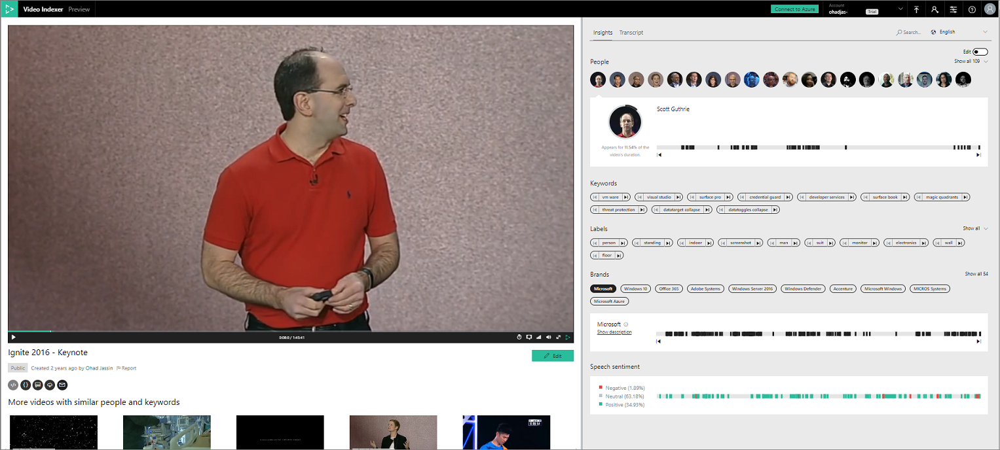

# View and edit Video Indexer insights

This topic shows you how to view and edit the Video Indexer insights of a video.

1. Browse to the [Video Indexer](https://www.videoindexer.ai/) website and sign in.
2. Find a video from which you want to create your Video Indexer insights. For more information, see [Find exact moments within videos](video-indexer-search.md).
3. Press **Play**.

	The page shows the video's summarized insights. 

	

4. View the summarized insights of the video. 

	Summarized insights show an aggregated view of the data: faces, keywords, sentiments. For example, you can see the faces of people and the time ranges each face appears in and the % of the time it is shown.

	The player and the insights are synchronized. For example, if you click a keyword or the transcript line, the player brings you to that moment in the video. You can achieve the player/insights view and synchronization in your application. For more information, see [Embed Azure Indexer widgets into your application](video-indexer-embed-widgets.md). 

3. Edit the Video Indexer insights.

	Press Edit under the video. The page that shows you the full breakdown of a video is displayed. The breakdown is broken into blocks. Blocks are here to make it easier to go through the data. For example, block might be broken down based on when speakers change or there is a long pause. You can create your own playlist that contains only lines that you want. To show only specific parts of the source video, you can filter by topics/keywords, sentiments, people, speakers. You can choose to only view the video's transcript or OCR.  

	

## Next steps

[Learn how to create your own Video Indexer insights based on some other video](video-indexer-create-new.md).

## See also

[Video Indexer overview](video-indexer-overview.md)

