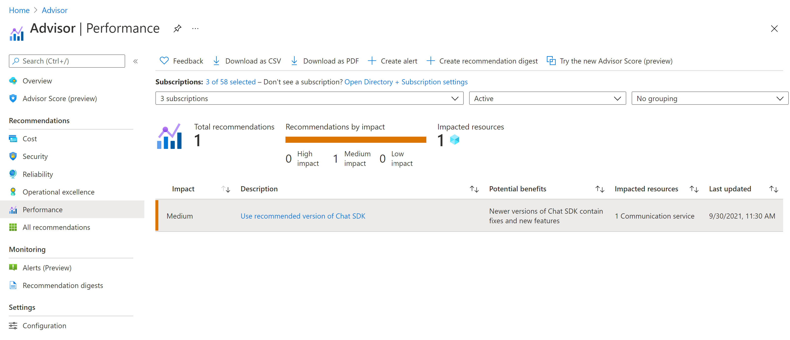

# Azure Advisor for Azure Communication Services

[Azure Advisor](../../advisor/advisor-overview.md) is a personalized cloud consultant that helps you follow best practices to optimize your Azure deployments. Azure Communication Services is onboarded to Azure Advisor and will post recommendations for ways to optimize your communication resources. You can view these recommendations in the [Azure portal](https://portal.azure.com) in the [Advisor blade](https://portal.azure.com/#blade/Microsoft_Azure_Expert/AdvisorMenuBlade/overview). Recommendations are stored in your [Azure Activity Log](../../azure-monitor/essentials/platform-logs-overview.md), and you can configure alerts for these recommendations via [ARM templates](../../advisor/advisor-alerts-arm.md) or the [portal](../../advisor/advisor-alerts-portal.md). 

## Install the latest SDKs

To ensure all the recent fixes and updates, it's recommended you always stay up to date with the latest SDKs available. If there's a newer version of the SDK(s) you're using available, you'll see a recommendation shows up in the **Performance** category to update to the latest SDK.

The following SDKs are supported for this feature, along with all their supported languages. This feature will only send recommendations for the newest generally available major release versions of the SDKs. Beta or preview versions won't trigger any recommendations or alerts. You can learn more about the [SDK options](./sdk-options.md) available.

* Calling (client)
* Chat
* SMS
* Identity
* Phone Numbers
* Management
* Network Traversal
* Call Automation

## Next steps

The following documents may be interesting to you:

- [Logging and diagnostics](./analytics/enable-logging.md)
- Access logs for [voice and video](./analytics/logs/voice-and-video-logs.md), [chat](./analytics/logs/chat-logs.md), [email](./analytics/logs/email-logs.md), [network traversal](./analytics/logs/network-traversal-logs.md), [recording](./analytics/logs/recording-logs.md), [SMS](./analytics/logs/sms-logs.md) and [call automation](./analytics/logs/call-automation-logs.md).
- [Metrics](./metrics.md)
