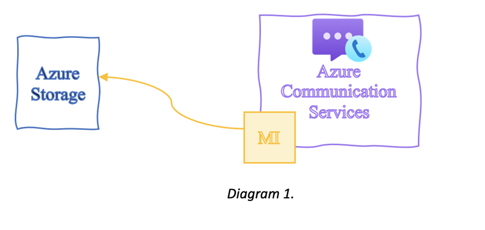
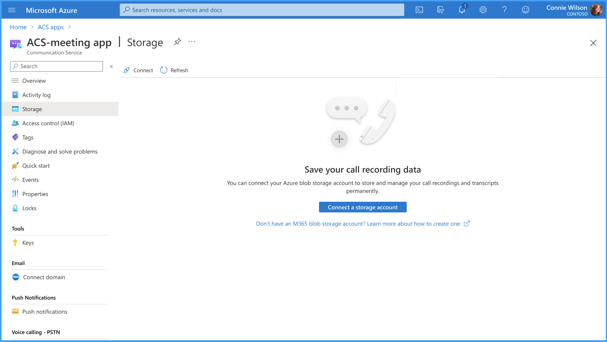
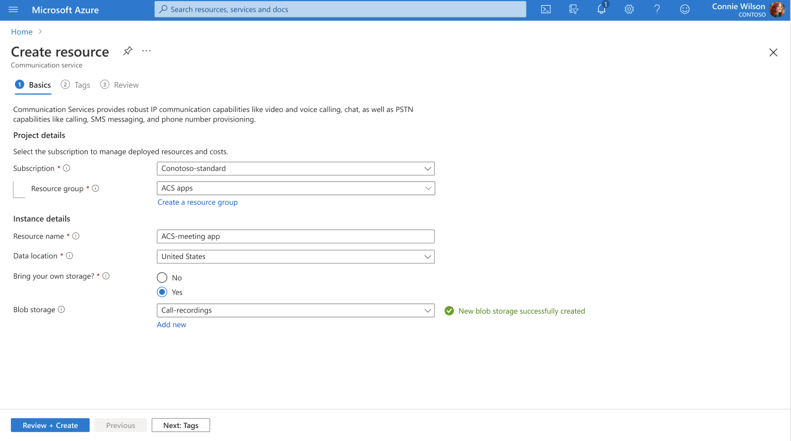

# Bring your own storage (BYOS) overview

[!INCLUDE [Private Preview Disclaimer](../includes/private-preview-include-section.md)]

In many applications, end-users may want to store their Call Recording files long-term. Some of the common scenarios are compliance, quality assurance, assessment, post-call analysis, training, and coaching. Now with the BYOS (bring your own storage) being available, end-users will have an option to store their files long-term and manage the files in a way they need. The end-user will be responsible for legal regulations about storing the data. BYOS simplifies downloading of the files from Azure Communication Services and minimizes the number of support requests if the customer was unable to download the recording in 48 hours. Data will be transferred securely from Microsoft Azure blob storage to a customer Azure blob storage. 
Here are a few examples:
- Contact Center Recording
- Compliance Recording Scenario
- Healthcare Virtual Visits Scenario
- Conference/meeting recordings and so on

BYOS can be easily integrated into any application regardless of the programming language. When creating a call recording resource in Azure Portal, enable the BYOS option and provide the URL to the storage. This simple experience allows developers to meet their needs, scale, and avoid investing time and resources into designing and maintaining a custom solution.

1.	Contoso enables MI (managed identities) on an Azure Storage account.
2.	Contoso creates Azure Communication Services resource.

3.	Contoso enables BYOS on the Azure Communication Services resource and specifies the URL to link with the storage. 
4.	After the resource has been created Contoso will see linked storage and will be able to change settings later in time

5.	If Contoso has built an application with Call Recording, they can record a meeting. Once the recording file is available, Contoso will receive an event from Azure Communication Services that a file is copied over to their storage.
6.	After the notification has been received Contoso will see the file 
6.	After the notification has been received Contoso will see the file located in the storage they have specified.
7.	Contoso has successfully linked their storage with Azure Communication Services!

## Feature highlights

- HIPAA complaint

## Next steps
- TBD
