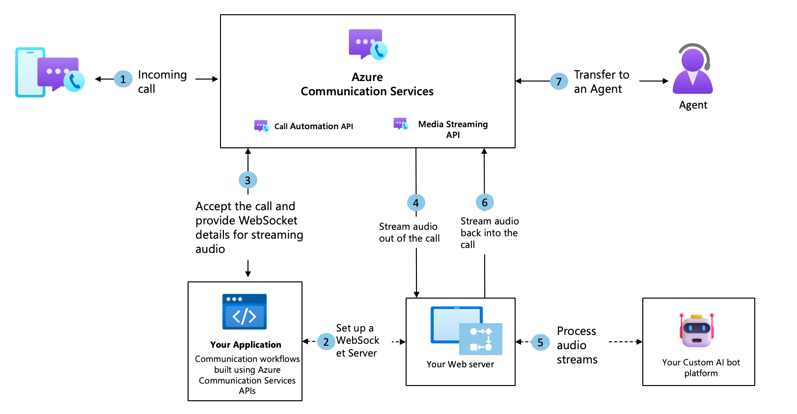

# Audio streaming overview - audio subscription

[!INCLUDE [Public Preview Disclaimer](../../includes/public-preview-include-document.md)]

Azure Communication Services provides bidirectional audio streaming capabilities, offering developers powerful tools to capture, analyze, and process audio content during active calls. This development paves the way for new possibilities in real-time communication for developers and businesses alike. 

By integrating bidirectional audio streaming with services like Azure OpenAI and other real-time voice APIs, businesses can achieve seamless, low-latency communication. This significantly enhances the development and deployment of conversational AI solutions, allowing for more engaging and efficient interactions. 

With bidirectional streaming, businesses can now elevate their voice solutions to low-latency, human-like, interactive conversational AI agents. Our bidirectional streaming APIs enable developers to stream audio from an ongoing call on Azure Communication Services to their web servers in real-time, and stream audio back into the call. While the initial focus of these features is to help businesses create conversational AI agents, other use cases include Natural Language Processing for conversation analysis or providing real-time insights and suggestions to agents while they are in active interaction with end users. 

This public preview supports the ability for developers to access real-time audio streams over a WebSocket from Azure Communication Services and stream audio back into the call.

### Real-time call assistance

- **Leverage conversational AI Solutions:** Develop sophisticated customer support virtual agents that can interact with customers in real-time, providing immediate responses and solutions.

- **Personalized customer experiences:** By harnessing real-time data, businesses can offer more personalized and dynamic customer interactions in real-time, leading to increased satisfaction and loyalty.

- **Reduce wait times for customers:** Using bidirectional audio streams with Large Language Models (LLMs), you can create virtual agents that serve as the first point of contact for customers, reducing their wait time for a human agent.

### Authentication

- **Biometric authentication** – Use the audio streams to carry out voice authentication, by running the audio from the call through your voice recognition/matching engine/tool.

## Sample architecture showing how bidirectional audio streaming can be used for conversational AI agents

## Supported formats

### Mixed
Contains mixed audio of all participants on the call. All audio is flattened into one stream.
	
### Unmixed
Contains audio per participant per channel, with support for up to four channels for the four most dominant speakers at any point in a call. You also get a participantRawID that you can use to determine the speaker. 

## Additional information
Developers can use the following information about audio sent from Azure Communication Services to convert the audio packets into audible content for their applications.
- Framerate: 50 frames per second
- Packet stream rate: 20-ms rate
- Data packet size: 640 bytes for 16,000 hz and 960 bytes for 24,000 hz
- Audio metric: 16-bit PCM mono at 16,000 hz and 24,000 hz
- Public string data is a base64 string that should be converted into a byte array to create raw PCM file.

## Billing
See the [Azure Communication Services pricing page](https://azure.microsoft.com/pricing/details/communication-services/?msockid=3b3359f3828f6cfe30994a9483c76d50) for information on how audio streaming is billed. Prices can be found in the calling category under audio streaming.

## Next Steps
Check out the [audio streaming quickstart](../../how-tos/call-automation/audio-streaming-quickstart.md) to learn more.
