# Connect Azure Communication Services with Azure AI services

Azure Communication Services Call Automation APIs provide developers the ability to steer and control the Azure Communication Services Telephony, VoIP or WebRTC calls using real-time event triggers to perform actions based on custom business logic specific to their domain. Within the Call Automation APIs developers can use simple AI powered APIs, which can be used to play personalized greeting messages, recognize conversational voice inputs to gather information on contextual questions to drive a more self-service model with customers, use sentiment analysis to improve customer service overall. These content specific APIs are orchestrated through **Azure AI Services** with support for customization of AI models without developers needing to terminate media streams on their services and streaming back to Azure for AI functionality. 

All this is possible with one-click where enterprises can access a secure solution and link their models through the portal. Furthermore, developers and enterprises don't need to manage credentials. Connecting your Azure AI services uses managed identities to access user-owned resources. Developers can use managed identities to authenticate any resource that supports Microsoft Entra authentication.

BYO Azure AI services can be easily integrated into any application regardless of the programming language. When creating an Azure Resource in Azure portal, enable the BYO option and provide the URL to the Azure AI services. This simple experience allows developers to meet their needs, scale, and avoid investing time and resources into designing and maintaining a custom solution.

> [!NOTE]
> This integration is supported in limited regions for Azure AI services, for more information about which regions are supported please view the limitations section at the bottom of this document. This integration only supports Multi-service Cognitive Service resource, we recommend if you're creating a new Azure AI Service resource you create a Multi-service Cognitive Service resource or when you're connecting an existing resource confirm that it is a Multi-service Cognitive Service resource.

## Common use cases

### Build applications that can play and recognize speech 

With the ability to, connect your Azure AI services to Azure Communication Services, you can enable custom play functionality, using [Text-to-Speech](../../../../articles/cognitive-services/Speech-Service/text-to-speech.md) and [SSML](../../../../articles/cognitive-services/Speech-Service/speech-synthesis-markup.md) configuration, to play more customized and natural sounding audio to users. Through the Azure AI services connection, you can also use the Speech-To-Text service to incorporate recognition of voice responses that can be converted into actionable tasks through business logic in the application. These functions can be further enhanced through the ability to create custom models within Azure AI services that are bespoke to your domain and region, through the ability to choose which languages are spoken and recognized, custom voices and custom models built based on your experience. 

## Run time flow

## Azure portal experience
You can configure and bind your Communication Services and Azure AI services through the Azure portal. 

## Prerequisites 
- Azure account with an active subscription and access to Azure portal, for details see [Create an account for free](https://azure.microsoft.com/free/).
- Azure Communication Services resource. See [Create an Azure Communication Services resource](../../quickstarts/create-communication-resource.md?tabs=windows&pivots=platform-azp). 
- An Azure Cognitive Services resource.

### Connecting through the Azure portal

1. Open your Azure Communication Services resource and click on the Cognitive Services tab.
2. If system-assigned managed identity isn't enabled, there are two ways to enable it.

   2.1. In the Cognitive Services tab, click on "Enable Managed Identity" button.
   
   [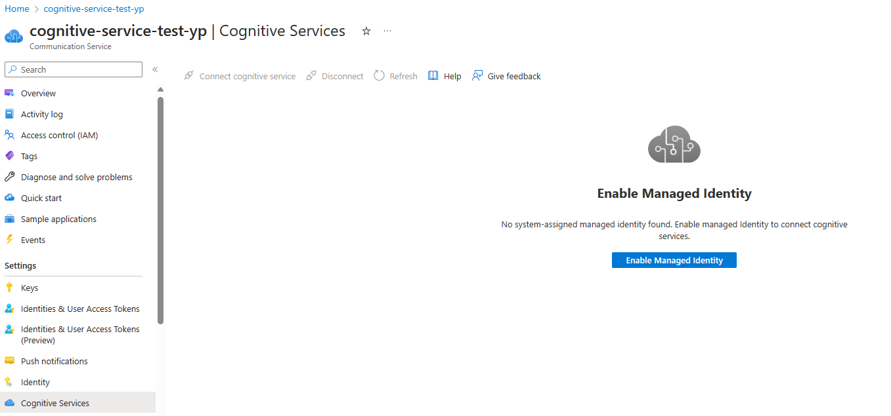](./media/enabled-identity.png#lightbox)

   or

   2.2. Navigate to the identity tab.
  
   2.3. Enable system assigned identity. This action begins the creation of the identity; A pop-up notification appears notifying you that the request is being processed.
  [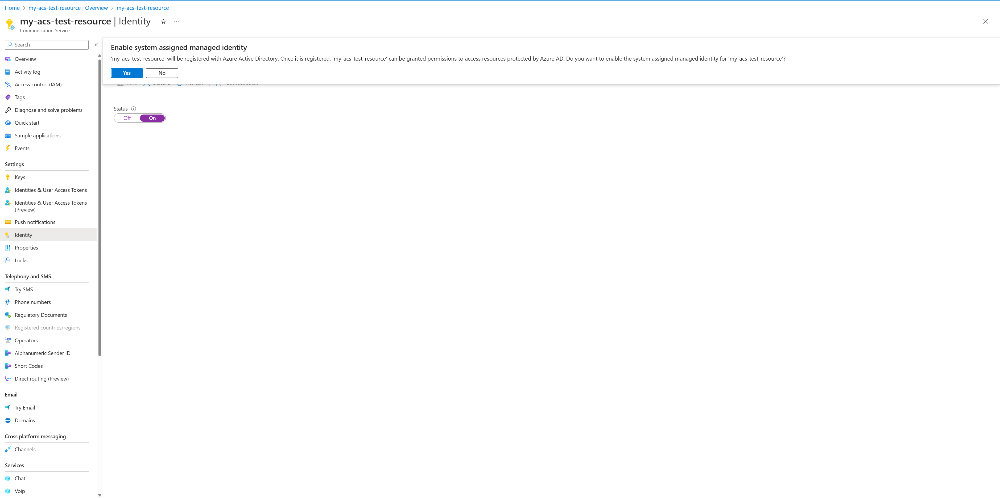](./media/enable-system-identity.png#lightbox)

   2.4. Once the identity is enabled, you should see something similar.
   [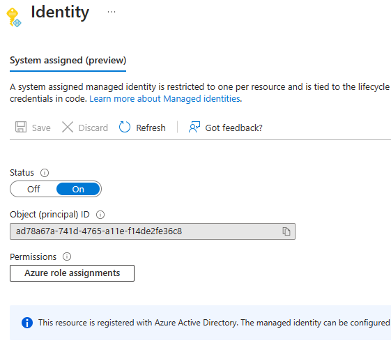](./media/identity-saved.png#lightbox)

3. When managed identity is enabled the Cognitive Service tab should show a button 'Connect cognitive service' to connect the two services.
[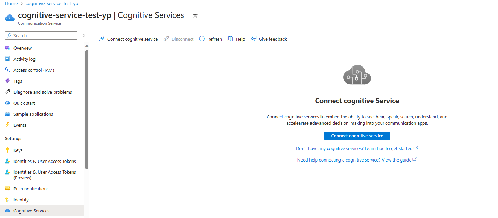](./media/cog-svc.png#lightbox)

4. Click on 'Connect cognitive service', select the Subscription, Resource Group and Resource and click 'Connect' in the context pane that opens up.
   [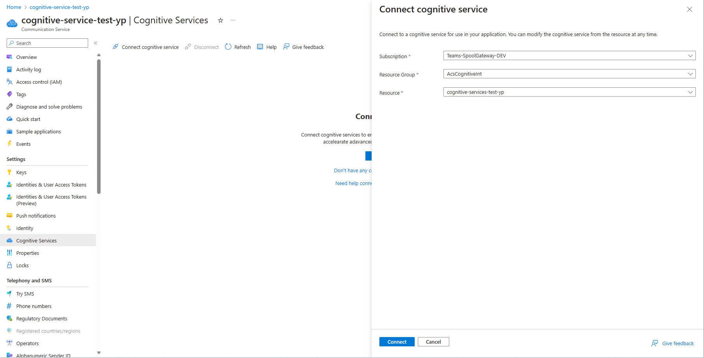](./media/choose-options.png#lightbox)
5. If connection is successful, you should see a green banner confirming successful connection.

   [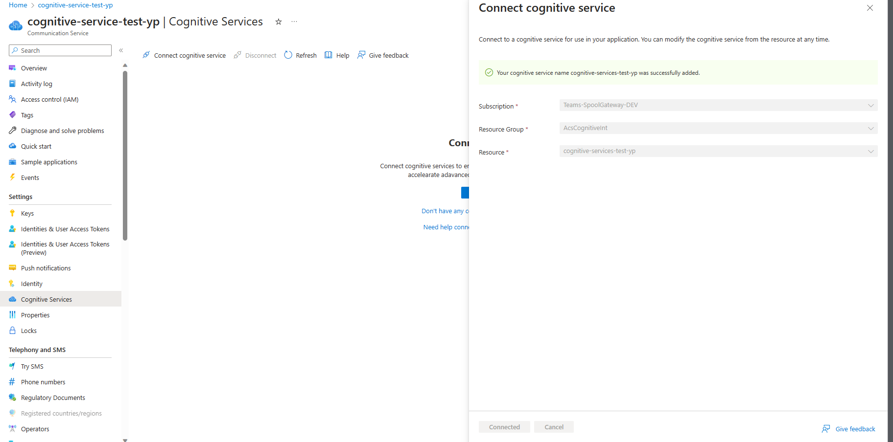](./media/connected.png#lightbox)

6. Now in the Cognitive Service tab you should see your connected services showing up. 
[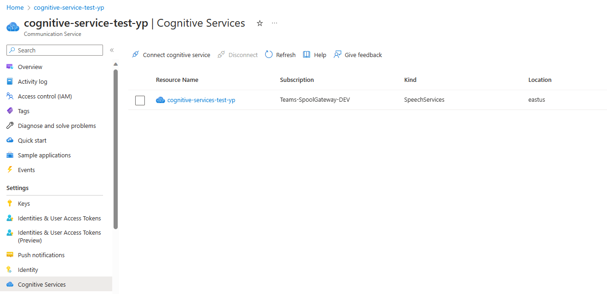](./media/new-entry-created.png#lightbox)

### Manually adding Managed Identity to Azure Communication Services resource
Alternatively if you would like to go through the manual process of connecting your resources you can follow these steps.

#### Enable system assigned identity
1. Navigate to your Azure Communication Services resource in the Azure portal.
2. Select the Identity tab.
3. Enable system assigned identity. This action begins the creation of the identity. A pop-up notification appears notifying you that the request is being processed.

#### Option 1: Add role from Azure Cognitive Services in the Azure portal
1. Navigate to your Azure Cognitive Services resource.
2. Select the "Access control (IAM)" tab.
3. Click the "+ Add" button.
4. Select "Add role assignments" from the menu.
[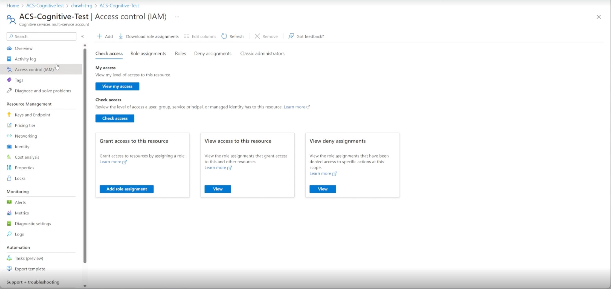](./media/add-role.png#lightbox)
5. Choose the "Cognitive Services User" role to assign, then click "Next."
[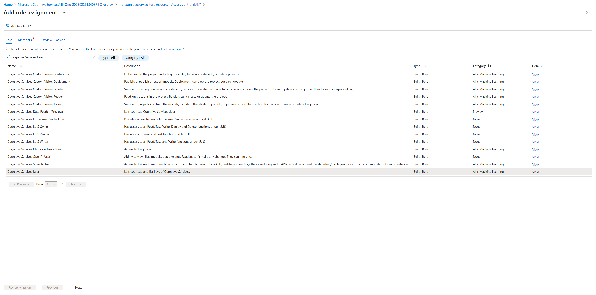](media/cognitive-service-user.png#lightbox)
6. For the field "Assign access to" choose the "User, group or service principal."
7. Press "+ Select members" and a side tab opens.
8. Search for your Azure Communication Services resource name in the text box and click it when it shows up, then click "Select."
[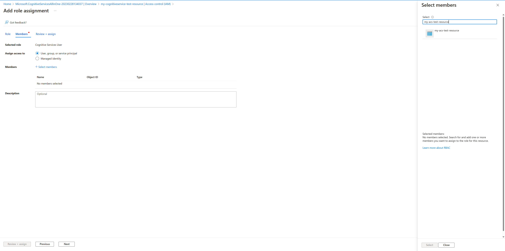](./media/select-acs-resource.png#lightbox)
9. Click "Review + assign," this assigns the role to the managed identity.

#### Option 2: Add role through Azure Communication Services Identity tab
1. Navigate to your Azure Communication Services resource in the Azure portal.
2. Select Identity tab.
3. Click on "Azure role assignments."
[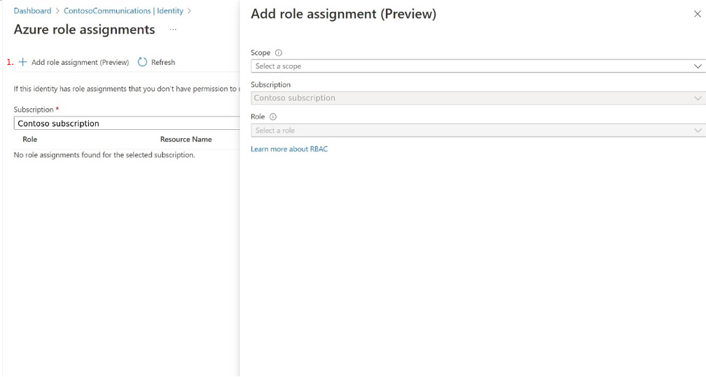](./media/add-role-acs.png#lightbox)
4. Click the "Add role assignment (Preview)" button, which opens the "Add role assignment (Preview)" tab.
5. Select the "Resource group" for "Scope."
6. Select the "Subscription."
7. Select the "Resource Group" containing the Cognitive Service.
8. Select the Role "Cognitive Services User."
[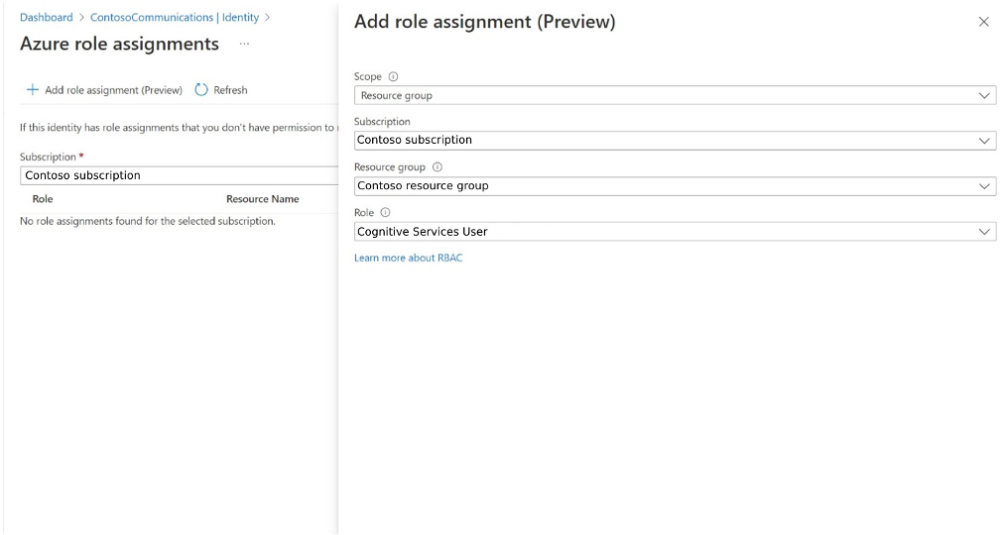](./media/acs-roles-cognitive-services.png#lightbox)
9. Click Save.

Your Azure Communication Service has now been linked to your Azure Cognitive Service resource.

## Azure AI services regions supported

This integration between Azure Communication Services and Azure AI services is only supported in the following regions:
- westus
- westus2
- westus3
- eastus
- eastus2
- centralus
- northcentralus
- southcentralus
- westcentralus
- westeurope
- uksouth
- northeurope
- southafricanorth
- canadacentral
- centralindia
- eastasia
- southeastasia
- australiaeast
- brazilsouth
- uaenorth

## Next steps
- Learn about [playing audio](../../concepts/call-automation/play-action.md) to callers using Text-to-Speech.
- Learn about [gathering user input](../../concepts/call-automation/recognize-action.md) with Speech-to-Text.
