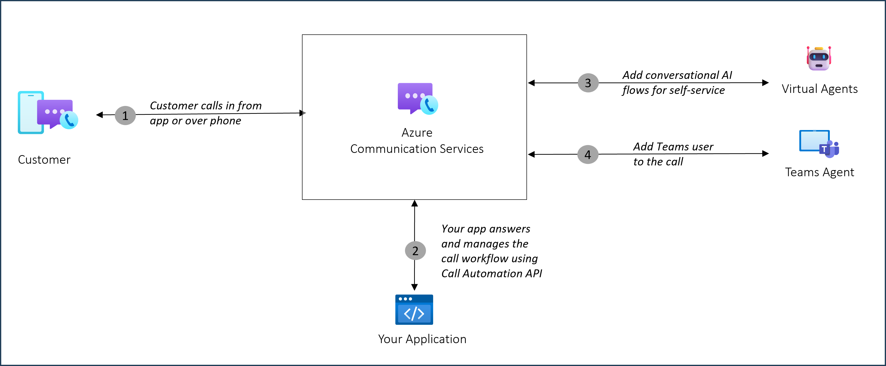

# Deliver expedient customer service by adding Microsoft Teams users in Call Automation workflows

[!INCLUDE [Public Preview Notice](../../includes/public-preview-include.md)]

Businesses are looking for innovative ways to increase the efficiency of their customer service operations. Azure Communication Services Call Automation provides developers the ability to build programmable customer interactions using real-time event triggers to perform actions based on custom business logic. For example, with support for interoperability with Microsoft Teams, developers can use Call Automation APIs to add subject matter experts (SMEs). These SMEs, who use Microsoft Teams, can be added to an existing customer service call to provide expert advice and help resolve a customer issue.

This interoperability with Microsoft Teams over VoIP makes it easy for developers to implement per-region multi-tenant trunks that maximize value and reduce telephony infrastructure overhead. Each new tenant will be able to use this setup in a few minutes after Microsoft Teams admin has granted necessary permissions to the Azure Communication Services resource.

## Use-cases

1. Expert Consultation: Businesses can invite subject matter experts into their customer service workflows for expedient issue resolution, and to improve their first call resolution rate. 
1. Extend customer service workforce with knowledge workers: Businesses can extend their customer service operation with more capacity during peak influx of customer service calls.

## Scenario Showcase – Expert Consultation
A customer service agent, who is using a Contact Center Agent experience, wants to now add a subject matter expert, who is knowledge worker (regular employee) at Contoso and uses Microsoft Teams, into a support call with a customer to provide some expert advice to resolve a customer issue. 

The dataflow diagram depicts a canonical scenario where a Teams user is added to an ongoing ACS call for expert consultation.

1. Customer is on an ongoing call with a Contact Center customer service agent. 
1. During the call, the customer service agent needs expert help from one of the domain experts part of an engineering team. The agent is able to identify a knowledge worker who is available on Teams (presence via Graph APIs) and tries to add them to the call. 
1. Contoso Contact Center’s SBC is already configured with ACS Direct Routing where this add participant request is processed.
1. Contoso Contact Center provider has implemented a web service, using ACS Call Automation that receives the “add Participant” request.
1. With Teams interop built into ACS Call Automation, ACS then uses the Teams user’s ObjectId to add them to the call. The Teams user receives the incoming call notification. They accept and join the call. 
1. Once the Teams user has provided their expertise, they leave the call. The customer service agent and customer continue wrap up their conversation.

## Capabilities

The following list presents the set of features that are currently available in the Azure Communication Services Call Automation SDKs for calls with Microsoft Teams users.

| Feature Area          | Capability                                        | .NET   | Java  | Python | JavaScript |
| ----------------------| -----------------------------------------------   | ------ | ----- |  ------ | ----- |
| Pre-call scenarios    | Place new outbound call to a Microsoft Teams user  | ✔️    | ✔️    | ✔️    | ✔️    |
|                       | Redirect (forward) a call to a Microsoft Teams user | ✔️    | ✔️    | ✔️    | ✔️    |
|                       | Set custom display name for the callee when making a call offer to a Microsoft Teams user | Only on Microsoft Teams desktop and web client    | Only on Microsoft Teams desktop 
 and web client    |
| Mid-call scenarios    | Add one or more endpoints to an existing call with a Microsoft Teams user     | ✔️    | ✔️    |  ✔️    | ✔️    |
|                       | Play Audio from an audio file                     | ✔️    | ✔️    | ✔️    | ✔️    |
|                       | Recognize user input through DTMF                 | ❌    | ❌   | ❌    | ❌  |
|                       | Remove one or more endpoints from an existing call| ✔️    | ✔️    | ✔️    | ✔️    |
|                       | Blind Transfer a 1:1 call to another endpoint     | ✔️    | ✔️    | ✔️    | ✔️    |
|                       | Hang up a call (remove the call leg)              | ✔️    | ✔️    | ✔️    | ✔️    |
|                       | Terminate a call (remove all participants and end call)| ✔️ | ✔️  | ✔️    | ✔️    |
| Query scenarios       | Get the call state                                | ✔️    | ✔️    | ✔️    | ✔️    |
|                       | Get a participant in a call                       | ✔️    | ✔️    | ✔️    | ✔️    |
|                       | List all participants in a call                   | ✔️    | ✔️    | ✔️    | ✔️    |
| Call Recording*        | Start/pause/resume/stop recording (call recording notifications in Teams clients are supported for Teams desktop, web, iOS and Android)  | ✔️    | ✔️    | ✔️    | ✔️    |

> [!IMPORTANT]
> During Public preview, you won't be able to stop the call recording if it started after adding the Teams participant.

## Supported clients
> [!IMPORTANT]
> Teams phone license is a must to use this feature.

| Clients          | Support     |
| -----------------| ----------- |
| Microsoft Teams Desktop | ✔️ |
| Microsoft Teams Web | ✔️ |
| Microsoft Teams iOS | ✔️ |
| Microsoft Teams Android | ✔️ |
| Azure Communications Services signed in with Microsoft 365 Identity | ❌ |

> [!NOTE]
> While in preview, the support for Microsoft Teams mobile apps is available with limited functionality and some features might not work properly.   

## Roadmap
1. Support for Azure Communications Services signed in with Microsoft 365 Identity coming soon.

## Next steps

> [!div class="nextstepaction"]
> [Get started with adding a Microsoft Teams user to an ongoing call using Call Automation](./../../how-tos/call-automation/teams-interop-call-automation.md)

Here are some articles of interest to you:
- Learn more about [Call Automation](../../concepts/call-automation/call-automation.md) and its features.
- Learn about [Play action](../../concepts/call-automation/play-Action.md) to play audio in a call.
- Learn how to build a [call workflow](../../quickstarts/call-automation/callflows-for-customer-interactions.md) for a customer support scenario.
- Understand how your resource is [charged for various calling use cases](../pricing.md) with examples.
