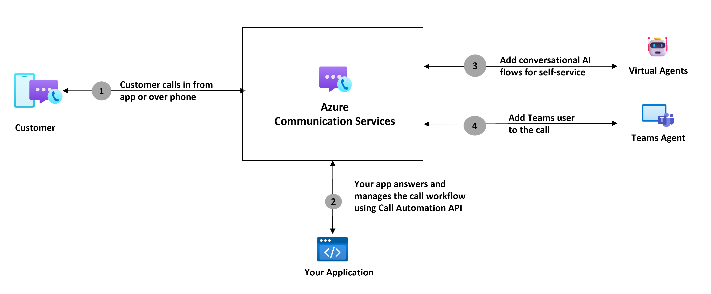

# Deliver expedient customer service by adding Microsoft Teams users in Call Automation workflows

Azure Communication Services Call Automation provides developers the ability to build programmable customer interactions using real-time event triggers to perform actions on the call. This programmability enables you to build intelligent calling workflows that can adapt to customer needs in real time and be fully customized for your business logic. You can learn more about the API [here](./call-automation.md). This document describes the interoperability Call Automation supports with Microsoft Teams.

Developers can use Call Automation APIs to add Teams users to their calling workflows and customer interactions, helping you deliver advanced customer service solutions​ with easy-to-use REST APIs and SDKs. This interoperability is offered over VoIP to reduce telephony infrastructure overhead. Developers can add Teams users to Azure Communication Services calls using the user's Entra object ID (OID).  

## Use-cases
1. Streamline customer service operations: Enable customer service agents to manage both internal and external customer facing communications through Teams app, by connecting your CCaaS solution to Microsoft Teams. The simplified integration model reduces setup time for both CCaaS and Teams tenant. Each new tenant will be able to use this setup in a few minutes after Microsoft Teams admin grants necessary permissions to the Azure Communication Services resource.
1. Expert Consultation: Businesses can invite subject matter experts into their customer service workflows for expedient issue resolution, and to improve their first call resolution rate. 

## Scenario Showcase – Streamline customer service operations
Lets take the example of Contoso Airlines, who uses Teams as their UCaaS solution. For their customer service operations, they want to use AI powered virtual agents to triage and resolve incoming customer calls and hand-off complex issues to human agents (On Microsoft Teams). The below dataflow diagram depicts how this scenario can be achieved using Azure Communication Services.  

As previously mentioned, Call automation API enables you to build programmable calling workflows. In this case, Contoso has developed a service that uses Call Automation API to handle and orchestrate customer calls.  
1. Customer calls Contoso's helpline number.
2. The incoming call is published to Contoso's service, which uses Call Automation API to answer the call.
3. The service connects the customer to virtual agent/bot to triage the call, using IVR or natural language based voice prompts.
4. When the bot requests for handing off the call to a human agent for further assistance,  Contoso's service identifies an available agent (presence via Graph APIs) and tries to add them to the call.
5. The Teams user receives the incoming call notification. They accept and join the call. 

Now, lets look at the scenario where Contoso is already using a CCaaS provider for their customer service operations. The below diagram depicts how CCaaS can use Call automation to connect Contoso's Teams tenant to their CCaaS solution. 

1. Customer is connected to contact center solution in an ongoing call. The customer might be waiting in queue or interacting with a virtual agent/bot. Contact center solution identifies an available agent on Teams (presence via Graph APIs) to connect to this call. 
1. Contact Center provider has implemented a web service, using Azure Communication Services Call Automation, that requests this Teams user to be added to the call. 
3. Since customer call is handled by contact center provider, they need to configure an SBC with Azure Communication Services Direct Routing in order to route/connect calls to Microsoft. With this model, only the contact center provider needs to have an SBC setup. This SBC can handle connections to multiple Teams tenants, making it easy for developers to implement per-region multitenant trunks that maximize value. Contoso doesn't have to set up Teams Direct Routing for each tenant, thus reducing the telephony overhead and Contoso's onboarding time to contact center provider. 
1. With Teams interop built into Call Automation, Azure Communication Services then uses the Teams user’s ObjectId to add them to the call. The Teams user receives the incoming call notification. They accept and join the call. 

[!INCLUDE [Teams Phone license](../../includes/teams-phone-license-include.md)]

## Capabilities

The following list presents the set of features that are currently available in the Azure Communication Services Call Automation SDKs for calls with Microsoft Teams users.

| Feature Area          | Capability                                        | Supported |
| ----------------------| -----------------------------------------------   | ------ | 
| Pre-call scenarios    | Place new outbound call to a Microsoft Teams user  | ✔️    | 
|                       | Redirect (forward) a call to a Microsoft Teams user | ✔️    | 
| Mid-call scenarios    | Add one or more endpoints to an existing call with a Microsoft Teams user     | ✔️    | 
|                       | Set custom display name for the callee when making a call offer to a Microsoft Teams user | ✔️    |
|                       | Play Audio from an audio file or text prompt (text-to-speech)   | ✔️    |
|                       | Recognize user input through DTMF or voice (speech-to-text)  | ❌    | 
|                       | Remove one or more endpoints from an existing call| ✔️    | 
|                       | Blind Transfer a 1:1 call to another endpoint     | ✔️    |
|                       | Hang up a call (remove the call leg)              | ✔️    |
|                       | Terminate a call (remove all participants and end call)| ✔️ | 
| Query scenarios       | Get the call state                                | ✔️    | 
|                       | Get a participant in a call                       | ✔️    | 
|                       | List all participants in a call                   | ✔️    | 
| Call Recording        | Start/pause/resume/stop recording (call recording notifications in Teams clients are supported)  | ✔️    |

## Supported Teams clients

| Clients          | Support     |
| -----------------| ----------- |
| Microsoft Teams Desktop | ✔️ |
| Microsoft Teams Web | ✔️ |
| Microsoft Teams iOS | ❌ |
| Microsoft Teams Android | ❌ |
| Custom app built using Azure Communications Services, signed in with Microsoft 365 Identity |✔️ |

Learn more about the experience for Teams users joining Azure Communication Services calls [here](./../interop/teams-interop-group-calls.md).

## Next steps

> [!div class="nextstepaction"]
> [Get started with adding a Microsoft Teams user to an ongoing call using Call Automation](./../../how-tos/call-automation/teams-interop-call-automation.md)

Here are some articles of interest to you:
- Learn more about [Call Automation](../../concepts/call-automation/call-automation.md) and its features.
- Learn about [Play action](../../concepts/call-automation/play-Action.md) to play audio in a call.
- Understand how your resource is [charged for various calling use cases](../pricing.md) with examples.
