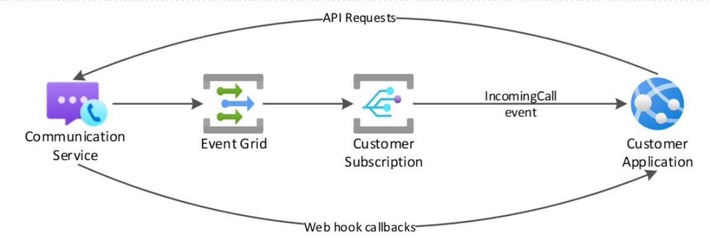

# Call Automation Overview

Azure Communication Services Call Automation provides developers the ability to build server-based, intelligent call workflows, and call recording for voice and Public Switched Telephone Network(PSTN) channels. The SDKs, available in C#, Java, JavaScript and Python, use an action-event model to help you build personalized customer interactions. Your communication applications can listen to real-time call events and perform control plane actions (like answer, transfer, play audio, start recording, etc.) to steer and control calls based on your business logic.

> [!NOTE]
> Call Automation currently doesn't support [Rooms](../rooms/room-concept.md) calls.

## Common use cases

Some of the common use cases that can be built using Call Automation include:

- Program VoIP or PSTN calls for transactional workflows such as click-to-call and appointment reminders to improve customer service.
- Build interactive interaction workflows to self-serve customers for use cases like order bookings and updates, using Play (Audio URL) and Recognize (DTMF) actions.
- Integrate your communication applications with Contact Centers and your private telephony networks using Direct Routing.
- Protect your customer's identity by building number masking services to connect buyers to sellers or users to partner vendors on your platform.
- Increase engagement by building automated customer outreach programs for marketing and customer service.
- Analyze in a post-call process your unmixed audio recordings for quality assurance purposes.  

Azure Communication Services Call Automation can be used to build calling workflows for customer service scenarios, as depicted in the high-level architecture. You can answer inbound calls or make outbound calls. Execute actions like playing a welcome message, connecting the customer to a live agent on an Azure Communication Services Calling SDK client app to answer the incoming call request. With support for Azure Communication Services PSTN or Direct Routing, you can then connect this workflow back to your contact center.  

## Capabilities

The following list presents the set of features that are currently available in the Azure Communication Services Call Automation SDKs.

| Feature Area          | Capability                                        | .NET   | Java  | JavaScript | Python |
| ----------------------| -----------------------------------------------   | ------ | ----- | ---------- | ------ |
| Pre-call scenarios    | Answer a one-to-one call                          | ✔️    | ✔️    |     ✔️         |    ✔️   |
|                       | Answer a group call                               | ✔️    | ✔️    |     ✔️         |    ✔️   |
|                       | Place new outbound call to one or more endpoints  | ✔️    | ✔️    |     ✔️         |    ✔️   |
|                       | Redirect* (forward) a call to one or more endpoints  | ✔️    | ✔️    |     ✔️         |    ✔️   |
|                       | Reject an incoming call                           | ✔️    | ✔️    |     ✔️         |    ✔️   |
| Mid-call scenarios    | Add one or more endpoints to an existing call     | ✔️    | ✔️    |     ✔️         |    ✔️   |
|                       | Play Audio from an audio file                     | ✔️    | ✔️    |     ✔️         |    ✔️   |
|                       | Recognize user input through DTMF                 | ✔️    | ✔️    |     ✔️         |    ✔️   |
|                       | Remove one or more endpoints from an existing call| ✔️    | ✔️    |     ✔️         |    ✔️   |
|                       | Blind Transfer* a 1:1 call to another endpoint    | ✔️    | ✔️    |     ✔️         |    ✔️   |
|                       | Hang up a call (remove the call leg)              | ✔️    | ✔️    |     ✔️         |    ✔️   |
|                       | Terminate a call (remove all participants and end call)| ✔️ | ✔️  |     ✔️         |    ✔️   |
|                       | Cancel media operations                           | ✔️    |  ✔️   |     ✔️         |    ✔️   |
| Query scenarios       | Get the call state                                | ✔️    | ✔️    |     ✔️         |    ✔️   |
|                       | Get a participant in a call                       | ✔️    | ✔️    |     ✔️         |    ✔️   |
|                       | List all participants in a call                   | ✔️    | ✔️    |     ✔️         |    ✔️   |
| Call Recording        | Start/pause/resume/stop recording                 | ✔️    | ✔️    |     ✔️         |    ✔️   |

*Transfer or redirect of a VoIP call to a phone number is currently not supported.

## Architecture

Call Automation uses a REST API interface to receive requests and provide responses to all actions performed within the service. Due to the asynchronous nature of calling, most actions have corresponding events that are triggered when the action completes successfully or fails.

Azure Communication Services uses Event Grid to deliver the [IncomingCall event](./incoming-call-notification.md) and HTTPS Webhooks for all mid-call action callbacks.

## Call actions

### Pre-call actions

These actions are performed before the destination endpoint listed in the IncomingCall event notification is connected. Web hook callback events only communicate the “answer” pre-call action, not for reject or redirect actions.  

**Answer**
Using the IncomingCall event from Event Grid and Call Automation SDK, a call can be answered by your application. This action allows for IVR scenarios where your application can programmatically answer inbound PSTN calls. Other scenarios include answering a call on behalf of a user.

**Reject**
To reject a call means your application can receive the IncomingCall event and prevent the call from being connected to the destination endpoint.

**Redirect**
Using the IncomingCall event from Event Grid, a call can be redirected to one or more endpoints creating a single or simultaneous ringing (sim-ring) scenario. Redirect action doesn't answer the call, the call is simply redirected or forwarded to another destination endpoint to be answered.

**Create Call**
Create Call action can be used to place outbound calls to phone numbers and to other communication users. Use cases include your application placing outbound calls to proactively inform users about an outage or notify about an order update.

### Mid-call actions

These actions can be performed on the calls that are answered or placed using Call Automation SDKs. Each mid-call action has a corresponding success or failure web hook callback event.

**Add/Remove participant(s)**
One or more participants can be added in a single request with each participant being a variation of supported destination endpoints. A web hook callback is sent for every participant successfully added to the call.

**Play**
When your application answers a call or places an outbound call, you can play an audio prompt for the caller. This audio can be looped if needed in scenarios like playing hold music. To learn more, view our [concepts](./play-action.md) and how-to guide for [Customizing voice prompts to users with Play action](../../how-tos/call-automation/play-action.md).

**Recognize input**
After your application has played an audio prompt, you can request user input to drive business logic and navigation in your application. To learn more, view our [concepts](./recognize-action.md) and how-to guide for [Gathering user input](../../how-tos/call-automation/recognize-action.md).

**Transfer**
When your application answers a call or places an outbound call to an endpoint, that call can be transferred to another destination endpoint. Transferring a 1:1 call removes your application's ability to control the call using the Call Automation SDKs.

**Record**
You decide when to start/pause/resume/stop recording based on your application business logic, or you can grant control to the end user to trigger those actions. To learn more, view our [concepts](./../voice-video-calling/call-recording.md) and [quickstart](../../quickstarts/voice-video-calling/get-started-call-recording.md).

**Hang-up**
When your application has answered a one-to-one call, the hang-up action removes the call leg and terminates the call with the other endpoint. If there are more than two participants in the call (group call), performing a ‘hang-up’ action removes your application’s endpoint from the group call.

**Terminate**
Whether your application has answered a one-to-one or group call, or placed an outbound call with one or more participants, this action removes all participants and ends the call. This operation is triggered by setting `forEveryOne` property to true in Hang-Up call action.

**Cancel media operations** 
Based on business logic your application may need to cancel ongoing and queued media operations. Depending on the media operation canceled and the ones in queue, you'll receive a webhook event indicating that the action has been canceled. 

### Query scenarios

**List participants**
Returns a list of all the participants in a call. Recording and transcription bots are omitted from this list.

## Events

The following table outlines the current events emitted by Azure Communication Services. The following two tables describe the events emitted by Event Grid and from the Call Automation as webhook events.

### Event Grid events

Most of the events sent by Event Grid are platform agnostic meaning they're emitted regardless of the SDK (Calling or Call Automation). While you can create a subscription for any event, we recommend you use the IncomingCall event for all Call Automation use cases where you want to control the call programmatically. Use the other events for reporting/telemetry purposes.

| Event             | Description |
| ----------------- | ------------ |
| IncomingCall      | Notification of a call to a communication user or phone number |
| CallStarted       | A call is established (inbound or outbound) |
| CallEnded         | A call is terminated and all participants are removed |
| ParticipantAdded  | A participant has been added to a call |
| ParticipantRemoved| A participant has been removed from a call |
| RecordingFileStatusUpdated| A recording file is available |

Read more about these events and payload schema [here](../../../event-grid/communication-services-voice-video-events.md)

### Call Automation webhook events

The Call Automation events are sent to the web hook callback URI specified when you answer or place a new outbound call.

| Event             | Description |
| ----------------- | ------------ |
| CallConnected      | Your application’s call leg is connected (inbound or outbound)  |
| CallDisconnected       | Your application’s call leg is disconnected  |
| CallTransferAccepted         | Your application’s call leg has been transferred to another endpoint  |
| CallTransferFailed  | The transfer of your application’s call leg failed  |
| AddParticipantSucceeded| Your application added a participant  |
| AddParticipantFailed   | Your application was unable to add a participant  |
| RemoveParticipantSucceeded| Your application has successfully removed a participant from the call.  |
| RemoveParticipantFailed   | Your application was unable to remove a participant from the call.  |
| ParticipantsUpdated    | The status of a participant changed while your application’s call leg was connected to a call  |
| PlayCompleted | Your application successfully played the audio file provided |
| PlayFailed | Your application failed to play audio |
| PlayCanceled | The requested play action has been canceled. |
| RecognizeCompleted | Recognition of user input was successfully completed |
| RecognizeCanceled | The requested recognize action has been canceled. |
| RecognizeFailed | Recognition of user input was unsuccessful  *to learn more about recognize action events view our how-to guide for [gathering user input](../../how-tos/call-automation/recognize-action.md)*|
|RecordingStateChanged | Status of recording action has changed from active to inactive or vice versa. |

To understand which events are published for different actions, refer to [this guide](../../how-tos/call-automation/actions-for-call-control.md) that provides code samples and sequence diagrams for various call control flows. 

To learn how to secure the callback event delivery, refer to [this guide](../../how-tos/call-automation/secure-webhook-endpoint.md).

## Next steps

> [!div class="nextstepaction"]
> [Get started with Call Automation](./../../quickstarts/call-automation/Callflows-for-customer-interactions.md)

Here are some articles of interest to you: 
- Understand how your resource is [charged for various calling use cases](../pricing.md) with examples. 
- Try out the quickstart to [place an outbound call](../../quickstarts/call-automation/quickstart-make-an-outbound-call.md).
- Learn about [usage and operational logs](../analytics/logs/call-automation-logs.md) published by call automation.
