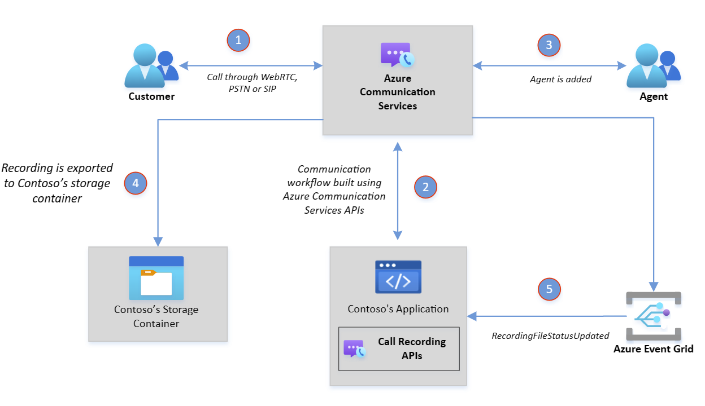

# Bring your own Azure storage overview

[!INCLUDE [Private Preview Disclaimer](../../../../communication-services/includes/private-preview-include-section.md)]

Bring Your Own Azure Storage for Call Recording allows you to specify an Azure blob storage account for storing call recording files. Bring your own Azure storage enables businesses to store their data in a way that meets their compliance requirements and business needs. For example, end-users could customize their own rules and access to the data, enabling them to store or delete content whenever they need it. Bring your own Azure Storage provides a simple and straightforward solution that eliminates the need for developers to invest time and resources in downloading and exporting files.

The same Azure Communication Services Call Recording APIs are used to export recordings to your Azure Blob Storage Container. While starting recording for a call, specify the container path where the recording needs to be exported. Upon recording completion, Azure Communication Services automatically fetches and uploads your recording to your storage.

## Azure Managed Identities

Bring your own Azure storage uses [Azure Managed Identities](../../../../active-directory/managed-identities-azure-resources/overview.md) to access user-owned resources securely. Azure Managed Identities provides an identity for the application to use when it needs to access Azure resources, eliminating the need for developers to manage credentials.

## Known issues

- Azure Communication Services will also store your files in a built-in storage for 48 hours even if the exporting is successful.
- Randomly, recording files are duplicated during the exporting process. Make sure you delete the duplicated file to avoid extra storage costs in your storage account.

## Next steps
For more information, see the following articles:
- Learn more about Bring your own Azure storage, check out the [BYO Azure Storage Quickstart](../../../quickstarts/call-automation/call-recording/bring-your-own-storage.md).
- Learn more about Call recording, check out the [Call Recording Quickstart](../../../quickstarts/voice-video-calling/get-started-call-recording.md).
- Learn more about [Call Automation](../../../quickstarts/call-automation/callflows-for-customer-interactions.md).

