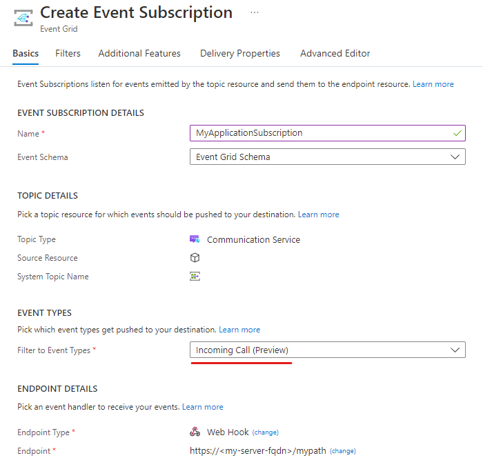
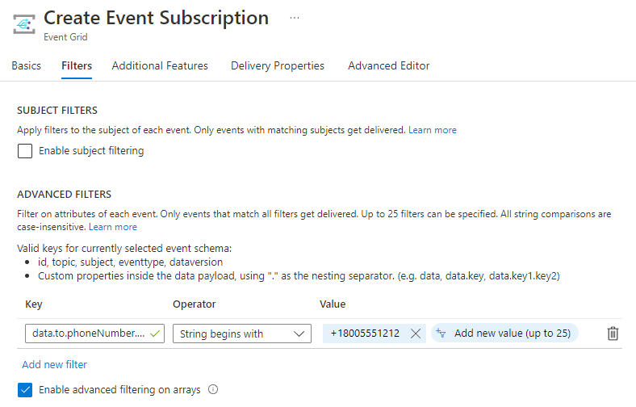

# Incoming call concepts

Azure Communication Services Call Automation enables developers to create applications that can make and receive calls. It leverages Event Grid subscriptions to deliver `IncomingCall` events, making it crucial to configure your environment to receive these notifications for your application to redirect or answer a call effectively. Therefore, understanding the fundamentals of incoming calls is essential for leveraging the full potential of Azure Communication Services Call Automation.

## Calling scenarios

Before setting up your environment, it's important to understand the scenarios that can trigger an `IncomingCall` event. To trigger an `IncomingCall` event, a call must be made to either an Azure Communication Services identity or a Public Switched Telephone Network (PSTN) number associated with your Azure Communication Services resource. The following are examples of these resources:

1. An Azure Communication Services identity
2. A PSTN phone number owned by your Azure Communication Services resource

Given these examples, the following scenarios trigger an `IncomingCall` event sent to Event Grid:

| Source | Destination | Scenario(s) |
| ------ | ----------- | -------- |
| Azure Communication Services identity | Azure Communication Services identity | Call, Redirect, Add Participant, Transfer |
| Azure Communication Services identity | PSTN number owned by your Azure Communication Services resource  | Call, Redirect, Add Participant, Transfer
| Public PSTN | PSTN number owned by your Azure Communication Services resource  | Call, Redirect, Add Participant, Transfer

> [!NOTE]
> It's important to understand that an Azure Communication Services identity can represent either a user or an application. While the platform does not have a built-in feature to explicitly assign an identity to a user or application, your application or supporting infrastructure can accomplish this. To learn more about this topic, refer to the [identity concepts guide](../identity-model.md).

## Register an Event Grid resource provider

If you haven't previously used Event Grid in your Azure subscription, you might need to register your Event Grid resource provider. To register the provider, follow these steps:

1. Go to the Azure portal.
2. On the left menu, select **Subscriptions**.
3. Select the subscription that you use for Event Grid.
4. On the left menu, under **Settings**, select **Resource providers**.
5. Find **Microsoft.EventGrid**.
6. If your resource provider isn't registered, select **Register**.

## Receiving an incoming call notification from Event Grid

In Azure Communication Services, receiving an `IncomingCall` notification is made possible through an Event Grid subscription. As the receiver of the notification, you have the flexibility to choose how to handle it. Since the Call Automation API leverages Webhook callbacks for events, it's common to use a 'Webhook' Event Grid subscription. However, the service offers various subscription types, and you have the liberty to choose the most suitable one for your needs.

This architecture has the following benefits:

- Using Event Grid subscription filters, you can route the `IncomingCall` notification to specific applications.
- PSTN number assignment and routing logic can exist in your application versus being statically configured online.
- As identified in the [calling scenarios](#calling-scenarios) section, your application can be notified even when users make calls between each other. You can then combine this scenario together with the [Call Recording APIs](../voice-video-calling/call-recording.md) to meet compliance needs.

For a sample payload of the event and more information on other calling events published to Event Grid, refer to this [guide](../../../event-grid/communication-services-voice-video-events.md#microsoftcommunicationincomingcall).

Here is an example of an Event Grid Webhook subscription where the event type filter is listening only to the `IncomingCall` event.



## Call routing options with Call Automation and Event Grid

In Call Automation and Event Grid, call routing can be tailored to your specific needs. By using [advanced filters](../../../event-grid/event-filtering.md) within your Event Grid subscription, you can subscribe to an `IncomingCall` notification that pertains to a specific source/destination phone number or an Azure Communication Services identity. This notification can then be directed to an endpoint, such as a Webhook subscription. Using the Call Automation SDK, the endpoint application can then make a decision to **redirect** the call to another Azure Communication Services identity or to the PSTN.

> [!NOTE]
> To ensure that your application receives only the necessary events, it is recommended to configure filtering in Event Grid. This is particularly crucial in scenarios that generate `IncomingCall` events, such as redirecting an inbound PSTN call to an Azure Communication Services endpoint. If a filter isn't used, your Event Grid subscription receives two `IncomingCall` events - one for the PSTN call and one for the Azure Communication Services user - even though you intended to receive only the first notification. Neglecting to handle such scenarios using filters or other mechanisms in your application can result in infinite loops and other undesirable behavior.

Here is an example of an advanced filter on an Event Grid subscription watching for the `data.to.PhoneNumber.Value` string starting with a PSTN phone number of `+18005551212.



## Number assignment

When using the `IncomingCall` notification in Azure Communication Services, you have the freedom to associate any particular number with any endpoint. For example, if you obtained a PSTN phone number of `+14255551212` and wish to assign it to a user with an identity of `375f0e2f-e8db-4449-9bf7-2054b02e42b4` in your application, you should maintain a mapping of that number to the identity. When an `IncomingCall` notification is sent that matches the phone number in the **to** field, you can invoke the `Redirect` API and provide the user's identity. In other words, you can manage the number assignment within your application and route or answer calls at runtime.

## Best Practices
1. To ensure that Event Grid delivers events to your Webhook endpoint and prevents malicious users from flooding your endpoint with events, you need to prove ownership of your endpoint. To address any issues with receiving events, confirm that the Webhook you configured is verified by handling `SubscriptionValidationEvent`. For more information, refer to this [guide](../../../event-grid/webhook-event-delivery.md).  
2. When an incoming call event is received, if your application fails to respond back with a 200Ok status code to Event Grid within the required time frame, Event Grid utilizes exponential backoff retry to send the event again. However, an incoming call only rings for 30 seconds, and responding to a call after that time won't be effective. To prevent retries for expired or stale calls, we recommend setting the retry policy as Max Event Delivery Attempts to 2 and Event Time to Live to 1 minute. You can find these settings under the Additional Features tab of the event subscription. Learn more about retries [here](../../../event-grid/delivery-and-retry.md).
3. We recommend you to enable logging for your Event Grid resource to monitor events that fail to deliver. To do this, navigate to the system topic under the Events tab of your Communication resource and enable logging from the Diagnostic settings. Failure logs can be found in the 'AegDeliveryFailureLogs' table.

    ```sql 
    AegDeliveryFailureLogs
    | limit 10 
    | where Message has "incomingCall"
    ```

## Next steps
- Try out the quickstart to [place an outbound call](../../quickstarts/call-automation/quickstart-make-an-outbound-call.md).
