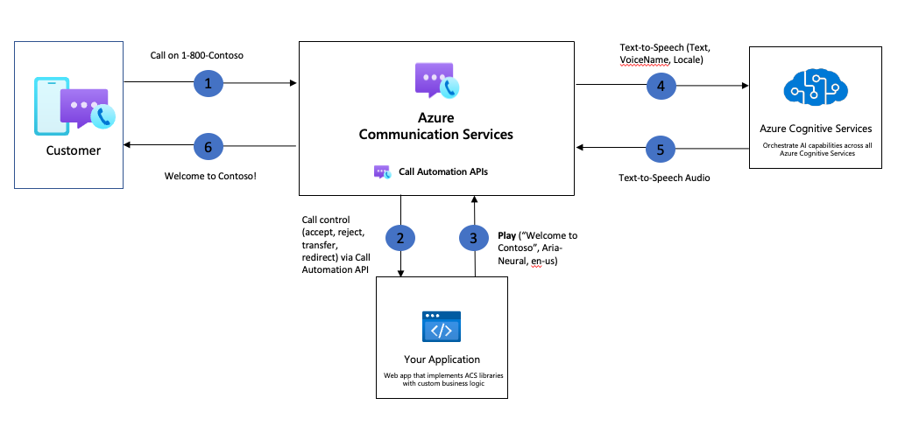
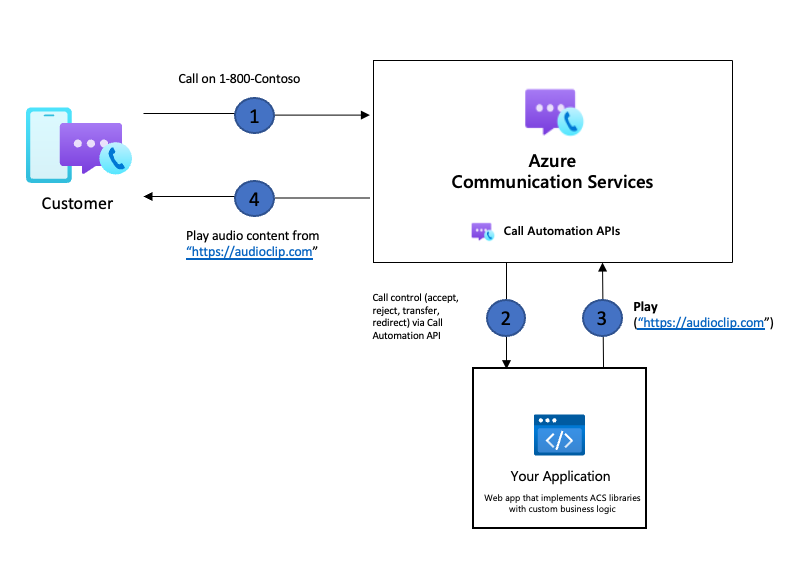

# Playing audio in calls

The play action provided through the Azure Communication Services Call Automation SDK allows you to play audio prompts to participants in the call. This action can be accessed through the server-side implementation of your application. You can play audio to call participants through one of two methods;
- Providing Azure Communication Services access to pre-recorded audio files of WAV format, that Azure Communication Services can access with support for authentication
- Regular text that can be converted into speech output through the integration with Azure AI services.

You can leverage the newly announced integration between [Azure Communication Services and Azure AI services](./azure-communication-services-azure-cognitive-services-integration.md) to play personalized responses using Azure [Text-To-Speech](../../../../articles/cognitive-services/Speech-Service/text-to-speech.md). You can use human like prebuilt neural voices out of the box or create custom neural voices that are unique to your product or brand. For more information on supported voices, languages and locales please see [Language and voice support for the Speech service](../../../../articles/cognitive-services/Speech-Service/language-support.md).

> [!NOTE]
> Azure Communication Services currently only supports WAV files formatted as mono channel audio recorded at 16KHz. You can create your own audio files using [Speech synthesis with Audio Content Creation tool](../../../../articles/cognitive-services/Speech-Service/how-to-audio-content-creation.md). 

## Prebuilt Neural Text to Speech voices
Microsoft uses deep neural networks to overcome the limits of traditional speech synthesis with regards to stress and intonation in spoken language. Prosody prediction and voice synthesis occur simultaneously, resulting in a more fluid and natural sounding output. You can use these neural voices to make interactions with your chatbots and voice assistants more natural and engaging. There are over 100 pre-built voices to choose from. Learn more about [Azure Text-to-Speech voices](../../../../articles/cognitive-services/Speech-Service/language-support.md).

## Common use cases 

The play action can be used in many ways, below are some examples of how developers may wish to use the play action in their applications.

### Announcements
Your application might want to play some sort of announcement when a participant joins or leaves the call, to notify other users.

### Self-serve customers

In scenarios with IVRs and virtual assistants, you can use your application or bots to play audio prompts to callers, this prompt can be in the form of a menu to guide the caller through their interaction.

### Hold music
The play action can also be used to play hold music for callers. This action can be set up in a loop so that the music keeps playing until an agent is available to assist the caller.

### Playing compliance messages
As part of compliance requirements in various industries, vendors are expected to play legal or compliance messages to callers, for example, “This call will be recorded for quality purposes”.

## Sample architecture for playing audio in call using Text-To-Speech

## Sample architecture for playing audio in a call

## Known limitations
- Play action isn't enabled to work with Teams Interoperability.

## Next steps
- Check out our how-to guide to learn [how-to play custom voice prompts](../../how-tos/call-automation/play-ai-action.md) to users.
