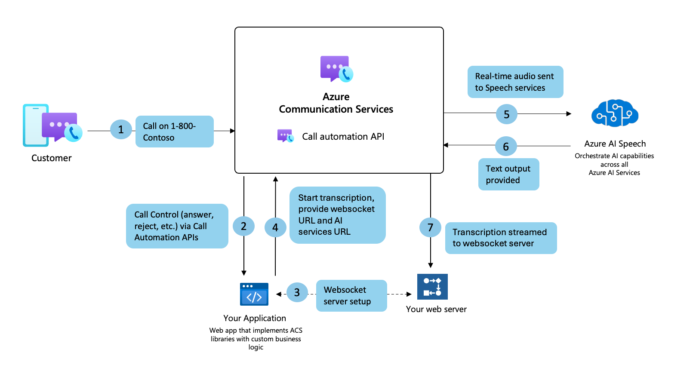

# Generating real-time transcripts

Real-time transcriptions are a crucial component in any major business for driving improved customer service experience. Powered by Azure Communication Services and Azure AI Services integration, developers can now use real-time transcriptions through Call Automation SDKs. 

Using the Azure Communication Services real-time transcription, you can easily integrate your Azure AI Services resource with Azure Communication Services to generate transcripts directly during the call. This capability eliminates the need for developers to extract audio content and deal with the overhead of converting audio into text on your side. You can store the contents of this transcript to use later on for creating a history of the call, summarizing the call to save an agent's time, and even feeding it into your training/learning modules to help improve your contact center agents' customer interactions.

Out of the box Microsoft utilizes a Universal Language Model as a base model that is trained with Microsoft-owned data and reflects commonly used spoken language. This model is pretrained with dialects and phonetics representing various common domains. For more information about supported languages, see [Languages and voice support for the Speech service](/azure/ai-services/speech-service/language-support).

## Common use cases

### Improved customer experience
Assist agents better understand customer needs and respond more quickly and accurately, leading to a better overall customer experience.

### Increased efficiency 
Help agents focus on the conversation rather than note-taking, allowing them to handle more calls and improve productivity

### Context for agents
Provide context to an agent before the agent picks up the call. This way, the agent knows the information the caller already gave and the caller does not need to repeat their issue.

### Derive insights
Using the transcript generated throughout the call, you can use other AI tools to gain live, real-time insights that help agents and supervisors improve their interactions with customers.

## Sample flow of real-time transcription using Call Automation

## Billing
See the [Azure Communication Services pricing page](https://azure.microsoft.com/pricing/details/communication-services/?msockid=3b3359f3828f6cfe30994a9483c76d50) for information on how real-time transcription is billed. Prices can be found in the calling category under audio streaming -> unmixed audio insights streaming.

## Known limitations
- Updating transcription with a new operationContext also fails to reflect the updated context.
  - When you create or answer a call with operationContext: "ABC" and enable transcription, you receive the TranscriptionStarted event with operationContext: "ABC".
  - If you call the UpdateTranscription API with a new operationContext: "XYZ," you would expect the TranscriptionUpdated event to include operationContext: "XYZ". However, due to a known issue, the TranscriptionUpdated event still returns operationContext: "ABC".

## Next Steps
- Check out our how-to guide to learn [how-to use our Real-time Transcription](../../how-tos/call-automation/real-time-transcription-tutorial.md) to users.
- Learn about [usage and operational logs](../analytics/logs/call-automation-logs.md) published by call automation.

