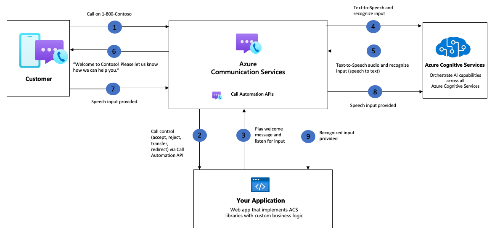
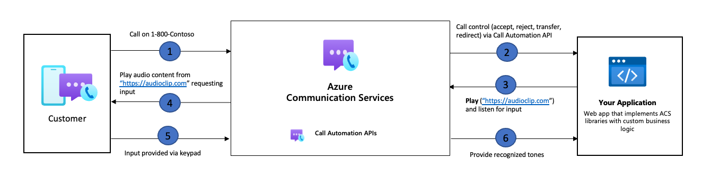

# Gathering user input with Recognize action

With the release of Azure Communication Services Call Automation Recognize action, developers can now enhance their IVR or contact center applications to recognize user input. One of the most common scenarios of recognition is playing a message for the user which prompts them to provide a response that then gets recognized by the application, once recognized the application then carries out a corresponding action. Input from callers can be received in several ways which include DTMF (user input via the digits on their calling device), speech or a combination of both DTMF and speech.

**Voice recognition with speech-to-text**

[Azure Communications services integration with Azure AI services](./azure-communication-services-azure-cognitive-services-integration.md), allows you through the Recognize action to analyze audio in real-time to transcribe spoken word into text. Out of the box Microsoft utilizes a Universal Language Model as a base model that is trained with Microsoft-owned data and reflects commonly used spoken language. This model is pre-trained with dialects and phonetics representing a variety of common domains. For more information about support languages please see [Languages and voice support for the Speech service](../../../../articles/cognitive-services/Speech-Service/language-support.md). 

**DTMF**

Dual-tone multifrequency (DTMF) recognition is the process of understanding tones/sounds generated by a telephone when a number is pressed. Equipment at the receiving end listening for the specific tone then converts them into commands. These commands generally signal user intent when navigating a menu in an IVR scenario or in some cases can be used to capture important information that the user needs to provide via their phones keypad.

**DTMF events and their associated tones**

|Event|Tone|
| --- |--|
|0|Zero|
|1|One|
|2|Two|
|3|Three|
|4|Four|
|5|Five|
|6|Six|
|7|Seven|
|8|Eight|
|9|Nine|
|A|A|
|B|B|
|C|C|
|D|D|
|*|Asterisk|
|#|Pound|

## Common use cases

The recognize action can be used for many reasons, below are a few examples of how developers can use the recognize action in their application.

### Improve user journey with self-service prompts

- **Users can control the call** - By enabling input recognition you allow the caller to navigate your IVR menu and provide information that can be used to resolve their query. 
- **Gather user information** - By enabling input recognition your application can gather input from the callers. This can be information such as account numbers, credit card information, etc.
- **Transcribe caller response** - With voice recognition you can collect user input and transcribe the audio to text and analyze it to carry out specific business action.

### Interrupt audio prompts

**User can exit from an IVR menu and speak to a human agent** - With DTMF interruption your application can allow users to interrupt the flow of the IVR menu and be able to chat to a human agent. 

## Sample architecture for gathering user input in a call with voice recognition

## Sample architecture for gathering user input in a call

## Next steps

- Check out our how-to guide to learn how you can [gather user input](../../how-tos/call-automation/recognize-ai-action.md).
