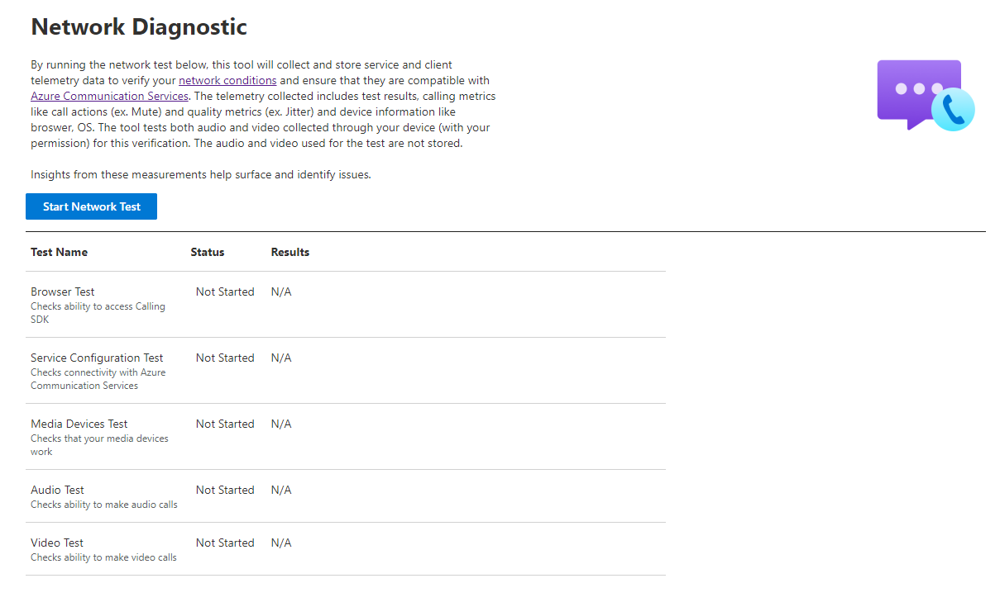

# Network Diagnostics Tool

[!INCLUDE [Public Preview Disclaimer](../../includes/public-preview-include.md)]

The **Network Diagnostics Tool** enables Azure Communication Services developers to ensure that their device and network conditions are optimal for connecting to the service to ensure a great call experience. The tool can be found at [aka.ms/acsdiagnostics](https://azurecommdiagnostics.net/). Users can quickly run a test, by pressing the start test button. The tool performs diagnostics on the network, devices, and call quality. The results of the diagnostics are directly provided through the tools UI. No sign-in required to use the tool. After the test, a GUID is presented which can be provided to our support team for further help.

  
As part of the diagnostics performed, the user is asked to enable permissions for the tool to access their devices. Next, the tool performs an audio and video test to measure the audio and video network conditions.

If you're looking to build your own Network Diagnostic Tool or to perform deeper integration of this tool into your application, you can leverage [pre-call diagnostic APIs](../voice-video-calling/pre-call-diagnostics.md) for the calling SDK. 
  
## Performed tests

  The tool performs the following tests on behalf of the users and provides results for them:
  
  | Test                              | Description                              |
  |-----------------------------------|------------------------------------------|
  | Browser Diagnostic                |  Checks for browser compatibility. Azure Communication Services supports specific browsers for [calling](../voice-video-calling/calling-sdk-features.md#javascript-calling-sdk-support-by-os-and-browser) and [chat](../chat/sdk-features.md#javascript-chat-sdk-support-by-os-and-browser). | 
  | Media Device Diagnostic           | Checks for availability of device (camera, microphone and speaker) and enabled permissions for those devices on the browser. |
  | Audio Test                        | Performs an echo bot call. Here the user can talk to echo bot and hear themselves back. The test records media quality statistics for audio including jitter, bitrate, packet loss and RTT with thresholds for optimal conditions. |
  | Video Test                        | Performs a loop back video test, where video captured by the camera is sent back and forth to check for network quality conditions. The test records media quality statistics for video including jitter, bitrate, packet loss and RTT with thresholds for optimal conditions. |
  
## Privacy

When a user runs a network diagnostic, the tool collects and store service and client telemetry data to verify your network conditions and ensure that they're compatible with Azure Communication Services.

The telemetry collected doesn't contain personal identifiable information. The test utilizes both audio and video collected through your device for this verification. The audio and video used for the test aren't stored.

## Support

The test provides a **unique identifier** for your test, which you can provide our support team who can provide further help. For more information, see [help and support options](../../support.md)
  
## Next Steps

- [Use Pre-Call Diagnostic APIs to build your own tech check](../voice-video-calling/pre-call-diagnostics.md)
- [Explore User-Facing Diagnostic APIs](../voice-video-calling/user-facing-diagnostics.md)
- [Enable Media Quality Statistics in your application](../voice-video-calling/media-quality-sdk.md)
- [Consume call logs with Azure Monitor](../analytics/logs/voice-and-video-logs.md)
