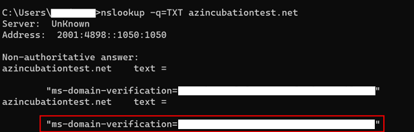
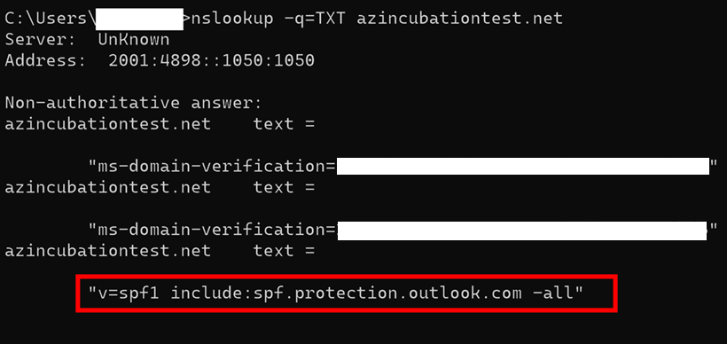
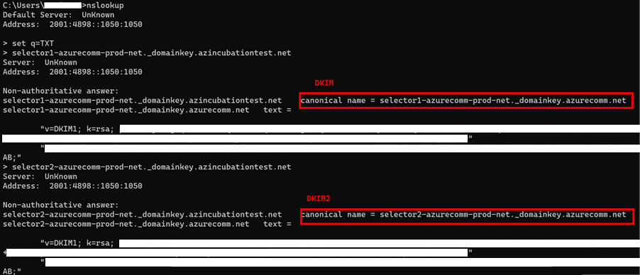

# Troubleshooting Domain Configuration issues

This guide describes how to resolve common problems with setting up and using custom domains for Azure Email Communication Service.

## 1. Unable to verify Custom Domain Status

You need to verify the ownership of your domain by adding a TXT record to your domain's registrar or Domain Name System (DNS) hosting provider. If the domain verification fails for any reason, complete the following steps in this section to identify and resolve the underlying issue.

### Reasons  

Once the verification process starts, Azure Email Communication Service attempts to read the TXT record from your custom domain. If Azure Email Communication Service fails to read the TXT record, it marks the verification status as failed.

### Steps to resolve

1. Copy the proposed TXT record by Email Service from [Azure portal](https://portal.azure.com). Your TXT record should be similar to this example:  

    `ms-domain-verification=43d01b7e-996b-4e31-8159-f10119c2087a`

2. If you haven’t added the TXT record, then you must add the TXT record to your domain's registrar or DNS hosting provider. For step-by-step instructions, see [Quickstart: How to add custom verified email domains](../../quickstarts/email/add-custom-verified-domains.md).   

3. Once you add the TXT record, you can query the TXT records for your custom domain.  

    1. Use the `nslookup` tool from Windows CMD terminal to read TXT records from your domain.
    2. Use a third-party DNS lookup tool: 

        https://www.bing.com/search?q=dns+lookup+tool

    In this section, we continue using the `nslookup` method.

4. Use the following `nslookup` command to query the TXT records: 

    `nslookup -q=TXT YourCustomDomain.com` 

    The `nslookup` query should return records like this: 

    

5. Review the list of TXT records for your custom domain. If you don’t see your TXT record listed, Azure Email Communication Service can't verify the domain.

## 2. Unable to verify SPF status

Once you verify the domain status, you need to verify the Sender Policy Framework (SPF) and DomainKeys Identified Mail (DKIM), and DKIM2. If your SPF status is failing, follow these steps to resolve the issue.

1.	Copy your SPF record from [Azure portal](https://portal.azure.com). Your SPF record should look like this:

    `v=spf1 include:spf.protection.outlook.com -all`  

2. Azure Email Communication Service requires you to add the SPF record to your domain's registrar or DNS hosting provider. For a list of providers, see [Add DNS records in popular domain registrars](../../quickstarts/email/add-custom-verified-domains.md#add-dns-records-in-popular-domain-registrars). 

4. Once you add the SPF record, you can query the SPF records for your custom domain. Here are two methods:

    1. Use `nslookup` tool from Windows CMD terminal to read SPF records from your domain.
    2. Use a third-party DNS lookup tool:

        https://www.bing.com/search?q=dns+lookup+tool

    In this section, we continue using the `nslookup` method.

5. Use the following `nslookup` command to query the SPF record: 

    `nslookup -q=TXT  YourCustomDomain.com`

    This query returns a list of TXT records for your custom domain. 

    

6. Review the list of TXT headers for your custom domain. If you don’t see your SPF record listed here, Azure Email Communication Service can't verify the SPF Status for your custom domain. 

7. Check for `-all` in your SPF record.

    If your SPF records contain `~all` the SPF verification fails.

    Azure Communication Services requires `-all` instead of `~all` to validate your SPF record.

## 3. Unable to verify DKIM or DKIM2 Status

If Azure Email Communication Service fails to verify the DKIM or DKIM2 status, follow these steps to resolve the issue.

1.	Open your command prompt and use `nslookup`:

    `nslookup set q=TXT`

2. If DKIM fails, then use `selector1`. If DKIM2 fails, then use `selector2`.

    `selector1-azurecomm-prod-net._domainkey.contoso.com`

    `selector2-azurecomm-prod-net._domainkey.contoso.com`

3. This query returns the CNAME DKIM records for your custom domain.

    

4. If `nslookup` returns your CNAME DKIM or DKIM2 records, similar to the preceding image, then you can expect Azure Email Communication Service to verify the DKIM or DKIM2 status.

    If the DKIM/DKIM2 CNAME records are missing from `nslookup` output, then Azure Email Communication Service can't verify the DKIM or DKIM2 status.

    For a list of providers, see [CNAME records](../../quickstarts/email/add-custom-verified-domains.md#cname-records).

## Next steps

* [Email domains and sender authentication for Azure Communication Services](./email-domain-and-sender-authentication.md)

* [Quickstart: Create and manage Email Communication Service resource in Azure Communication Services](../../quickstarts/email/create-email-communication-resource.md)

* [Quickstart: How to connect a verified email domain with Azure Communication Services resource](../../quickstarts/email/connect-email-communication-resource.md)

## Related articles

- [Email client library](../email/sdk-features.md)
- [Add custom verified domains](../../quickstarts/email/add-custom-verified-domains.md)
- [Add Azure Managed domains](../../quickstarts/email/add-azure-managed-domains.md)
- [Quota increase for email domains](./email-quota-increase.md)
