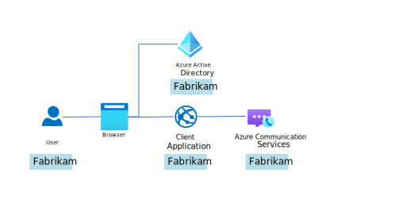
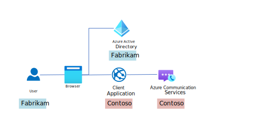

# Single-tenant and multitenant authentication for Microsoft Entra ID users

 This article provides an overview of the authentication process for both single-tenant and multitenant *Microsoft Entra ID* applications. It explains how authentication can be used when building communication experiences for Microsoft Entra ID users with *Azure Communication Services*, and breaks down the individual authentication artifacts involved in each use case.

## Case 1: Example of a single-tenant application
The Fabrikam company has built an internal application where all users are from the same Microsoft Entra ID tenant. Access to Azure Communication Services is controlled by *Azure Portal blade* or [Entra Id Assignment](/rest/api/communication/identity/entra-id-assignment) REST APIs.

The following sequence diagram details single-tenant authentication.

:::image type="content" source="./media/identity/entra-id/entra-id-single-tenant-authentication-sequence-diagram.svg" alt-text="A sequence diagram that details authentication of Fabrikam's Microsoft Entra ID users. The client application gets an Azure Communication Services access token for a single tenant Microsoft Entra application." lightbox="./media/identity/entra-id/entra-id-single-tenant-authentication-sequence-diagram.svg":::

Before we begin:
- Alice or her Microsoft Entra administrator needs to give the custom Microsoft Entra ID application consent, prior to the first attempt to sign in. Learn more about [consent](../../../active-directory/develop/consent-framework.md).
- The Fabrikam Azure Communication Services resource admin needs to grant Alice permission to perform her role via *Azure Portal blade* or [Entra Id Assignment](/rest/api/communication/identity/entra-id-assignment) REST APIs.

Steps:
1. Authenticate Alice using Microsoft Entra ID: Alice is authenticated using a standard OAuth flow with *Microsoft Authentication Library (MSAL)* or *Azure Identity SDK*. If authentication is successful, the client application receives a Microsoft Entra access token, with a value of `A`. Tokens are outlined later in this article. Authentication from the developer perspective is explored in this [quickstart](../quickstarts/identity/entra-id-authentication-integration.md#developer-actions).
1. Get an access token for Alice: The Fabrikam application by using the authentication artifact with value `A` performs exchange the Microsoft Entra access token for an Azure Communication Services access token logic. After successful authorization, the Azure Communication Services access token `B` is generated for Alice within the Fabrikam application. This access token can be used for data plane actions in Azure Communication Services, like Calling. For more information on how to implement the logic, see [Obtain access tokens for Microsoft Entra ID users](../quickstarts/identity/entra-id-authentication-integration.md) and [Get an Application ID](../troubleshooting-info.md#get-an-application-id).
1. Call Bob: Alice makes a call to Microsoft Entra ID user Bob, with Fabrikam's app. The call takes place via the Calling SDK with an Azure Communication Services access token. Learn more about [developing application for Microsoft Entra ID users](../quickstarts/identity/entra-id-authentication-integration.md#developer-actions).

Artifacts:
- Artifact `A`
  - Type: Microsoft Entra access token
  - Audience: _`Azure Communication Services`_, control plane
  - Source: Fabrikam's Microsoft Entra tenant
  - Permissions: _All permissions listed in [Access tokens with Microsoft Entra ID](./identity-model.md#access-tokens-with-microsoft-entra-id)_
- Artifact `B`
  - Type: Azure Communication Services access token
  - Audience: _`Azure Communication Services`_, data plane
  - Azure Communication Services Resource ID: Fabrikam's _`Azure Communication Services Resource ID`_
  
## Case 2: Example of a multitenant application
The Contoso company has built an application for external customers. The Fabrikam company decided to use the application. This application uses Microsoft Entra ID authentication within Contoso's infrastructure. 

The following sequence diagram details multitenant authentication.

:::image type="content" source="./media/identity/entra-id/entra-id-multi-tenant-authentication-sequence-diagram.svg" alt-text="A sequence diagram that details authentication of Microsoft Entra ID users and Azure Communication Services access tokens for multitenant Microsoft Entra applications." lightbox="./media/identity/entra-id/entra-id-multi-tenant-authentication-sequence-diagram.svg":::

Before we begin:
- Alice or her Microsoft Entra administrator needs to give Contoso's Microsoft Entra application consent before the first attempt to sign in. Learn more about [consent](/entra/identity-platform/application-consent-experience).
- The Contoso Azure Communication Services resource admin needs to grant Alice permission to perform her role via *Azure Portal blade* or [Entra Id Assignment](/rest/api/communication/identity/entra-id-assignment) REST APIs.

Steps:
1. Authenticate Alice using the Contoso application: Alice is authenticated using a standard OAuth flow with *Microsoft Authentication Library (MSAL)* or *Azure Identity SDK*. If authentication is successful, the client application receives a Microsoft Entra access token, with a value of `A`. Tokens are outlined later in this article. Authentication from the developer perspective is explored in this [quickstart](../quickstarts/identity/entra-id-authentication-integration.md#developer-actions). 
1. Get an access token for Alice: The Contoso application by using the authentication artifact with value `A` performs exchange the Microsoft Entra access token for an Azure Communication Services access token logic. After successful authorization, the Azure Communication Services access token `B` is generated for Alice within the Contoso application. This access token can be used for data plane actions in Azure Communication Services, like Calling. For more information on how to implement the logic, see [Obtain access tokens for Microsoft Entra ID users](../quickstarts/identity/entra-id-authentication-integration.md) and [Get an Application ID](../troubleshooting-info.md#get-an-application-id).
1. Call Bob: Alice makes a call to Microsoft Entra ID user Bob, with Contoso's app. The call takes place via the Calling SDK with an Azure Communication Services access token. Learn more about [developing application for Microsoft Entra ID users](../quickstarts/identity/entra-id-authentication-integration.md).

Artifacts:
- Artifact `A`
  - Type: Microsoft Entra access token
  - Audience: _`Azure Communication Services`_, control plane
  - Source: Contoso application registration's Microsoft Entra tenant
  - Permissions: _All permissions listed in [Access tokens with Microsoft Entra ID](./identity-model.md#access-tokens-with-microsoft-entra-id)_
- Artifact `B`
  - Type: Azure Communication Services access token
  - Audience: _`Azure Communication Services`_, data plane
  - Azure Communication Services Resource ID: Contoso's _`Azure Communication Services Resource ID`_

## Next steps

- Try this [quickstart to authenticate Microsoft Entra ID users](../quickstarts/identity/entra-id-authentication-integration.md).

The following sample app may be interesting to you:

- Try the [Sample App](https://github.com/Azure-Samples/communication-services-javascript-quickstarts/tree/main/entra-id-users-support-quickstart), which showcases a process of acquiring Azure Communication Services access tokens for Microsoft Entra ID users in mobile and desktop applications.

