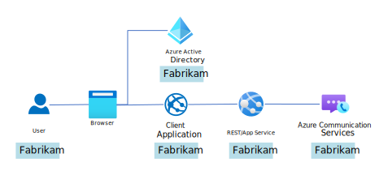
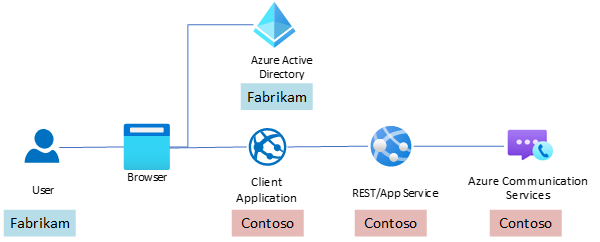

# Single-tenant and multi-tenant authentication for Teams users

 This article gives you insight into the authentication process for single-tenant and multi-tenant, *Microsoft Entra ID* (Microsoft Entra ID) applications. You can use authentication when you build calling experiences for Teams users with the *Calling software development kit* (SDK) that *Azure Communication Services* makes available. Use cases in this article also break down individual authentication artifacts.

## Case 1: Example of a single-tenant application
The Fabrikam company has built a custom, Teams calling application for internal company use. All Teams users are managed by Microsoft Entra ID. Access to Azure Communication Services is controlled by *Azure role-based access control (Azure RBAC)*.

The following sequence diagram details single-tenant authentication.

:::image type="content" source="./media/custom-teams-endpoint/authentication-case-single-tenant-azure-rbac.svg" alt-text="A sequence diagram that details authentication of Fabrikam Teams users. The client application gets an Azure Communication Services access token for a single tenant Microsoft Entra application." lightbox="./media/custom-teams-endpoint/authentication-case-single-tenant-azure-rbac.svg":::

Before we begin:
- Alice or her Microsoft Entra administrator needs to give the custom Teams application consent, prior to the first attempt to sign in. Learn more about [consent](../../../active-directory/develop/consent-framework.md).
- The Azure Communication Services resource admin needs to grant Alice permission to perform her role. Learn more about [Azure RBAC role assignment](../../../role-based-access-control/role-assignments-portal.md).

Steps:
1. Authenticate Alice using Microsoft Entra ID: Alice is authenticated using a standard OAuth flow with *Microsoft Authentication Library (MSAL)*. If authentication is successful, the client application receives a Microsoft Entra access token, with a value of 'A1' and an Object ID of a Microsoft Entra user with a value of 'A2'. Tokens are outlined later in this article. Authentication from the developer perspective is explored in this [quickstart](../../quickstarts/manage-teams-identity.md).
1. Get an access token for Alice: The Fabrikam application by using a custom authentication artifact with value 'B' performs authorization logic to decide whether Alice has permission to exchange the Microsoft Entra access token for an Azure Communication Services access token. After successful authorization, the Fabrikam application performs control plane logic, using artifacts 'A1', 'A2', and 'A3'. Azure Communication Services access token 'D' is generated for Alice within the Fabrikam application. This access token can be used for data plane actions in Azure Communication Services, like Calling. The 'A2' and 'A3' artifacts are passed along with the artifact 'A1' for validation. The validation assures that the Microsoft Entra Token was issued to the expected user. The application and will prevent attackers from using the Microsoft Entra access tokens issued to other applications or other users. For more information on how to get 'A' artifacts, see [Receive the Microsoft Entra user token and object ID via the MSAL library](../../quickstarts/manage-teams-identity.md?pivots=programming-language-csharp#step-1-receive-the-azure-ad-user-token-and-object-id-via-the-msal-library) and [Getting Application ID](../troubleshooting-info.md#getting-application-id).
1. Call Bob: Alice makes a call to Teams user Bob, with Fabrikam's app. The call takes place via the Calling SDK with an Azure Communication Services access token. Learn more about [developing custom Teams clients](../../quickstarts/voice-video-calling/get-started-with-voice-video-calling-custom-teams-client.md).

Artifacts:
- Artifact A1
  - Type: Microsoft Entra access token
  - Audience: _`Azure Communication Services`_ — control plane
  - Source: Fabrikam's Microsoft Entra tenant
  - Permissions: _`https://auth.msft.communication.azure.com/Teams.ManageCalls`_, _`https://auth.msft.communication.azure.com/Teams.ManageChats`_
- Artifact A2
  - Type: Object ID of a Microsoft Entra user
  - Source: Fabrikam's Microsoft Entra tenant
  - Authority: `https://login.microsoftonline.com/<tenant>/`
- Artifact A3
  - Type: Microsoft Entra application ID
  - Source: Fabrikam's Microsoft Entra tenant
- Artifact B
  - Type: Custom Fabrikam authorization artifact (issued either by Microsoft Entra ID or a different authorization service)
- Artifact C
  - Type: Azure Communication Services resource authorization artifact. 
  - Source: "Authorization" HTTP header with either a bearer token for [Microsoft Entra authentication](../authentication.md#azure-ad-authentication) or a Hash-based Message Authentication Code (HMAC) payload and a signature for [access key-based authentication](../authentication.md#access-key).
- Artifact D
  - Type: Azure Communication Services access token
  - Audience: _`Azure Communication Services`_ — data plane
  - Azure Communication Services Resource ID: Fabrikam's _`Azure Communication Services Resource ID`_
  
## Case 2: Example of a multi-tenant application
The Contoso company has built a custom Teams calling application for external customers. This application uses custom authentication within Contoso's own infrastructure. Contoso uses a connection string to retrieve tokens from Fabrikam's application.

The following sequence diagram details multi-tenant authentication.

:::image type="content" source="./media/custom-teams-endpoint/authentication-case-multiple-tenants-hmac.svg" alt-text="A sequence diagram that details authentication of Teams users and Azure Communication Services access tokens for multi-tenant Microsoft Entra applications." lightbox="./media/custom-teams-endpoint/authentication-case-multiple-tenants-hmac.svg":::

Before we begin:
- Alice or her Microsoft Entra administrator needs to give Contoso's Microsoft Entra application consent before the first attempt to sign in. Learn more about [consent](../../../active-directory/develop/consent-framework.md).

Steps:
1. Authenticate Alice using the Fabrikam application: Alice is authenticated through Fabrikam's application. A standard OAuth flow with Microsoft Authentication Library (MSAL) is used. Make sure you configure MSAL with a correct [authority](../../../active-directory/develop/msal-client-application-configuration.md#authority). If authentication is successful, the Contoso client application receives a Microsoft Entra access token with a value of 'A1' and an Object ID of a Microsoft Entra user with a value of 'A2'. Token details are outlined below. Authentication from the developer perspective is explored in this [quickstart](../../quickstarts/manage-teams-identity.md). 
1. Get an access token for Alice: The Contoso application by using a custom authentication artifact with value 'B' performs authorization logic to decide whether Alice has permission to exchange the Microsoft Entra access token for an Azure Communication Services access token. After successful authorization, the Contoso application performs control plane logic, using artifacts 'A1', 'A2', and 'A3'. An Azure Communication Services access token 'D' is generated for Alice within the Contoso application. This access token can be used for data plane actions in Azure Communication Services, like Calling. The 'A2' and 'A3' artifacts are passed along with the artifact 'A1'. The validation assures that the Microsoft Entra Token was issued to the expected user. The application and will prevent attackers from using the Microsoft Entra access tokens issued to other applications or other users. For more information on how to get 'A' artifacts, see [Receive the Microsoft Entra user token and object ID via the MSAL library](../../quickstarts/manage-teams-identity.md?pivots=programming-language-csharp#step-1-receive-the-azure-ad-user-token-and-object-id-via-the-msal-library) and [Getting Application ID](../troubleshooting-info.md#getting-application-id).
1. Call Bob: Alice makes a call to Teams user Bob, with Fabrikam's application. The call takes place via the Calling SDK with an Azure Communication Services access token. Learn more about developing custom, Teams apps [in this quickstart](../../quickstarts/voice-video-calling/get-started-with-voice-video-calling-custom-teams-client.md).

Artifacts:
- Artifact A1
  - Type: Microsoft Entra access token
  - Audience: Azure Communication Services — control plane
  - Source: Contoso application registration's Microsoft Entra tenant
  - Permission: _`https://auth.msft.communication.azure.com/Teams.ManageCalls`_, _`https://auth.msft.communication.azure.com/Teams.ManageChats`_
- Artifact A2
  - Type: Object ID of a Microsoft Entra user
  - Source: Fabrikam's Microsoft Entra tenant
  - Authority: `https://login.microsoftonline.com/<tenant>/` or `https://login.microsoftonline.com/organizations/` (based on your [scenario](../../../active-directory/develop/msal-client-application-configuration.md#authority))
- Artifact A3
  - Type: Microsoft Entra application ID
  - Source: Contoso application registration's Microsoft Entra tenant
- Artifact B
  - Type: Custom Contoso authorization artifact (issued either by Microsoft Entra ID or a different authorization service)
- Artifact C
  - Type: Azure Communication Services resource authorization artifact. 
  - Source: "Authorization" HTTP header with either a bearer token for [Microsoft Entra authentication](../authentication.md#azure-ad-authentication) or a Hash-based Message Authentication Code (HMAC) payload and a signature for [access key-based authentication](../authentication.md#access-key)
- Artifact D
  - Type: Azure Communication Services access token
  - Audience: _`Azure Communication Services`_ — data plane
  - Azure Communication Services Resource ID: Contoso's _`Azure Communication Services Resource ID`_

## Next steps

- Learn more about [authentication](../authentication.md).
- Try this [quickstart to authenticate Teams users](../../quickstarts/manage-teams-identity.md).
- Try this [quickstart to call a Teams user](../../quickstarts/voice-video-calling/get-started-with-voice-video-calling-custom-teams-client.md).

The following sample apps may be interesting to you:

- Try the [Sample App](https://github.com/Azure-Samples/communication-services-javascript-quickstarts/tree/main/manage-teams-identity-mobile-and-desktop), which showcases a process of acquiring Azure Communication Services access tokens for Teams users in mobile and desktop applications.

- To see how the Azure Communication Services access tokens for Teams users are acquired in a single-page application, check out a [SPA sample app](https://github.com/Azure-Samples/communication-services-javascript-quickstarts/tree/main/manage-teams-identity-spa).

- To learn more about a server implementation of an authentication service for Azure Communication Services, check out the [Authentication service hero sample](../../samples/trusted-auth-sample.md).
