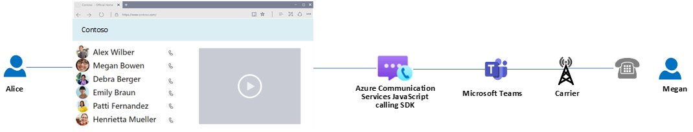
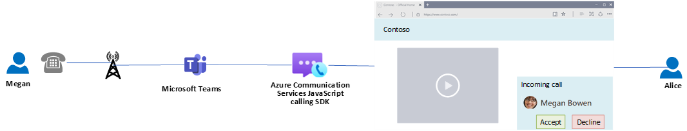
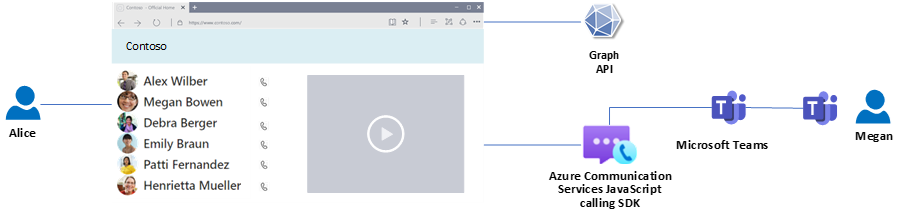
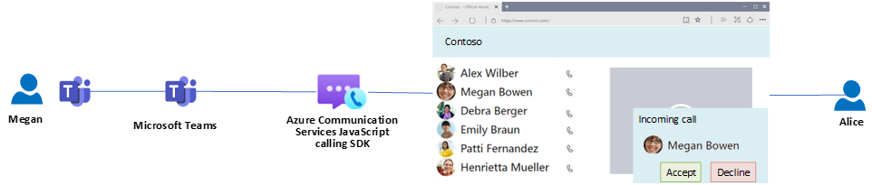
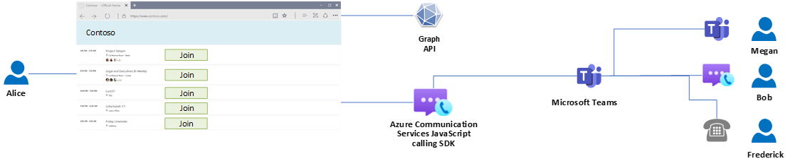

# Azure Communication Services support for Teams identities — Use cases

Microsoft Teams provides identities managed by Microsoft Entra ID and calling experiences controlled by Teams Admin Center and policies. Users might have assigned licenses to enable phone calls and advanced calling capabilities of Microsoft Teams Phone. Azure Communication Services support for Teams identities allows managing Teams voice over IP (VoIP) calls, Teams phone calls, and join Teams meetings. Developers might extend the Azure Communication Services with Graph API to provide contextual data from Microsoft 365 ecosystem. This page is providing inspiration on how to use existing Microsoft technologies to provide an end-to-end experience for calling scenarios with Teams users and Azure Communication Services calling SDKs. 

## Use case 1: Make outbound Teams PSTN call
This scenario is showing a multi-tenant use case, where company Contoso is providing SaaS to company Fabrikam. SaaS allows Fabrikam's users to make Teams phone calls via a custom website that takes the identity of the Teams user and configuration of the PSTN connectivity assigned to that Teams user.



The following sequence diagram shows detailed steps of initiation of a Teams phone call:

:::image type="content" source="./media/custom-teams-endpoint/end-to-end-use-cases/cte-e2e-cte-to-pstn-out-full.svg" alt-text="Sequence diagram is describing detailed set of steps that happens to initiate a Teams phone call using Azure Communication Services and Teams." lightbox="./media/custom-teams-endpoint/end-to-end-use-cases/cte-e2e-cte-to-pstn-out-full.svg":::

### Steps
1. Authenticate Alice from Fabrikam in Contoso's client application: Alice is using a browser to open Fabrikam's web page and authenticates. You can find more details about [the authentication with Teams identity](./custom-teams-endpoint-authentication-overview.md). If the authentication is successful, Alice is redirected to the initial page.
2. Load customers and their PSTN numbers: Contoso provides custom logic to retrieve the list of customers and their associated phone numbers. This list is rendered on the initial page to Alice.
3. Initiate a call to Megan: Alice selects a button to initiate a PSTN call to Megan in the Contoso's Client application. Client application uses Azure Communication Services calling SDK to provide the calling capability. First, it creates an instance of callAgent, that holds the Azure Communication Services access token acquired during first step.

```js
const callClient = new CallClient(); 
tokenCredential = new AzureCommunicationTokenCredential('<AlICE_ACCESS_TOKEN>');
callAgent = await callClient.createTeamsCallAgent(tokenCredential)
```
Then you need to start a call to Megan's phone number.

```js
const pstnCallee = { phoneNumber: '<MEGAN_PHONE_NUMBER_E164_FORMAT>' }
const oneToOneCall = callAgent.startCall([pstnCallee], { threadId: '00000000-0000-0000-0000-000000000000' });
```
4. Connecting PSTN call to Megan: The call is routed through the Teams phone connectivity assigned to Alice, reaching the PSTN network and ringing the phone associated with the provided phone number. Megan sees an incoming call from the phone number associated with Alice's Teams user. 
5. Megans accepts the call: Megan accepts the call and the connection between Alice and Megan is established.

## Use case 2: Receive inbound Teams phone call
This scenario is showing a multi-tenant use case, where company Contoso is providing SaaS to company Fabrikam. SaaS allows Fabrikam's users to receive a Teams phone call via a custom website that takes the identity of the Teams user and configuration of the PSTN connectivity assigned to that Teams user.



The following sequence diagram shows detailed steps for accepting incoming Teams phone calls:

:::image type="content" source="./media/custom-teams-endpoint/end-to-end-use-cases/cte-e2e-cte-to-pstn-in-full.svg" alt-text="Sequence diagram is describing detailed set of steps that happens to receive a Teams phone call using Azure Communication Services and Teams." lightbox="./media/custom-teams-endpoint/end-to-end-use-cases/cte-e2e-cte-to-pstn-in-full.svg":::

### Steps
1. Authenticate Alice from Fabrikam in Contoso's client application: Alice is using a browser to open Fabrikam's web page and authenticates. You can find more details about [the authentication with Teams identity](./custom-teams-endpoint-authentication-overview.md). If the authentication is successful, Alice is redirected to the initial page.
2. Subscribe for receiving calls: Client application uses Azure Communication Services calling SDK to provide the calling capability. First, it creates an instance of callAgent, that holds the Azure Communication Services access token acquired during first step.

```js
const callClient = new CallClient(); 
tokenCredential = new AzureCommunicationTokenCredential('<AlICE_ACCESS_TOKEN>');
callAgent = await callClient.createTeamsCallAgent(tokenCredential)
```
Then you subscribe to the incoming call event.

```js
const incomingCallHandler = async (args: { teamsIncomingCall: TeamsIncomingCall }) => {
    
    const incomingCall = args.teamsIncomingCall;
    
    // Get information about caller
    var callerInfo = incomingCall.callerInfo
    
    showIncomingCall(callerInfo,incomingCall);
};
callAgent.on('incomingCall', incomingCallHandler);
```
The method _showIncomingCall_ is a custom Contoso's method that will render a user interface to indicate incoming calls and two buttons to accept and decline the call. If you select accept button, then the following code is used:

```js
// Accept the call
var call = await incomingCall.accept();
```

If you select the decline button, then the following code is used:


```js
// Reject the call
incomingCall.reject();
```

3. Megan start's a call to PSTN number assigned to Teams user Alice: Megan uses her phone to call Alice. The carrier network will connect to Teams phone connectivity assigned to Alice and it will ring all Teams endpoints registered for Alice. It includes: Teams desktop, mobile, web clients, and applications based on Azure Communication Services calling SDK.
4. Contoso's client application shows Megan's incoming call: Client application receives incoming call notification. _showIncomingCall_ method would use custom Contoso's logic to translate the phone number to customer's name (for example, a database storing key-value pairs consisting of a phone number and customer name). When the information is retrieved, the notification is shown to Alice in Contoso's client application.
5. Alice accepts the call: Alice selects a button to accept the call and the connection between Alice and Megan is established.


## Use case 3: Make outbound Teams VoIP call
This scenario is showing a multi-tenant use case, where company Contoso is providing SaaS to company Fabrikam. SaaS allows Fabrikam's users to make Teams VoIP calls via a custom website that takes the identity of the Teams user.



The following sequence diagram shows detailed steps for initiation of a Teams VoIP call:

:::image type="content" source="./media/custom-teams-endpoint/end-to-end-use-cases/cte-e2e-cte-to-voip-out-full.svg" alt-text="Sequence diagram is describing detailed set of steps that happens to initiate a Teams VoIP call using Azure Communication Services and Teams." lightbox="./media/custom-teams-endpoint/end-to-end-use-cases/cte-e2e-cte-to-voip-out-full.svg":::

### Steps
1. Authenticate Alice from Fabrikam in Contoso's client application: Alice is using a browser to open Fabrikam's web page and authenticates. You can find more details about [the authentication with Teams identity](./custom-teams-endpoint-authentication-overview.md). If the authentication is successful, Alice is redirected to the initial page.
2. Load users from Fabrikam's organization and their identifiers: Contoso client application utilizes Graph API to get a list of users from Fabrikam's tenant. Alice or her Admin needs to provide consent to Graph API to perform this action. You can learn more about [the Graph API command in the documentation](/graph/api/user-list).

```
GET https://graph.microsoft.com/v1.0/users
Permissions: User.ReadBasic.All (delegated)
Response: response.body.value[1].displayName; // ”Megan Bowen”
	  response.body.value[1].id; // "e8b753b5-4117-464e-9a08-713e1ff266b3"
```

Contoso's client application will then show the list of users and the ability to initiate a call to a given user.

3. Initiate a call to Megan: Alice selects a button to initiate a Teams VoIP call to Megan in the Contoso's Client application. Client application uses Azure Communication Services calling SDK to provide the calling capability. Calls in Teams Clients are associated with Teams chat. First, the application requests creation of a dedicated chat for the VoIP call.

```
POST https://graph.microsoft.com/v1.0/chats
Body:
{
    "chatType": "oneOnOne",
    "members": [
        {
            "@odata.type": "#microsoft.graph.aadUserConversationMember",
            "roles": [
                "owner"
            ],
            "user@odata.bind": "https://graph.microsoft.com/v1.0/users('8c0a1a67-50ce-4114-bb6c-da9c5dbcf6ca')"
        },
        {
            "@odata.type": "#microsoft.graph.aadUserConversationMember",
            "roles": [
                "owner"
            ],
            "user@odata.bind": "https://graph.microsoft.com/v1.0/users('e8b753b5-4117-464e-9a08-713e1ff266b3')"
        }
    ]
}
Permissions: Chat.Create (delegated)
Response: response.body.value.id; // "19:8c0a1a67-50ce-4114-bb6c-da9c5dbcf6ca_e8b753b5-4117-464e-9a08-713e1ff266b3@unq.gbl.spaces"
```

Then the client application creates an instance of callAgent that holds the Azure Communication Services access token acquired during first step.

```js
const callClient = new CallClient(); 
tokenCredential = new AzureCommunicationTokenCredential('<AlICE_ACCESS_TOKEN>');
callAgent = await callClient.createTeamsCallAgent(tokenCredential)
```
Then you start a call to Megan's Teams ID.

```js
var teamsUser = { microsoftTeamsUserId: 'e8b753b5-4117-464e-9a08-713e1ff266b3'};
const oneToOneCall = callAgent.startCall([teamsUser], { threadId: '19:8c0a1a67-50ce-4114-bb6c-da9c5dbcf6ca_e8b753b5-4117-464e-9a08-713e1ff266b3@unq.gbl.spaces' });
```

4. Connecting VoIP call to Megan: The call is routed through the Teams and ringing Teams clients associated with Megan. Megan sees an incoming call from Alice with the name defined in the Microsoft Entra ID. 
5. Megans accepts the call: Megan accepts the call and the connection between Alice and Megan is established.


## Use case 4: Receive inbound Teams VoIP call
This scenario is showing a multi-tenant use case, where company Contoso is providing SaaS to company Fabrikam. SaaS allows Fabrikam's users to receive a Teams VoIP call via a custom website that takes the identity of the Teams user and applies routing policies applied to the Teams user.



The following sequence diagram shows detailed steps for accepting incoming Teams VoIP calls:

:::image type="content" source="./media/custom-teams-endpoint/end-to-end-use-cases/cte-e2e-cte-to-voip-in-full.svg" alt-text="Sequence diagram is describing detailed set of steps that happens to receive a Teams VoIP call using Azure Communication Services. Graph API, and Teams." lightbox="./media/custom-teams-endpoint/end-to-end-use-cases/cte-e2e-cte-to-voip-in-full.svg":::

### Steps
1. Authenticate Alice from Fabrikam in Contoso's client application: Alice is using a browser to open Fabrikam's web page and authenticates. You can find more details about [the authentication with Teams identity](./custom-teams-endpoint-authentication-overview.md). If the authentication is successful, Alice is redirected to the initial page.
2. Subscribe for receiving calls: Client application uses Azure Communication Services calling SDK to provide the calling capability. First, it creates an instance of callAgent that holds the Azure Communication Services access token acquired during first step.

```js
const callClient = new CallClient(); 
tokenCredential = new AzureCommunicationTokenCredential('<AlICE_ACCESS_TOKEN>');
callAgent = await callClient.createTeamsCallAgent(tokenCredential)
```
Then application subscribes to the incoming call event.

```js
const incomingCallHandler = async (args: { teamsIncomingCall: TeamsIncomingCall }) => {
    
    const incomingCall = args.teamsIncomingCall;
    
    // Get information about caller
    var callerInfo = incomingCall.callerInfo
    
    showIncomingCall(callerInfo,incomingCall);
};
callAgent.on('incomingCall', incomingCallHandler);
```
The method _showIncomingCall_ is a custom Contoso's method that will render a user interface to indicate incoming calls and two buttons to accept and decline the call. If you select accept button then the following code is used:

```js
// Accept the call
var call = await incomingCall.accept();
```

If you select the decline button, then the following code is used:


```js
// Reject the call
incomingCall.reject();
```

3. Megan start's a VoIP call to Teams user Alice: Megan uses her Teams desktop client to call Alice. The Teams infrastructure will ring all endpoints associated with Alice. It includes: Teams desktop, mobile, web clients, and applications based on Azure Communication Services calling SDK.
4. Contoso's client application shows Megan's incoming call: Client application receives incoming call notification. _showIncomingCall_ method would use Graph API to translate the Teams user ID to display name. 
 
```
GET https://graph.microsoft.com/v1.0/users/e8b753b5-4117-464e-9a08-713e1ff266b3
Permissions: User.Read (delegated)
Response: response.body.value.displayName; // ”Megan Bowen”
	  response.body.value.id; // "e8b753b5-4117-464e-9a08-713e1ff266b3"
```

When the information is retrieved, the notification is shown to Alice in Contoso's client application.

5. Alice accepts the call: Alice selects a button to accept the call and the connection between Alice and Megan is established.

## Use case 5: Join Teams meeting
This scenario is showing a multi-tenant use case, where company Contoso is providing SaaS to company Fabrikam. SaaS allows Fabrikam's users to join Teams meetings via a custom website that takes the identity of the Teams user.



The following sequence diagram shows detailed steps for joining a Teams meeting:

:::image type="content" source="./media/custom-teams-endpoint/end-to-end-use-cases/cte-e2e-cte-to-meeting-full.svg" alt-text="Sequence diagram is describing detailed set of steps that happens to join a Teams meeting using Azure Communication Services, Graph API, and Teams." lightbox="./media/custom-teams-endpoint/end-to-end-use-cases/cte-e2e-cte-to-meeting-full.svg":::

### Steps
1. Authenticate Alice from Fabrikam in Contoso's client application: Alice is using a browser to open Fabrikam's web page and authenticates. You can find more details about [the authentication with Teams identity](./custom-teams-endpoint-authentication-overview.md). If the authentication is successful, Alice is redirected to the initial page.
2. Load Teams meetings and their identifiers: Contoso client application utilizes Graph API to get a list of Teams meetings for Fabrikam's users. Alice or her Admin needs to provide consent to Graph API to perform this action. You can learn more about [the Graph API command in the documentation](/graph/api/user-list-calendarview).

```
GET https://graph.microsoft.com/v1.0/me/calendar/calendarView?startDateTime={start_datetime}&endDateTime={end_datetime}
Permissions: Calendars.Read (delegated)
Response: response.body.value[0].subject; // ”Project Tailspin”
	  response.body.value[0].onlineMeeting.joinUrl; // "https://teams.microsoft.com/l/meetup-join/..."
	  response.body.value[0].start.dateTime;
	  response.body.value[0].end.dateTime;
	  response.body.value[0].location.displayName;
```

Contoso's client application will then show the list of Teams meetings and the ability to join them.

3. Join Teams meeting "Project Tailspin": Alice selects a button to join Teams meeting "Project Tailspin" in the Contoso's Client application. Client application uses Azure Communication Services calling SDK to provide the calling capability. Client applications create an instance of callAgent that holds the Azure Communication Services access token acquired during first step.

```js
const callClient = new CallClient(); 
tokenCredential = new AzureCommunicationTokenCredential('<AlICE_ACCESS_TOKEN>');
callAgent = await callClient.createTeamsCallAgent(tokenCredential)
```
Then application joins a meeting via received joinUrl.

```js
var meetingLocator = new TeamsMeetingLinkLocator("https://teams.microsoft.com/l/meetup-join/...");
callAgent.startCallJoinAsync(meetingLocator , new JoinCallOptions());
```

Alice then joins the Teams meeting.

4. Other participants joining the Teams meeting: The provided experience is a standard Teams meeting. Based on the configuration and invites, the Teams meeting can be joined by Teams user, Teams anonymous user using Team web client, Teams desktop client, Teams mobile client, Azure Communication Services user via applications based on Communication Services calling SDK or users using phones.

## Next steps

The following articles might be of interest to you:

- Learn more about [authentication](../authentication.md).
- Try [quickstart for authentication of Teams users](../../quickstarts/manage-teams-identity.md).
- Try [quickstart for calling to a Teams user](../../quickstarts/voice-video-calling/get-started-with-voice-video-calling-custom-teams-client.md).
