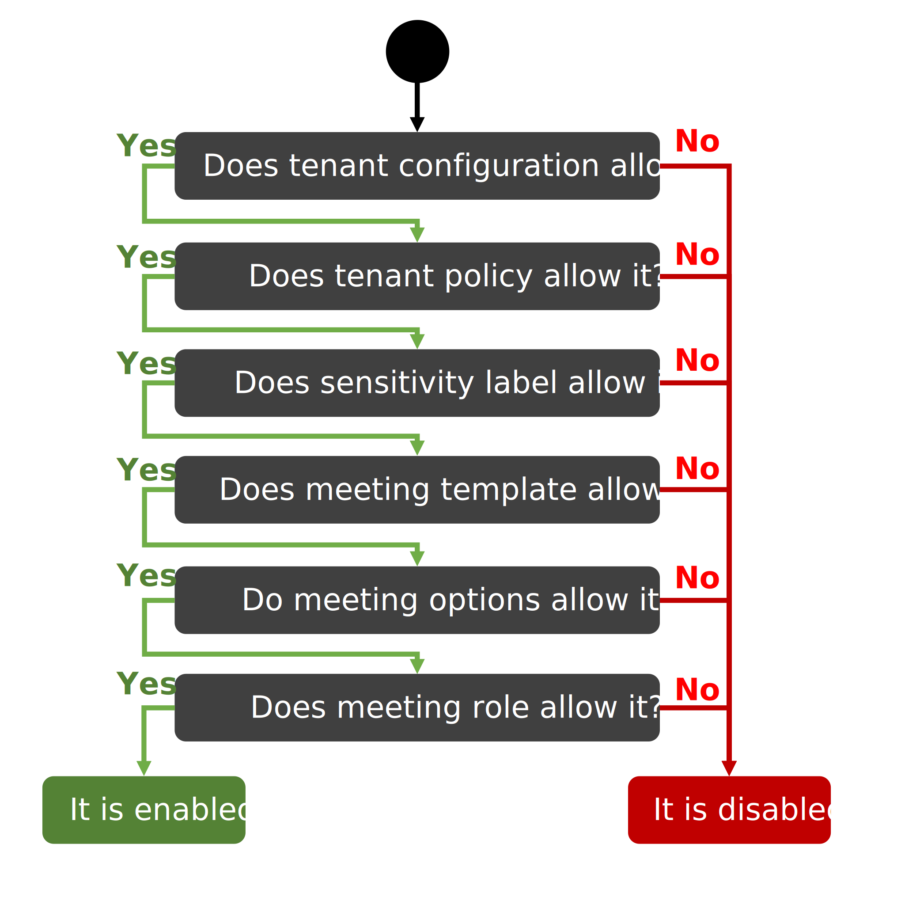
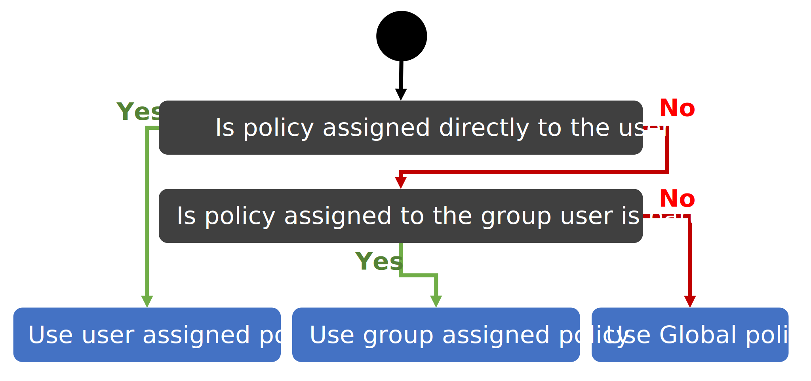

# Teams controls
In this article, you learn what tools Microsoft 365 provides to control the user experience in Microsoft Teams meetings. You know what those tools are, how they interact, which roles and licenses you need, and many more.
Let's start with a high-level decision tree diagram describing whether a specific feature is allowed for a meeting participant. A subset of the controls might control individual features. Let's take an example of call recording in the Teams meeting. Microsoft 365 administrators can't control this feature with tenant configuration but can control it via 
-	Policy assigned to the users, 
-	A sensibility label selected for the meeting, 
-	Meeting template selected for the meeting
-	Meeting options defined by the meeting organizer 
-	Role of the user in the meeting.

## Tenant configurations
Tenant configurations are organization-wide settings that impact everyone in the tenant. There's only one configuration, and the administrator can't create a new configuration. Just modify the existing one. Microsoft Teams provides, for example, configuration for [federation with Azure Communication Services](/powershell/module/teams/set-csteamsacsfederationconfiguration), [federation with Skype for Business](/powershell/module/skype/set-cstenantfederationconfiguration), or [configuration to control Teams meetings](/powershell/module/skype/set-csteamsmeetingconfiguration) (this configuration is being deprecated). Teams administrators can use these configurations as safeguards to disable capabilities for everyone in the tenant easily.
- Required role: Teams or global administrator
- Licensing: standard licensing
- Tools: Teams Admin Center or PowerShell

|Setting name | 	Description|	Tenant configuration	|Property	|
|--|--|--|--|
|Enable federation with Azure Communication Services| If enabled, Azure Communication Services users can join Teams meeting as Communication Services users even if Teams anonymous users are not allowed|	[CsTeamsAcsFederationConfiguration](/PowerShell/module/teams/set-csteamsacsfederationconfiguration)| 	EnableAcsUsers|
|List federated Azure Communication Services resources | Users from listed Azure Communication Services resources can join Teams meeting if Teams anonymous users are not allowed to join. |[CsTeamsAcsFederationConfiguration](/PowerShell/module/teams/set-csteamsacsfederationconfiguration)| 	AllowedAcsResources |
|[Anonymous users can join a meeting](/microsoftteams/meeting-settings-in-teams#allow-anonymous-users-to-join-meetings) | If disabled, Teams external users can't join Teams meetings. |	[CsTeamsMeetingConfiguration](/PowerShell/module/skype/set-csteamsmeetingconfiguration) |	DisableAnonymousJoin |

Your custom application should consider user authentication and other security measures to protect Teams meetings. Be mindful of the security implications of enabling anonymous users to join meetings. Use the [Teams security guide](/microsoftteams/teams-security-guide#addressing-threats-to-teams-meetings) to configure capabilities available to anonymous users.

## Tenant policies
Tenant policies are configurations that can be assigned to specific users or groups of users. A policy consists of properties with one of the following scopes: per-organizer, per-user, or both. Scope controls which policy is considered when evaluating the feature's availability, the organizers, participants, or both. 
Popular tenant policies are meeting, calling, messaging, or external access policies. A tenant has, by default, a Global policy assigned to everyone in the tenant. However, an administrator can create a new policy of a specific type, define a custom configuration, and assign it to users or groups of users. The following priority takes place when selecting which policy applies to the user:
1.	Directly assigned policy: The policy is assigned directly to the user.
2.	Group-assigned policy: The policy is assigned to a group the user is part of.
3.	Organization-wide policy: The Global policy applies.

An organizer-assigned policy can disable the feature in all meetings this user organizes. Disabled capability by policy can't be enabled with other tools. For example, administrators can use a global meeting policy to allow recording for everyone. Then create a new meeting policy called "external customers", which would disable recording. Admin then assigns the new policy to a group of users that conduct calls with external customers.
- Required role: Teams or global administrator
- Licensing: standard licensing
- Tools: Teams Admin Center or PowerShell

|Setting name |	Policy scope|Description	|Tenant policy|	property	|
|--|--|--|--|--|
|[Let anonymous people join a meeting](/microsoftteams/meeting-settings-in-teams#allow-anonymous-users-to-join-meetings) | per-organizer | If disabled, Teams external users can't join Teams meetings.	| [CsExternalAccessPolicy](/PowerShell/module/skype/set-csexternalaccesspolicy)|	EnableAcsFederationAccess	|
|Blocked anonymous join client types | per-organizer	|  If the property "BlockedAnonymousJoinClientTypes" is set to "Teams" or "Null", the Teams external users via Azure Communication Services can join Teams meeting.	| [CsTeamsMeetingPolicy](/powershell/module/skype/set-csteamsmeetingpolicy) |	BlockedAnonymousJoinClientTypes	|
|[Anonymous users can join a meeting](/microsoftteams/meeting-settings-in-teams#allow-anonymous-users-to-join-meetings) | per-organizer |  If disabled, Teams external users can't join Teams meetings.	|[CsTeamsMeetingPolicy](/powershell/module/skype/set-csteamsmeetingpolicy)|	AllowAnonymousUsersToJoinMeeting|
|[Let anonymous people start a meeting](/microsoftteams/meeting-settings-in-teams#allow-anonymous-users-to-join-meetings)| per-organizer |  Teams external users can start a Teams meeting without Teams user if enabled. |	[CsTeamsMeetingPolicy](/powershell/module/skype/set-csteamsmeetingpolicy)	|AllowAnonymousUsersToStartMeeting|
|Anonymous users can dial out to phone users | per-organizer |  If enabled, Teams external users can add phone participants to the meeting.|	[CsTeamsMeetingPolicy](/powershell/module/skype/set-csteamsmeetingpolicy)	|AllowAnonymousUsersToDialOut|
|[Automatically admit people](/microsoftteams/meeting-policies-participants-and-guests#automatically-admit-people)| per-organizer|  If set to "Everyone", Teams external users can bypass the lobby. Otherwise, Teams external users must wait in the lobby until an organizer, coorganizer, or presenter admits them.|	[CsTeamsMeetingPolicy](/powershell/module/skype/set-csteamsmeetingpolicy)	|AutoAdmittedUsers|

## Sensitivity label
[Sensitivity labels allow Teams admins](/microsoft-365/compliance/sensitivity-labels-meetings) to protect and regulate access to sensitive organizational content during Microsoft Teams meetings. Compliance administrators can create sensitivity labels in [Microsoft Purview compliance portal](/microsoft-365/compliance/go-to-the-securitycompliance-center) and assign them with policy to users or groups of users. These labels can then be assigned to Teams meeting via meeting templates or meeting options.
The sensitivity labels control subset of meeting options, adds new controls such as prevention of copy & paste in the chat, and might require justification for a change of the sensitivity label of the meeting. 
- Required role: Compliance or global administrator to manage sensitivity labels and policy. Teams or global administrators to manage meeting templates. Meeting organizer to manage meeting options.
- Licensing: Microsoft Purview
- Tools: Microsoft Purview compliance portal

Meeting options that can be controlled via sensitivity label:
-	Who can bypass the lobby
-	Who can present
-	Who can record
-	Encryption for meeting video and audio
-	Automatically record
-	Video watermark for screen sharing and camera streams
-	Prevent copying of meeting chat
-	Prevent or allow copying of chat contents to the clipboard

## Meeting templates
Teams administrators can use meeting templates to control meeting settings that the meeting organizer usually controls. With templates, Teams administrators can create consistent meeting experiences in your organization and help enforce compliance requirements and business rules. Meeting templates can be used to enforce settings or to set default values. The administrator can lock the individual template option so the meeting organizer can't change it, or it can be left unlocked for the meeting organizer to change it if needed.
- Required role: Teams or global administrator to manage meeting templates. Meeting organizer to select meeting template for the meeting.
- Licensing: Microsoft Premium
- Tools: Teams Admin Center

|Group|Teams meeting option |	Description|
|--|--|--|
|Security|Sensitivity label|	Specifies the sensitivity label to be used for the meeting.
||Lobby - Who can bypass the lobby? |	Specify who can bypass the lobby and join the meeting directly.
||People calling in by phone can bypass the lobby| Specifies whether phone users can bypass the lobby.
||Enable meeting end-to-end encryption |	Specifies if the meeting is encrypted.
||Enable Watermarks|Specifies if watermarks are used for camera feeds and content that's shared on screen in the meeting.
|Audio and video|Enable mic for attendees? |	When off, you can unmute individual attendees as needed.
||Enable camera for attendees? | When on, meeting attendees can turn on video.
|Recording and transcription|Record meetings automatically|	 Speficy if the meeting is recorded automatically.
||Who can record meetings?| Specifies who can record the meeting.
|Roles|Notify when callers join and leave|A sound plays when someone calling in by phone joins or leaves the meeting.
|Meeting engagement|Allow meeting chat|	Specifies if the meeting chat is available. It can also be used to prevent chatting before and after the meeting.
||Allow reactions|	Specifies if attendees can use reactions in the meeting.
||Enable Q&A |	Specifies if attendees can use the Q&A feature to ask questions during the meeting.
||Manage what attendees see |	Specifies if meeting organizers can preview and approve content being shared on screen before other meeting participants can see it.

## Meeting roles
[Teams meeting roles](https://support.microsoft.com/office/roles-in-a-teams-meeting-c16fa7d0-1666-4dde-8686-0a0bfe16e019) define permissions that Teams meeting participants have. Microsoft Teams provides roles: organizer, coorganizer, presenter, and attendee. The meeting organizer can assign default roles to the participants. Coorganizers and presenters share most organizer permissions, while attendees are more controlled. There can be only one meeting organizer.
- Required role: Organizer, coorganizer, and presenter can change the roles of individual participants. Each user knows their role.
- Licensing: standard licensing
- Tools: Microsoft Teams and Graph API (only default roles)

List of permissions per role can be found [here](https://support.microsoft.com/office/roles-in-a-teams-meeting-c16fa7d0-1666-4dde-8686-0a0bfe16e019) and more details about [coorganizer](https://support.microsoft.com/office/add-co-organizers-to-a-meeting-in-teams-0de2c31c-8207-47ff-ae2a-fc1792d466e2).

## Meeting options
[Meeting options](https://support.microsoft.com/office/participant-settings-for-a-teams-meeting-53261366-dbd5-45f9-aae9-a70e6354f88e) allow meeting organizer and coorganizers to customize the meeting experience before and during the meeting. Default values, editability, and visibility of individual features depend on the tenant configuration, policies, sensitivity label, and meeting template.
- Required role: Organizer or coorganizer can change available meeting options. 
- Licensing: standard licensing
- Tools: Microsoft Teams and Graph API (only before the meeting starts)

Here's an overview of Meeting options:

|Option name|Description| Supported |
| --- | --- | --- |
| [Automatically admit people](/microsoftteams/meeting-policies-participants-and-guests#automatically-admit-people) | If set to "Everyone", Teams external users can bypass the lobby. Otherwise, Teams external users have to wait in the lobby until an authenticated user admits them.| ✔️ |
| [Always let callers bypass the lobby](/microsoftteams/meeting-policies-participants-and-guests#allow-dial-in-users-to-bypass-the-lobby)| Participants joining through phone can bypass lobby | Not applicable |
| Announce when callers join or leave| Participants hear announcement sounds when phone participants join and leave the meeting | ✔️ |
| [Choose coorganizers](https://support.microsoft.com/office/add-co-organizers-to-a-meeting-in-teams-0de2c31c-8207-47ff-ae2a-fc1792d466e2)|  Not applicable to external users | ✔️ |
| [Who can present in meetings](/microsoftteams/meeting-policies-in-teams-general#designated-presenter-role-mode) | Controls who in the Teams meeting can have assigned presenter role.  | ✔️ |
|[Manage what attendees see](https://support.microsoft.com/office/spotlight-someone-s-video-in-a-teams-meeting-58be74a4-efac-4e89-a212-8d198182081e)|Teams organizer, coorganizer and presenter can spotlight videos for everyone. |✔️|
|[Allow mic for attendees](https://support.microsoft.com/office/manage-attendee-audio-and-video-permissions-in-teams-meetings-f9db15e1-f46f-46da-95c6-34f9f39e671a)|If an external user is an attendee, then this option controls whether the external user can send local audio |✔️|
|[Allow camera for attendees](https://support.microsoft.com/office/manage-attendee-audio-and-video-permissions-in-teams-meetings-f9db15e1-f46f-46da-95c6-34f9f39e671a)|If an external user is an attendee, then this option controls whether the external user can send local video |✔️|
|[Record automatically](/graph/api/resources/onlinemeeting)|Records meeting when anyone starts the meeting. The user in the lobby does not start a recording.|✔️|
|Allow meeting chat|If enabled, external users can use the chat associated with the Teams meeting.|✔️|
|[Allow reactions](/microsoftteams/meeting-policies-in-teams-general#meeting-reactions)|If enabled, external users can use reactions in the Teams meeting |❌|
|[RTMP-IN](/microsoftteams/stream-teams-meetings)|If enabled, organizers can stream meetings and webinars to external endpoints by providing a Real-Time Messaging Protocol (RTMP) URL and key to the built-in Custom Streaming app in Teams. |Not applicable|
|[Provide CART Captions](https://support.microsoft.com/office/use-cart-captions-in-a-microsoft-teams-meeting-human-generated-captions-2dd889e8-32a8-4582-98b8-6c96cf14eb47)|Communication access real-time translation (CART) is a service in which a trained CART captioner listens to the speech and instantaneously translates all speech to text. As a meeting organizer, you can set up and offer CART captioning to your audience instead of the Microsoft Teams built-in live captions that are automatically generated.|❌|
|[Apply a watermark to everyone's video feed](https://support.microsoft.com/office/watermark-for-teams-meetings-a9166432-f429-4a19-9a72-c9e8fdf4f589)| Watermark is applied to everyone's video feed. Instead, no video is received. |❌|
|[Apply a watermark to shared content](https://support.microsoft.com/office/watermark-for-teams-meetings-a9166432-f429-4a19-9a72-c9e8fdf4f589)| Watermark is applied to screen share feed. Instead, no screen-sharing video is received. | ❌|
|[End-to-end encryption](https://support.microsoft.com/office/use-end-to-end-encryption-for-teams-meetings-a8326d15-d187-49c4-ac99-14c17dbd617c)| Enable end-to-end encryption for Teams meeting. Audio and video streams are encoded end-to-end. Azure Communication Services can't join meetings with end-to-end encryption. |❌|
|[Who can record](https://support.microsoft.com/office/record-a-meeting-in-teams-34dfbe7f-b07d-4a27-b4c6-de62f1348c24)| Select which roles in the meeting can manage Teams recording. Azure Communication Services does not provide API for Teams recording. | ❌|
|[Enable Q&A](https://support.microsoft.com/office/q-a-in-teams-meetings-f3c84c72-57c3-4b6d-aea5-67b11face787)| Allow Q&A in the Teams meeting |❌|
|[Enable language interpretation](https://support.microsoft.com/office/use-language-interpretation-in-a-teams-meeting-b9fdde0f-1896-48ba-8540-efc99f5f4b2e) |Allows professional interpreters to translate what a speaker says into another language in real-time. |❌|
|[Enable Green room](https://support.microsoft.com/office/green-room-for-teams-meetings-5b744652-789f-42da-ad56-78a68e8460d5)| Use a green room to prepare with other presenters, practice sharing materials, and more before attendees enter the meeting. |❌|

## Next steps

- [Authenticate as Teams external user](../../../quickstarts/identity/access-tokens.md)
- [Join Teams meeting audio and video as Teams external user](../../../quickstarts/voice-video-calling/get-started-teams-interop.md)
- [Join Teams meeting chat as Teams external user](../../../quickstarts/chat/meeting-interop.md)
- [Join meeting options](../../../how-tos/calling-sdk/teams-interoperability.md)
- [Communicate as Teams user](../../teams-endpoint.md).
