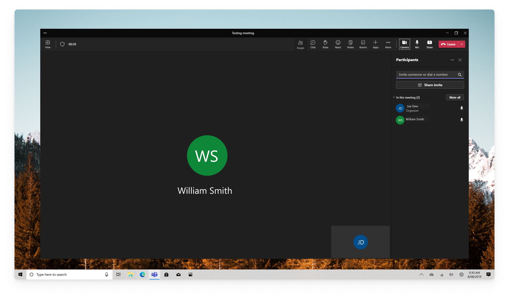
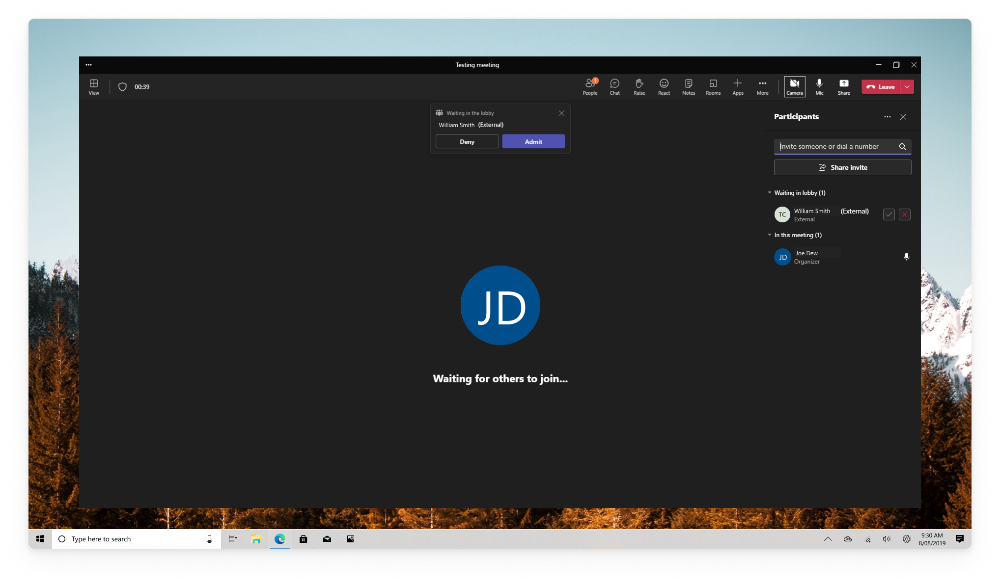
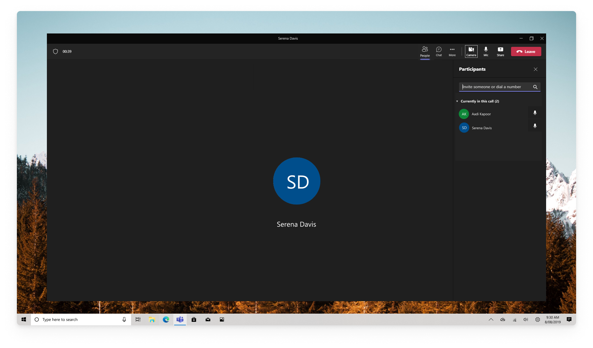
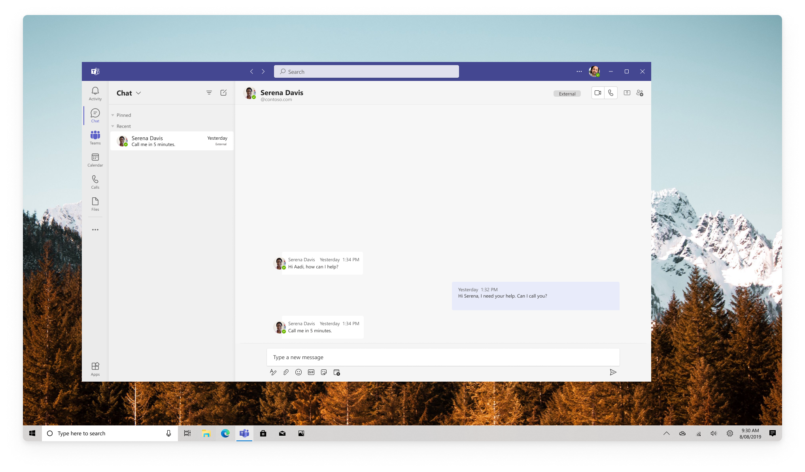
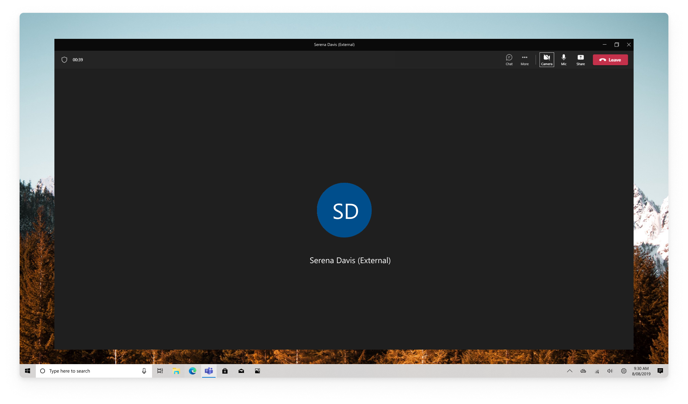
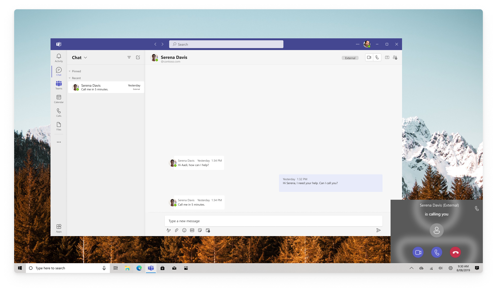

# Experience for users in Teams client interacting with Teams users
Teams users calling users in the same organization or joining Teams meetings organized in the same organization will be represented in Teams client as any other Teams user. Teams users calling users in trusted organizations or joining Teams meetings organized in trusted organizations will be represented in Teams clients as Teams users from different organizations. Teams users from the other organizations will be marked as "external" in the participant's lists as Teams clients. As Teams users from a trusted organization, their capabilities in the Teams meetings will be limited regardless of the assigned Teams meeting role.

## Joining meetings within the organization
The following image illustrates the experience of a Teams user using Teams client interacting with another Teams user from the same organization using Azure Communication Services SDK who joined Teams meeting.

## Joining meetings outside of the organization
The following image illustrates the experience of a Teams user using Teams client interacting with another Teams user from a different organization using Azure Communication Services SDK who joined Teams meeting.

## Start a call to Teams user within the organization
The following image illustrates the experience of a Teams user using Teams client calling another Teams user from the same organization using Azure Communication Services SDK. First, the user opens a chat with the person and selects the call button.

If callee accepts the call, both users are connected via a 1:1 VoIP call.

## Start a call to Teams users from different organization
The following image illustrates the experience of a Teams user using Teams client calling another Teams user from a different organization using Azure Communication Services SDK. First, the user opens a chat with the person and selects the call button.

If callee accepts the call, both users are connected via a 1:1 VoIP call.

## Incoming call from Teams user within the organization
The following image illustrates the experience of a Teams user using Teams client receiving a notification of an incoming call from another Teams user from the same organization. The caller is using Azure Communication Services SDK. 

## Incoming call from Teams user from a different organization
The following image illustrates the experience of a Teams user using Teams client receiving a notification of an incoming call from another Teams user from a different organization. The caller is using Azure Communication Services SDK. 

## Next steps

> [!div class="nextstepaction"]
> [Get started with calling](../../../quickstarts/voice-video-calling/get-started-with-voice-video-calling-custom-teams-client.md)
