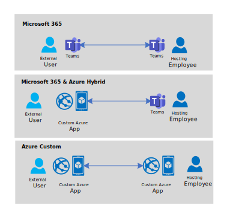

# Overview of virtual appointments

Virtual appointments are a communication pattern where a **consumer** and a **business** assemble for a scheduled appointment. The **organizational boundary** between consumer and business, and **scheduled** nature of the interaction, are key attributes of most virtual appointments. Many industries operate virtual appointments: meetings with a healthcare provider, a loan officer, or a product support technician.

## Personas

No matter the industry, there are at least three personas involved in a virtual appointment and certain tasks they accomplish:
- **Office Manager.** The office manager configures the business’ availability and booking rules for providers and consumers.
- **Provider.** The provider gets on the call with the consumer. They must be able to view upcoming virtual appointments and join the virtual appointment and engage in communication.
- **Consumer**. The consumer who schedules and motivates the appointment. They must schedule an appointment, enjoy reminders of the appointment, typically through SMS or email, and join the virtual appointment and engage in communication.

## Architecture options

Azure and Teams are interoperable. This interoperability gives organizations choice in how they deliver virtual appointments using Microsoft's cloud. Three examples include:

-  **Microsoft 365** provides a zero-code suite for virtual appointments using Microsoft [Teams](https://www.microsoft.com/microsoft-teams/group-chat-software/) and [Bookings](https://www.microsoft.com/microsoft-365/business/scheduling-and-booking-app). This is the easiest option but customization is limited. [Check out this video for an introduction.](https://www.youtube.com/watch?v=zqfGrwW2lEw)
-  **Microsoft 365 + Azure hybrid.** Combine Microsoft 365 Teams and Bookings with a custom Azure application for the consumer experience. Organizations take advantage of Microsoft 365's employee familiarity but customize and embed the consumer appointment experience in their own application.
-  **Azure custom.** Build the entire solution on Azure primitives: the business experience, the consumer experience, and scheduling systems.

These three **implementation options** are columns in the table below, while each row provides a **use case** and the **enabling technologies**.

|*Persona* | **Use Case** | **Microsoft 365** | **Microsoft 365 + Azure hybrid** | **Azure Custom** |
|--------------|------------|-----------|---------------|---------------|
| *Manager* | Configure Business Availability | Bookings | Bookings | Custom |
| *Provider* | Managing upcoming appointments | Outlook & Teams | Outlook & Teams | Custom |
| *Provider* | Join the appointment | Teams | Teams | Azure Communication Services Calling & Chat |
| *Consumer* | Schedule an appointment | Bookings | Bookings | Azure Communication Services Rooms |
| *Consumer*| Be reminded of an appointment | Bookings | Bookings | Azure Communication Services SMS |
| *Consumer*| Join the appointment | Teams or virtual appointments | Azure Communication Services Calling & Chat | Azure Communication Services Calling & Chat |

There are other ways to customize and combine Microsoft tools to deliver a virtual appointments experience:
-  **Replace Bookings with a custom scheduling experience with Graph.** You can build your own consumer-facing scheduling experience that controls Microsoft 365 meetings with Graph APIs.
-  **Replace Teams’ provider experience with Azure.** You can still use Microsoft 365 and Bookings to manage meetings but have the business user launch a custom Azure application to join the Teams meeting. This might be useful where you want to split or customize virtual appointment interactions from day-to-day employee Teams activity.

## Next steps
- [Build your own virtual appointments](../../../tutorials/virtual-visits/sample-builder.md)
- [Learn about Teams controls](../guest/teams-administration.md).
- [Govern user experience in Teams meetings](./govern-meeting-experience.md)
- [Plan user experience in Teams meetings](./plan-user-experience.md)
