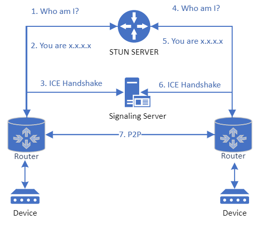

# STUN and TURN

[!INCLUDE [Public Preview Notice](../../includes/public-preview-include.md)]

When using the Communication Services networking SDK, you'll encounter terms like ICE, STUN, NAT, TURN, and SDP. These are each protocols that help your client devices connect with one another using the WebRTC framework. 

In most cases, the Calling SDK handles these concerns for you. These concepts will be interesting to you in scenarios that require more fine-grain control over your communications protocol than the Communication Services calling SDK offers. In this case, you may be interested in using Communication Services to [provision STUN and TURN network relay tokens](../../quickstarts/networking/get-turn-token.md).

## Concepts

### ICE

Your users' devices usually sit behind firewalls, routers, and other network "gateways". For one device to connect to another over WebRTC, each device needs to know exactly who it's talking to. The ICE (Interactive Connectivity Establishment) protocol helps establish this device identity using a signaling server and a traversal server. There are two types of traversal servers: STUN and TURN. Azure Communication Services supports both STUN and TURN server configurations.

### STUN

STUN is an acronym within an acronym. It stands for "Session Traversal Utilities for NAT". STUN allows one device to discover another device's public IP address if it's available. If it's not available, a TURN server must be used.

### TURN

If your device is sitting behind a router that uses Symmetric NAT, a TURN (Traversal Using Relays Around NAT) server can be used to relay data between devices. When a TURN server is used, all data flows through the TURN server.

See the [Fetch a network traversal token quickstart](../../quickstarts/networking/get-turn-token.md) for guidance around TURN token provisioning.

### NAT

Because you might have many devices sitting behind a single router, we need a way to uniquely identify those devices. While the ICE protocol helps us connect two devices with unique identities, NAT (Network Address Translation) is the process that gives your device a unique identity. It does this by translating your device's private IP address into your router's public IP address plus a unique port.

A STUN server is used to discover a device's public IP address. Though in some cases, routers restrict the discoverability of devices via NAT. This is where TURN comes into play.

### SDP

SDP (Session Description Protocol) is uses to describe the format of the media being shared between clients. Your device will capture and transmit media using a particular format (resolution, codec, etc.). SDP is what helps devices understand each other's media by facilitating metadata exchange. To learn more about SDP, feel free to [refer to the spec](https://tools.ietf.org/html/rfc4566).

## STUN and TURN scenarios

### Scenario 1: STUN server

Let's imagine that you'd like to establish peer-to-peer video connectivity between your phone and your neighbor's phone. It's likely that both networks sit behind consumer-grade routers, which will allow you to use a STUN server. Here's a high-level description of what happens in this case:

1. Your device asks a STUN server for a unique identity.
2. Your device receives a unique identity.
3. Your device shares this unique identification with a signaling server.
4. Your neighbor's device asks a STUN server for a unique identity.
5. Your neighbor's device receives the unique identity.
6. Your devices exchange identities in a handshake and use the ICE protocol to establish peer-to-peer connectivity.
7. Your devices can now transmit media directly to each other by using a signaling server to maintain connection; media is transferred peer-to-peer.

### Scenario 2: TURN server

If your devices are behind a symmetric NAT, a TURN server must be used to relay all data between devices.

1. Your device asks a STUN server for a unique identity.
2. Your device receives a unique identity.
3. Your device shares this unique identification with a signaling server.
4. Your neighbor's device asks a STUN server for a unique identity.
5. Your neighbor's device receives the unique identity.
6. Your devices exchange identities in a handshake and use the ICE protocol to establish peer-to-peer connectivity through a TURN server.
7. Your devices can now relay media to each other by using a signaling server to maintain connection; media is relayed through a TURN server.

Azure Communication Services offers both STUN and TURN support.

## Next steps

> [!div class="nextstepaction"]
> [Fetch a network traversal token](../../quickstarts/networking/get-turn-token.md)