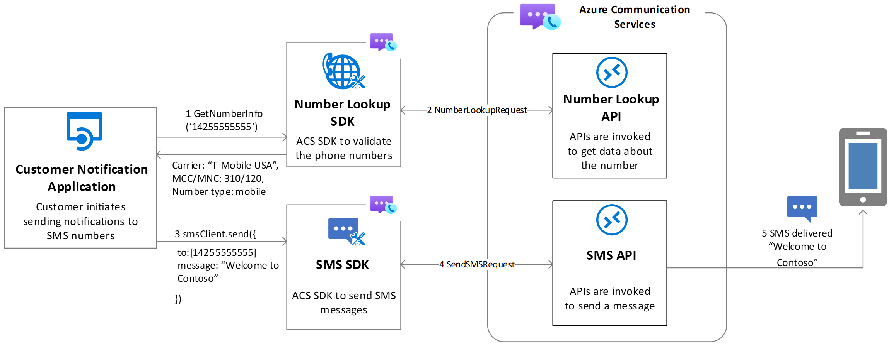

# Number Lookup overview

[!INCLUDE [Private Preview Notice](../../includes/private-preview-include.md)]
> This feature is available today only for US and Canadian phone numbers.

Azure Communication Services enables you to retrieve insights and lookup a specific phone number using the Communication Services Number Lookup SDK. It's part of the Number Management SDK and can be used to support customer service scenarios, appointment reminders, two-factor authentication, and other real-time communication needs. Communication Services Number Lookup allows you to reliably retrieve number insights before engaging with end users. 
[!INCLUDE ]

## Number Lookup features

Key features of Azure Communication Services Number Lookup SDKs include:

- **Simple** Our API is easy to integrate with your application. We provide detailed documentation to guide you through the process, and our team of experts is always available to assist you.
- **High Accuracy** We gather data from the most reliable suppliers to ensure that you receive accurate data. Our data is updated regularly to guarantee the highest quality possible.
- **High Velocity** Our API is designed to deliver fast and accurate data, even under high loads. It is optimized for speed and performance to ensure that you always receive the information you need, quickly and reliably.
- **SMS Capability Check** Our API provides you with the associated number type to determine whether or not an SMS can be sent to a particular number. This helps avoid frustrating attempts to send messages to non-SMS capable numbers.
- **Carrier Details** We provide information about the country of destination and carrier information. This can help you estimate potential costs and find alternative messaging methods (e.g. sending an email).

## Value Proposition

The main benefits the solution will provide to ACS customers can be summarized on the below:
-  **Reduce Cost:** optimize your communication expenses by sending messages only to phone numbers that are SMS ready and still active 
-  **Increase efficiency:** better target customers based on subscribers’ data (name, type, location…). You can also decide the best communication channel to choose based on status (e.g. SMS or email while roaming instead of calls). 

## Key Use Cases

-  **Validate the number can receive the SMS before you send it:** Check if a number has SMS capabilities or not and decide if needed to use different communication channels. 
 *Contoso bank collected the phone numbers of the people who are interested in their services on their site. Contoso wants to send an invite to register for the promotional offer. Contoso checks before sending the link on the offer if SMS is possible channel for the number that customer provided on the site and don’t waste money to send SMS on landline or disconnected mobile numbers.* 
-  **Estimate the total cost of an SMS campaign before you launch it:** Get the current carrier of the target number and compare that with the list of known carrier surcharges.
*Contoso, a marketing company, wants to launch a large SMS campaign to promote a product. Contoso checks the current carrier details for the different numbers he is targeting with this campaign to estimate the cost based on what ACS is charging him.*

## Next steps

> [!div class="nextstepaction"]
> [Get started with Number Lookup API](../../quickstarts/number-lookup/getdata.md)

The following documents may be interesting to you:

- Familiarize yourself with the [Number Lookup SDK](../numbers/number-lookup-sdk.md)